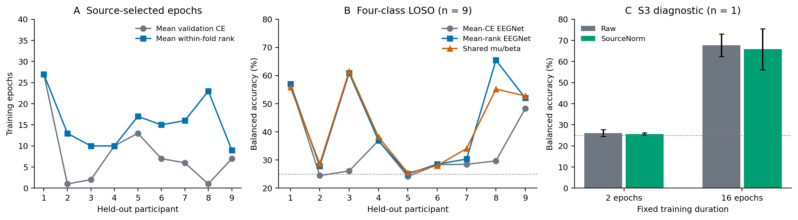
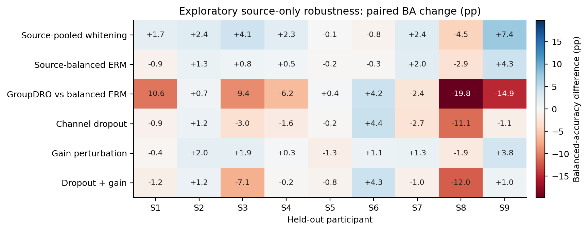

# Source-only model selection and shared spectral representations in cross-subject motor-imagery EEG decoding

*An exploratory internal study with a frozen binary external evaluation*

Working draft for author review — 2 October 2026. Author details pending.

## Abstract

Objective. Cross-subject motor-imagery EEG decoding requires training and model selection without calibration from the held-out person. We examined whether failures associated with source-only training-duration selection could be distinguished from the effects of spectral representations. Methods. Completed experiments were re-audited using archived protocols, trial predictions, source partitions, and experiment-specific validation records. Internal four-class analyses used nine BNCI2014_001 participants with both sessions held out per outer fold. We compared raw validation-loss selection with within-fold rank aggregation, fixed-duration and matched-runtime controls, spatial-spectral ablations, and source-only robustness interventions. A separate, frozen binary source model was evaluated on 109 PhysioNet participants. Results. The internal mean balanced accuracy increased from 33.72% under mean-loss selection to 42.67% under mean-rank selection; most of the aggregate improvement arose from two participants. In a matched-runtime control, fixed 20-epoch training exceeded the historical source-selected duration schedule by 10.06 percentage points (pp; bootstrap 95% interval [0.68, 21.53], exact sign-flip p = 0.125). Shared mu/beta input did not improve the internal mean over the rank-selected broad model. In external binary transfer, broad and shared models achieved 61.81% and 62.39%; the primary paired difference was +0.573 pp (95% interval [-0.097, 1.242], sign-test p = 0.0645). Conclusion. These exploratory results identify training-duration selection and participant heterogeneity as important audit targets. They do not establish general superiority of rank selection or shared spectral representations. External interpretation requires disclosure of a metadata-driven sampling-rate amendment.

Keywords: motor imagery; EEG; cross-subject decoding; EEGNet; source-only model selection; spectral parameter sharing; reproducibility.

## 1. Introduction

Motor-imagery EEG provides a setting in which a decoder must distinguish imagined actions from weak, variable scalp signals. A calibration-free decoder should transfer from previously recorded people to a new person without fitting to that person’s labels or distributional statistics. This requirement differs from within-person evaluation and from adaptation procedures that use unlabeled target recordings. The BCI Competition IV dataset 2a remains a useful, small, well-documented benchmark for studying this distinction [1,2]. Its limited participant count also makes aggregate performance especially sensitive to a few people.

Spatial filtering and frequency decomposition offer complementary inductive biases. Common spatial patterns (CSP) learn discriminative projections from class covariance structure [4], while filter-bank CSP extends that approach across frequency bands [5,6]. Compact convolutional models such as EEGNet combine temporal filtering, depthwise spatial filtering, and separable convolutions [3]. Broader CNN work illustrates the flexibility of learned EEG representations [7]. None of these architectural ideas removes the need to choose training duration using source participants whose validation curves may differ in scale, shape, and optimum epoch.

A decoder that predicts predominantly one class can have balanced accuracy near chance even when the same architecture performs well with a different training duration. Such a failure can be mistaken for evidence that the input distribution requires normalization or a new representation. Conversely, a positive average after an intervention may reflect rescue of one or two participants rather than consistent improvement. Source-only fitting prevents per-fit target leakage, but it does not make a method independently confirmatory when the research program was developed after examining the same benchmark.

We therefore treat model selection, representation, and robustness as distinct experimental questions. The first question is whether heterogeneous source-validation losses can lead to short training schedules and whether a rank-based aggregation changes those schedules. The second is whether fixed mu/beta views processed by one parameter-shared EEGNet provide an advantage beyond broad inputs, explicit spatial projections, or architectural controls. The third is whether those conclusions survive source-composition and matched-runtime checks. Finally, we evaluate a separately frozen binary model on an independent public cohort [9,10], while preserving its protocol-amendment history.

The contribution is an evidence-grounded experimental audit, rather than a claim of a universally improved decoder. We report null and adverse conditions alongside positive point estimates; keep the held-out person as the inference unit; separate four-class development from binary external transfer; and distinguish archived checkpoint reconstruction from current prediction-table reanalysis. No new model was trained to prepare this manuscript.

## 2. Materials and methods

### 2.1. Datasets, populations, and task separation

BNCI2014_001 corresponds to BCI Competition IV dataset 2a [1,2]. Nine participants completed two recording sessions, each containing six runs of 48 trials: 12 each of left-hand, right-hand, feet, and tongue imagery. Twenty-two EEG channels and three EOG channels were sampled at 250 Hz. Original acquisition used a left-mastoid reference, right-mastoid ground, 0.5–100 Hz band-pass, and 50-Hz notch; the offline operations below are additional processing of those recordings. The primary neural input uses EEG channels only. The archived metadata contain 5,184 trials, 576 per participant and 1,296 per class. All 488 expert artifact-flagged trials remain in the primary evaluation population. This include-all endpoint differs from the original competition’s artifact-free scoring; source-clean conditions exclude flagged source-training trials but retain every target trial.

The external EEG Motor Movement/Imagery Database version 1.0.0 [9] supplies a separate binary task. We include all 109 subjects and only imagery runs 4, 8, and 12; T1 and T2 denote left- and right-fist imagery. Executed-movement, bilateral-task, and rest events do not enter this contrast. The final audited inventory contains 327 official-checksum-verified EDF files and 4,918 unique trials. The nominal 160-Hz acquisition description is supplemented by the actual headers: three subjects have 128-Hz recordings. Four-class and binary balanced accuracy have different chance levels and are never pooled into a common score.

**Table 1. Evaluated populations and computational endpoints.**

| Analysis | People | Classes | Unique trials | Primary tensor |
| --- | --- | --- | --- | --- |
| Internal BNCI | 9 | 4 | 5,184 | 22 × 750 at 250 Hz |
| Binary BNCI source | 9 | 2 | 2,592 | 22 × 480 at 160 Hz |
| External PhysioNet | 109 | 2 | 4,918 | 22 × 480 at 160 Hz |

Both sessions of each BNCI outer target are held out. The binary source models are separately fitted and are not a relabeling of the four-class checkpoints. The 34,426 external model/seed prediction rows represent seven saved predictions per unique trial, not independent observations.

### 2.2. Offline preprocessing and source-only partitions

For internal BNCI analyses, fourth-order zero-phase Butterworth filters are applied within each native recording run before epoch extraction. The half-open interval [2.5,5.5) s after the MAT trial start corresponds to [0.5,3.5) s after the cue and yields 750 samples. There is no baseline subtraction, additional notch, or additional re-reference in the primary neural pipeline. MNE-loaded volt values are multiplied by 10^6 for network inputs in microvolts. These offline zero-phase operations use future samples and are not a causal online decoder.

The broad mean-loss and mean-rank EEGNet conditions use 4–40 Hz. Restricted broad input uses 8–30 Hz, and the shared representation uses fixed mu (8–13 Hz) and beta (13–30 Hz) views. The bands are predefined experimental choices, not participant-specific estimates or physiological source separation. Any fitted scaler, CSP/PCA projection, or whitening transform is estimated on the applicable source-training partition only.

Each primary four-class outer split holds out both sessions of one participant. The eight source people contribute 4,608 trials and the target contributes 576. Sorted source IDs define four consecutive, two-person inner-validation groups. Each inner fit trains on six people/3,456 trials and validates on two people/1,152 trials. This separation is by person, not by random trial. Final evaluation retains three fixed seeds, averaged within person before cross-person aggregation. Model evaluation freezes BatchNorm statistics; target examples do not update them.

### 2.3. Training-duration selection and diagnostic controls

The mean-loss rule selects the earliest epoch minimizing the equally weighted mean validation cross-entropy across the four inner folds. Candidate epochs are 1–40. The mean-rank rule first ranks epochs within each fold by validation cross-entropy, assigns average ranks to ties, averages those ranks across folds, and selects the earliest minimum. Its operational purpose is invariance to strictly increasing (order-preserving) transformations within a fold; that property does not guarantee better target prediction. The rank follow-up reuses the 36 frozen original inner trajectories and trains 27 new final models after the schedule has been frozen.

Selected epoch = earliest argmin over e of (1/K) Σ_k rank_k[L_k(e)].

The rank candidate was motivated by earlier results on the same BNCI participants, so the internal comparison remains exploratory despite source-only per-fit selection. A four-cell diagnostic for S3 crosses raw versus source-normalized input with two versus 16 fixed epochs. Here raw means filtered, microvolt-scaled EEG without fitted source normalization. Two cells reuse the archived original conditions and two are new archived diagnostic conditions; this is one participant, not a population-level replication. Source normalization estimates per-channel mean and scale from source-training samples only.

Later controls compare fixed 20-epoch training with raw-loss-selected schedules. An additive matched-runtime experiment uses the same historical source-selected epoch counts but retrains the 27 final models on the same actual runtime and raw files as the fixed-duration comparator. It does not reselect epochs under the newer runtime. Source-count controls use k = 2, 4, or 6 source participants, four predefined identity subsets per count, and the k = 8 anchor; all counts use fixed 20 epochs. The 0train-versus-1test source-session contrast uses equal budgets: 2,304 trials, 20 epochs, and 720 optimizer updates per fit. Source-count contrasts and comparisons of one source session with the both-session anchor change the number of training examples and optimizer updates; those contrasts do not isolate a single causal factor.

### 2.4. Neural representation and spatial-spectral controls

The four-class model is Braindecode 1.5.1 EEGNet with 22 input channels, 750 samples, F1 = 8, depth multiplier D = 2, F2 = 16, temporal kernel length 64 samples, and dropout 0.25. It has 2,932 trainable parameters in the archived implementation. Training uses Adam, learning rate 0.001, batch size 64, cross-entropy, zero weight decay, and no scheduler or default augmentation. The selection seed is 20260923 and the three final seeds are 20260924, 20260925, and 20260926. This is a configured EEGNet study, not an exact reproduction of the original paper’s preprocessing or splits [3].

For shared mu/beta input, both band views pass through the same EEGNet in one concatenated mini-batch. Their class logits are averaged before cross-entropy in training and before softmax in inference. Network parameters and BatchNorm are shared; dropout acts per view. There are no learned band weights, attention mechanism, or separate independently trained branches. Parameter count matches one EEGNet, while forward-pass work and preprocessing differ.

Shared prediction: p = softmax[(fθ(Xμ) + fθ(Xβ))/2].

Controls include individual frequency bands; fixed source-selected durations; Welch log-bandpower with source-fitted shallow classifiers; eight source-only CSP or PCA time-series projections per band; log-Euclidean covariance features; source-only normalization; and source-clean training. The CSP/PCA neural controls both use 16 projected channels and source-fitted standardization, so their width is matched to each other but differs from the 22-channel shared-logit model. Architectural ablations use two independent networks, early band stacking, four shared bands, and a broadband capacity comparator. The independent two-band model has 5,864 parameters and its comparator has 5,914, a disclosed 0.85% mismatch. The traditional filter-bank implementation is FBCSP-inspired, not a literal reproduction of Ang et al. [5,6].

### 2.5. Source-only robustness interventions

The six completed robustness conditions comprise source-pooled whitening, source-balanced empirical risk minimization (ERM), source-group distributionally robust optimization (GroupDRO), channel dropout, gain perturbation, and their combination. Source whitening uses equal-person covariance aggregation, a ridge of 5% of the mean eigenvalue, and scale preservation; no target covariance or target alignment is fitted. GroupDRO treats source person as group [8]: persistent log weights increase by 0.05 times detached per-group cross-entropy, are normalized by log-sum-exp, and weight the group loss. Its declared matched comparator is balanced ERM, preserving the batching/sampling intervention. Training-only channel dropout uses probability 0.1 with surviving-channel scale 1/0.9; gain perturbation uses U[0.8,1.2], applied before dropout in the combined condition. Validation and target inputs are not augmented.

Whitening and augmentation conditions are compared with the previously frozen broad rank-selected baseline. That historical baseline was executed on a different runtime from the robustness batch, so those cross-batch deltas combine intervention and runtime variation. GroupDRO versus balanced ERM is a cleaner within-runtime objective comparison. We retain this distinction beside the numerical table rather than attributing every delta to its named method.

### 2.6. Separate binary source freeze and external inference

The binary BNCI source population contains 2,592 left/right trials, 288 per person. Filtering and epoching occur at 250 Hz before deterministic polyphase resampling by 16/25 to 160 Hz, giving 22 × 480 samples. The broad binary model uses 8–30 Hz; the shared model uses the fixed mu/beta views. All-nine-source duration selection uses the validation groups [1,2], [3,4], [5,6], and [7,8,9], with equal fold weighting. Frozen durations are 18 broad-model epochs and 17 shared-model epochs. Checkpoints, channels, labels, contrast, seeds, and preprocessing are frozen before external access. A source-only CSP4 + LDA comparator uses reg = None and LDA solver = svd; it does not inherit the internal CSP8 OAS/shrinkage-LDA configuration.

A partial external run stopped at S88 when its 128-Hz header violated the original 160-Hz assumption. A versioned, metadata-driven amendment inspected remaining headers without using their predictions or scores. S88, S92, and S100 are filtered and epoched at their native rate, then resampled by 5/4 from 384 to 480 samples. The other 106 subjects retain native 160-Hz processing. The 87 completed earlier subject outputs are copied byte-for-byte and 22 additional subjects complete the cohort. No target statistics, fitted normalization, adaptation, seed selection, or class-performance-dependent branch is introduced. Because amendment followed partial external execution, the combined result is not a pristine execution of the original freeze.

The original aggregate validation failed when re-serialized CSV probabilities were subjected to an inappropriate exact floating-point equality check. A later cross-host runtime mismatch was a separate limitation and motivated a versioned portability amendment. Both events remain in the record. The versioned validation-only attempt verified official EDF checksums and event identities and recomputed saved probability/argmax consistency, subject metrics, and statistics. It passed with zero new fits and zero new model-inference rows. This audit must not be described as regenerating all external predictions from checkpoints on the later validation host.

### 2.7. Endpoints, uncertainty, and evidence verification

Balanced accuracy = (1/C) Σ_c TP_c/(TP_c + FN_c).

The held-out person is the inference unit. Seeds are paired and averaged within person; predefined source-identity subsets are averaged within person and source count. Shallow conditions have one prediction per trial rather than three independent neural seeds. Paired differences are expressed in balanced-accuracy percentage points (pp). Person-bootstrap percentile intervals resample people, not trials, sessions, seeds, or source subsets. External intervals condition on the frozen source models and do not quantify source-cohort sampling uncertainty. Internal analyses remain exploratory because benchmark outcomes informed the research program and outer training sets overlap.

We preserve archived experiment-specific statistics and identify each interval’s resampling procedure. Rank-selection intervals use 20,000 person-bootstrap draws with seed 20260923. The archived shared-minus-broad representation contrast and robustness intervals use 20,000 draws with seed 20260924. Source-composition and matched-runtime intervals use 10,000 draws with seed 20260926 and exhaustive two-sided sign flips over nine participant differences; familywise exploratory p-values use Holm correction within the frozen families. The external primary contrast uses 20,000 draws with seed 20260924 and an exact two-sided binomial sign test excluding exact zero differences. Its primary hypothesis is shared-minus-broad; contextual comparisons with CSP do not replace it. A supplementary numerical audit uses 200,000 draws with seed 20261002 and is labelled separately. We do not equate an interval excluding zero with agreement across all small-sample tests.

One historical rank-selection script labelled a nine-person binomial calculation as a sign test while retaining two unchanged participants in its denominator. We describe its p = 0.1797 as an archived nine-person sign sensitivity. A conventional tie-excluding calculation uses seven nonzero changes and gives p = 0.015625; the paired t-test gives p = 0.111. This distinction is reported transparently rather than selecting the favorable procedure or rewriting the frozen result. Multiplicity corrections from later declared families are not retrospectively imposed on unrelated earlier statistics.

For this manuscript, archived prediction tables were independently reaggregated by participant and seed, with checks for missing/duplicate trial identities and agreement with reported balanced accuracy. Available historical scientific validators provide deeper checkpoint/raw-data reconstruction for specific batches; the early spectral batch’s top-level validator establishes orchestration only. Validation depth is therefore recorded per experiment. Some text prediction hashes correspond to archived CRLF line endings while the cloud checkout uses LF; those cases are documented as exact newline-conversion matches, not asserted to be identical original bytes. No checkpoint inference or new fit was performed in manuscript preparation.

## 3. Results

### 3.1. Traditional baselines and heterogeneous duration selection

The all-trial four-class broad CSP8 + LDA baseline achieved 39.04% balanced accuracy; broad CSP + SVM and the full filter-bank LDA comparator achieved 37.50% and 38.12%. Raw mean-loss-selected EEGNet achieved 33.72%, below the broad CSP mean. These descriptive comparisons do not establish superiority of a model class. The mean-loss schedule selected only one or two epochs for S2, S3, and S8, while source-validation optima differed substantially across folds.

Source-only per-channel normalization increased the mean to 37.93%, a +4.21 pp difference. The archived paired 95% interval spans −1.12 to +13.49 pp and the median change is only +0.23 pp. The intervention has heterogeneous effects, including negative transfer in S8. It does not establish a general normalization benefit.

The S3 diagnostic separates normalization from duration. Raw input at two epochs gave 26.10% balanced accuracy and source normalization at two epochs gave 25.69%. At 16 epochs, raw and normalized inputs gave 67.71% and 65.86%. The short-run raw condition placed approximately 94% of predictions in one class. Duration can reproduce the observed rescue for this participant; this four-cell diagnostic does not prove that duration explains all cross-person failures.

Mean-rank selection increased equal-person mean balanced accuracy to 42.67%, a +8.95 pp change over raw mean-loss selection. The archived bootstrap interval is [+1.05,+19.96] pp and the median change is +1.85 pp. Seven participants improved and two were unchanged. S3 and S8 account for 87.57% of the summed improvement. Thus the positive average includes a marked concentration of benefit, and the prior same-dataset development and disagreement among small-sample statistics limit a general claim.

**Figure 1.** Training-duration selection and participant-level internal results. A: archived source-selected epochs. B: each participant’s all-trial balanced accuracy after averaging three fixed seeds; the dotted line is four-class chance (25%). C: the S3 four-cell diagnostic; error bars are standard deviations across three seeds, not uncertainty across people. Raw and source-normalized input are compared at two fixed durations. The diagnostic involves one person.

**Table 2. Selected completed four-class conditions; all nine participants.**

| Condition | Bands (Hz) | Mean BA (%) | Interpretation |
| --- | --- | --- | --- |
| Broad CSP8 + LDA | 4–40 | 39.04 | Single source fit/fold |
| Filter-bank CSP + LDA | 4–40 bank | 38.12 | Fixed filter-bank control |
| EEGNet, mean loss | 4–40 | 33.72 | Source-selected duration |
| EEGNet, source norm | 4–40 | 37.93 | Source-only fitted scale |
| EEGNet, mean rank | 4–40 | 42.67 | Reused source curves |
| Shared mu/beta | 8–13 / 13–30 | 42.19 | Representation-specific rank |
| Broad, fixed 20 | 4–40 | 43.99 | Later runtime |
| Broad, matched CE schedule | 4–40 | 33.92 | Same runtime as fixed 20 |

All-trial primary population. Neural means average three fixed seeds within person first. Rows span different batches; only explicitly matched comparisons isolate runtime variation. These rows summarize declared controls, not a target-selected ranking. Complete representation and robustness inventories are supplied in the supplement.

### 3.2. Matched-runtime duration and source-composition controls

In the additive matched-runtime experiment, retraining the historical raw-loss duration schedule gave 33.92% balanced accuracy versus 43.99% for fixed 20 epochs. The fixed-minus-historical-schedule mean was +10.06 pp, with bootstrap 95% interval [+0.68,+21.53] pp. The exact sign-flip p-value was 0.125. The schedule comparison persists on a matched runtime, but its nine-person inferential evidence remains sensitive to the test; it is not proof of a universally optimal fixed duration or of a newly selected schedule under that runtime.

Mean balanced accuracy increased descriptively with source count. Broad fixed-duration models gave 32.96%, 38.89%, 43.16%, and 43.99% at k = 2, 4, 6, and 8; shared models gave 34.74%, 38.89%, 42.48%, and 43.98%. Source-identity variation within each count remained substantial. The two-source broad-minus-eight-source difference was −11.03 pp, but its Holm-adjusted exploratory p was 0.164. Every source-count/selection/session family retained null corrected findings. One-session-versus-the-other contrasts were small and heterogeneous. These trajectories are consistent with training-information sensitivity and do not separate source diversity from sample count or optimizer-update budget.

**Figure 2.** Source composition and matched-runtime controls. A: strong lines are equal-person means; faint lines are individual target-person trajectories after averaging the four predefined identity subsets and three seeds at k = 2, 4, 6. All counts use 20 epochs; k = 8 reuses the fixed-20 anchor. B: all nine fixed-20-minus-historical-CE-schedule effects on the matched runtime. The interval is the sign-reversed archived matched contrast. Source count changes data volume and optimizer updates; these are exploratory sensitivities.

### 3.3. Spectral, spatial, and architectural interventions

The internal shared mu/beta condition achieved 42.19% versus 42.67% for the broad mean-rank baseline, a −0.48 pp mean difference. The archived Q10-V001 exploratory paired interval is [−3.21,+1.41] pp (20,000 draws, seed 20260924), with exact sign-flip p = 0.914. There is no demonstrated primary spectral-sharing gain. A restricted broad band and the individual bands provide descriptive frequency controls, while fixed-duration representation controls preserve their declared schedules.

The source-only CSP8 and PCA8 neural projections achieved 41.48% and 42.06%. The architectural controls achieved 42.99% for independent two-band networks, 42.19% for the broadband capacity comparator, 42.66% for early stacking, and 39.80% for four-band sharing. These completed alternatives do not supply evidence for a general shared-band advantage. Their differences in preprocessing, projected width, BatchNorm behavior, and compute prevent a single-factor physiological interpretation. Complete model means and participant-level values accompany the manuscript.

### 3.4. Source-only robustness has no corrected established gain

Source-pooled whitening, source-balanced ERM, and gain perturbation had positive point estimates relative to the historical broad rank baseline, whereas dropout conditions were lower. None established a corrected improvement. The matched GroupDRO-minus-balanced-ERM difference was −6.45 pp (unadjusted bootstrap interval [−11.47,−1.79] pp; exact sign-flip p = 0.046875, Holm-adjusted p = 0.140625). This adverse estimate is a follow-up lead, not evidence that distributionally robust optimization generally harms EEG decoding. Whitening and gain perturbation intervals cross zero; their cross-runtime historical comparator further limits attribution.

**Table 3. Exploratory source-only robustness (nine participants).**

| Condition | BA (%) | Control | Δ (pp) | 95% CI (pp) | Holm p |
| --- | --- | --- | --- | --- | --- |
| Whitening | 44.34 | Q8 historical | +1.67 | [−0.39,+3.67] | 0.3594 |
| Balanced ERM | 43.18 | Q8 historical | +0.51 | [−0.71,+1.77] | 0.4766 |
| GroupDRO | 36.73 | Balanced ERM | −6.45 | [−11.47,−1.79] | 0.1406 |
| Channel dropout | 41.00 | Q8 historical | −1.67 | [−4.51,+0.64] | 0.7617 |
| Gain perturbation | 43.42 | Q8 historical | +0.75 | [−0.34,+1.86] | 0.7617 |
| Dropout + gain | 40.92 | Q8 historical | −1.75 | [−5.05,+0.91] | 0.7617 |

Intervals are the archived, unadjusted person-bootstrap intervals; p-values use the declared within-family Holm correction. All comparisons with Q8 cross runtimes. GroupDRO versus balanced ERM is the matched-batching, within-runtime contrast. No interval/p-value is treated as a target-selection rule.

### 3.5. Frozen binary external transfer has a small uncertain primary effect

In binary BNCI development, broad, shared, and CSP models achieved 68.21%, 67.35%, and 61.54% balanced accuracy. These development outcomes cannot be pooled with the four-class analyses. The separately frozen all-nine-source models then provided predictions for all 109 external subjects. The final validation confirms 4,918 trial identities and 34,426 saved prediction rows. No target fit was made.

External equal-person balanced accuracy was 61.81% for broad EEGNet, 62.39% for shared mu/beta, and 54.46% for CSP4 + LDA. The predeclared shared-minus-broad primary difference was +0.573 pp, with 95% bootstrap interval [-0.097,+1.242] pp. Sixty-three people favored shared, 43 favored broad, and three tied; the exact tie-excluding sign-test p was 0.06446. Neither the interval nor this test establishes external superiority.

Individual performance varied widely. The shared model ranged from 39.33% to 97.07% balanced accuracy, with median 58.73%. Three-seed average differences also varied in direction across people. The three resampled subjects had mean shared-minus-broad Δ = +0.514 pp, versus +0.575 pp for the 106 native-160-Hz subjects. The small three-person subgroup is descriptive, not a powered subgroup test. This result is reported with the sampling-rate and validation-portability amendments, rather than as an unmodified original external protocol.

**Table 4. Separate binary external evaluation (109 participants).**

| Frozen model | Mean BA (%) | Subject SD (pp) | Median BA (%) |
| --- | --- | --- | --- |
| Broad EEGNet | 61.81 | 12.56 | 58.23 |
| Shared mu/beta | 62.39 | 12.92 | 58.73 |
| CSP4 + LDA | 54.46 | 7.90 | 52.08 |

Deep-model seeds are averaged within each person. The primary contrast is shared minus broad: +0.573 pp, 95% CI [−0.097,+1.242], p = 0.06446. CSP comparisons are contextual and do not replace the primary hypothesis. Sampling-rate amendment and versioned portability validation are disclosed in Methods.

**Figure 3.** Independent-cohort binary transfer. A: empirical cumulative distributions of three-seed subject mean balanced accuracy (one CSP value per person); the vertical dotted line denotes binary chance (50%). B: all 109 primary paired effects, with zero and the mean indicated. The interval and p-value are the frozen person-bootstrap and tie-excluding sign-test outputs. The cohort contains three deterministically resampled subjects under the disclosed metadata amendment.

## 4. Discussion

### 4.1. Model selection is part of the generalization problem

The internal experiments indicate that a source-only decoder can fail through its training-duration decision even before a representation intervention is considered. The S3 fixed-duration diagnostic reproduced a large recovery with raw input and did not reproduce it through normalization at the shorter duration. Rank aggregation changed source-selected epochs and rescued S3/S8 in the archived follow-up. A matched-runtime control retained a substantial average penalty for the historical short schedule. Together these findings motivate inspecting source-validation curves, selected duration, class recall, and prediction concentration whenever a cross-person model appears to collapse.

These results support a specific diagnostic interpretation, not a universal duration prescription. Rank aggregation discards fold-specific loss scale but also discards magnitude information and weights every fold equally. The external study did not independently compare mean-rank with mean-loss duration selection, so it is not an external confirmation of rank selection. A prospective duration comparison on new participants, with runtime matched and training-update budgets controlled, is required to establish that contribution beyond this research program.

### 4.2. Spectral sharing is a constrained representation, not established superiority

Fixed mu/beta views and shared parameters are plausible ways to constrain a compact decoder. However, the internal primary representation comparison was slightly negative and the independent binary contrast was small and uncertain. Source-fitted spatial projections and architectural controls did not create a coherent superiority pattern. This evidence does not justify a claim that the method identifies invariant rhythms, separates physiological sources, or solves subject shift. Nor does a null comparison prove equivalence; the intervals and sample sizes leave a range of small effects compatible with the data.

The shared model’s parameter economy must also be distinguished from compute economy. It processes two band views and shares their BatchNorm statistics, whereas an independent-branch model has different capacity and normalization behavior. The near capacity-matched broad comparator has a small disclosed parameter mismatch. A future controlled study should measure runtime and isolate these design factors rather than crediting every difference to band physiology. We retain the implemented descriptive name “shared mu/beta EEGNet” instead of labelling it a novel attention or adaptation architecture.

### 4.3. Participant heterogeneity and statistical limits

The same average can conceal near-chance people, high-performing people, adverse changes, and large rescues. The concentration of the rank-selection gain in S3/S8 and the directional variability of external differences make person-level tables essential. Multiple seeds help characterize stochastic variation but do not increase the number of independent people. Source subsets and sessions are also repeated measurements within the same target person. Outer LOSO training sets overlap, adding dependence beyond a simple independent-participant model.

Bootstrap intervals, sign tests, sign flips, and paired t-tests answer related questions under different assumptions. With nine skewed differences they need not agree. We report those discrepancies and the archived tie-denominator convention explicitly. The broad internal program contains many hypotheses, so internal unadjusted findings are exploratory; the later frozen families retain their Holm-corrected null outcomes. The independent external primary result is stronger in population size and source-freeze design, but its interval includes zero and its metadata amendment reduces the claim of pristine confirmation.

### 4.4. Reproducibility and scope of external evidence

The public record retains configurations, source identities, checkpoints where published, trial predictions, transform receipts, statistics, technical failures, and versioned amendments. A successful schedule/checkpoint bookkeeping check is distinct from scientific replay. Likewise, a later audit of saved probabilities and official event identities is distinct from regenerating predictions on a different host. Preserving those distinctions and newline-custody notes avoids overstating reproducibility while making the available evidence inspectable.

The external cohort uses different acquisition hardware, references, channels selected from a broader montage, task labels, and a binary decision. Its source-to-external performance change cannot be attributed to one isolated shift mechanism. All pipelines remain offline; no clinical population, assistive-control task, or online BCI was tested. We make no claim of clinical benefit or universal calibration-free reliability.

## 5. Conclusion

Completed source-only experiments show that training-duration decisions can reproduce substantial cross-subject failure and rescue in a small, previously explored benchmark. Person-level and matched-runtime analyses qualify the aggregate gains. Fixed shared mu/beta representations, spatial controls, and source-only robustness interventions do not establish a general advantage. A separately frozen binary external evaluation yields a small positive shared-minus-broad point estimate with an interval spanning zero. The resulting evidence favors transparent selection diagnostics, complete negative-result reporting, and prospective participant-level validation over a claim of a finished universally superior spatial-spectral decoder.

## Data, code, ethics, and author declarations

The source datasets are public resources [1,2,9], with PhysioNet providing the external distribution platform [11]; their original licenses and usage terms apply. Code, archived experiment records, and published results are available at https://github.com/jackzhu119/cross-subject-mi-eeg. This draft reviewed GitHub main at commit adb2d406b4300e2c8e4d5112969291c0331f3ed5; the manuscript evidence bundle records local input hashes, audit scope, and reproducible table/figure scripts. Raw EEG is not redistributed in the manuscript bundle. Some large checkpoint files may be omitted by recorded publication policies; availability must be verified before submission.

This work analyzes existing public recordings and recruited no new participants. Ethical approval and consent for original collection are governed by the dataset creators’ reports; the authors must confirm any institutional requirements for secondary analysis. Author names, affiliations, corresponding author, funding, competing interests, contributions, and any required AI-assistance disclosure remain to be supplied or confirmed by the authors. No approval number, consent statement, funding award, or competing-interest declaration is invented here.

## Supplementary material

### S1. Full internal model inventory and participant effects

Table S1 reports all completed nine-person Q4–Q11 four-class conditions, including shallow spectral/geometric controls and source-clean/source-normalized variants. It is descriptive: higher target mean does not select a method for a confirmatory claim. Individual participant values, fixed seeds, primary all-trial populations, and source file hashes are available in the accompanying CSV/JSON evidence. The complete inventory includes 61 Q4–Q14 condition records, with repeated endpoints and the four single-person diagnostic cells marked; these rows are not independent replications or a cumulative fit count. Robustness conditions are reported in Table 3, source-composition means in the complete CSV, and their statistical families in Table S2.

**Table S1. Completed nine-person Q4–Q11 four-class conditions.**

| Archived condition | Mean BA (%) | Subject SD (pp) |
| --- | --- | --- |
| Q4-E001/BroadCSP LDA | 39.04 | 14.18 |
| Q4-E001/BroadCSP SVM | 37.50 | 12.66 |
| Q4-E001/FBCSP LDA | 38.12 | 7.69 |
| Q4-E001/FBCSP MI8 LDA | 31.37 | 4.26 |
| Q4-A001/FBCSP MI16 LDA | 34.65 | 8.45 |
| Q4-A001/FBCSP MI32 LDA | 36.75 | 8.86 |
| Q4-A001/FBCSP MI72 LDA | 38.12 | 7.69 |
| Q4-A001/FBCSP MI8 LDA | 31.37 | 4.26 |
| Q5-E001 | 33.72 | 11.58 |
| Q6-E001 | 37.93 | 15.68 |
| Q8-E001 | 42.67 | 16.04 |
| Q9-A001/PSD44 LDA | 36.28 | 8.17 |
| Q9-A001/PSD44 LINEAR SVM | 35.78 | 8.39 |
| Q10-A001/BROAD LOGE LOGREG | 35.32 | 10.74 |
| Q10-A001/BROAD LOGE MDM | 29.49 | 8.73 |
| Q10-A001/MUBETA LOGE LDA | 36.00 | 10.75 |
| Q10-A001/MUBETA LOGE SVM | 35.47 | 8.83 |
| Q9-E001/BETA 13 30 | 31.53 | 10.05 |
| Q9-E001/MID 8 30 | 44.55 | 17.17 |
| Q9-E001/MU 8 13 | 43.30 | 16.22 |
| Q9-E001/MU BETA SHARED | 42.19 | 14.10 |
| Q9-E002/MID 8 30 Q8 EPOCHS | 42.73 | 15.73 |
| Q9-E002/MU BETA SHARED Q8 EPOCHS | 43.50 | 15.82 |
| Q9-E004/MU BETA SHARED SOURCE CLEAN | 42.11 | 15.23 |
| Q9-E005/MU BETA SHARED SOURCE NORM | 41.53 | 13.88 |
| Q10-E001/MU BETA CSP8 EEGNET | 41.48 | 16.04 |
| Q10-E001/MU BETA PCA8 EEGNET | 42.06 | 15.51 |
| Q11-E001/BROAD CAPACITY MATCHED | 42.19 | 14.05 |
| Q11-E001/FOUR BAND SHARED | 39.80 | 11.58 |
| Q11-E001/TWO BAND EARLY STACK | 42.66 | 16.23 |
| Q11-E001/TWO BAND INDEPENDENT | 42.99 | 17.38 |

Neural seeds are averaged within person; shallow arms have one evaluated model per fold. Q4-A001 reuses fitted CSP feature caches but refits scaler/LDA; its k8/k72 predictions reproduce prior Q4 endpoints and do not add independent outcomes. Archived condition IDs identify protocol order, not a sorted leaderboard. The four S3 diagnostic cells are shown in Figure 1C, not included as nine-person rows.

### S2. Robustness heterogeneity

**Figure S1.** All nine participant-level robustness differences in fixed order. Color and annotations are balanced-accuracy percentage points. The GroupDRO row uses balanced ERM as control; every other row uses the historical Q8 rank baseline and therefore crosses runtime. This is descriptive, without target-based exclusion or significance stars.

### S3. Duration, source-count, and source-session statistical families

**Table S2. Archived exploratory Q13/E006 paired contrasts.**

| Contrast | Δ (pp) | 95% CI (pp) | Holm p |
| --- | --- | --- | --- |
| Broad k2 minus k8 | -11.03 | [-18.80,-3.56] | 0.1641 |
| Broad k4 minus k8 | -5.10 | [-10.36,-0.38] | 0.4336 |
| Broad k6 minus k8 | -0.83 | [-3.67,+1.89] | 0.5664 |
| Shared k2 minus k8 | -9.23 | [-15.41,-3.15] | 0.1641 |
| Shared k4 minus k8 | -5.09 | [-9.28,-1.31] | 0.2344 |
| Shared k6 minus k8 | -1.49 | [-3.41,+0.42] | 0.4336 |
| Broad 1test minus 0train | -0.84 | [-1.89,+0.19] | 0.3516 |
| Shared 1test minus 0train | +0.08 | [-1.14,+1.18] | 0.8516 |
| Fixed20 minus Historical CE | +10.27 | [+0.96,+21.62] | 0.1562 |
| Shared FIXED20 minus Shared RAW CE | +3.91 | [+0.44,+7.62] | 0.1562 |
| Matched CE minus Fixed20 | -10.06 | [-21.53,-0.68] | 0.1250 |

Each row uses nine people after within-person averaging of fixed seeds and, where applicable, source subsets. The historical CE contrast crosses runtimes; the separately declared matched-CE-minus-fixed20 row matches them. Intervals are unadjusted, while p-values are corrected within each declared family. These signs follow the archived contrasts; Figure 2B reverses the matched contrast for readability.

### S4. Audit and reporting boundaries

The manuscript-number audit independently reaggregates stored predictions and records its actual CSV hashes. Historical source scientific replay counts are reported only where a passing scientific receipt supports them. The Q9 top-level batch report alone is orchestration-only. The external versioned portability validator adds no new inference. CRLF-to-LF matches are labelled explicitly. The paper bundle includes the source-snapshot manifest, per-review input hashes, an independent numerical audit, generated tables, figure sources, and draft-render checks. None of these files is a new training authorization or an external outcome-selected method freeze.

The original rank-follow-up archive reports a bootstrap interval [+1.048,+19.959] pp (20,000 draws, seed 20260923); the independent 200,000-draw reanalysis with seed 20261002 gives [+1.067,+19.952] pp. The main text preserves the original interval. The saved nine-person sign sensitivity retains zero changes in its denominator; the conventional tie-excluding sensitivity is identified separately. Disclosing both implementation and resampling differences prevents an apparent numerical disagreement from being silently concealed.

The external primary sign test preserves the archived exact-zero rule. S10 has a saved shared-minus-broad difference of approximately −1.11 × 10^−16 and therefore counts as negative: 63 positive, 43 negative, and three zero differences, p = 0.06446. A numerical-tolerance sensitivity at 10^−14 classifies that difference as a tie, giving 63 positive, 42 negative, four ties, and p = 0.05044. The primary rule is unchanged; neither calculation establishes superiority at the conventional 0.05 threshold.

### S5. Earlier binary calibration, artifact, and EOG checks

Earlier pipeline checks use only left/right imagery and must remain separate from the four-class analysis. P2-E001 contains 2,346 expert-clean trials. Its within-session leave-run-out and cross-session models use labeled trials from the evaluated person; only its cross-subject LOSO excludes both target sessions. Within-session/LOSO each evaluate all 2,346 trials, while cross-session evaluates 1,183 later-session trials. The single-person P2-SMOKE-S1B is a technical smoke, not a population replication. The all-trial P2-E002-ALLTRIALS condition changes both source and target populations to include 2,592 trials; some retained metadata uses an earlier clean-name field, so effective populations, rather than those labels, determine interpretation.

P3-E001 compares CSP4, Welch PSD88, and their 92-feature fusion under source-all versus source-expert-clean training. The same 2,346 expert-clean target trials define its primary endpoint; all 2,592 and the 246 flagged target trials are secondary strata. P4-E001B is the successful EOG-processing retry: regression coefficients are fitted on clean source data, then applied to three synchronous target EOG channels. It uses no target parameter fit but requires those additional sensors. Its clean-target balanced accuracy is 62.57% versus 62.85% uncorrected, so the result does not establish a decoding benefit or selective ocular-artifact removal. The failed original P4 attempt remains in the technical record.

**Table S3. Earlier binary QC primary endpoints; all nine participants.**

| Stage / model | Split / source policy | Target trials | BA (%) |
| --- | --- | --- | --- |
| P2-E001 / CSP+LDA | cross session; expert clean only | 1183 | 76.06 |
| P2-E001 / CSP+linearSVM | cross session; expert clean only | 1183 | 75.05 |
| P2-E001 / CSP+LDA | cross subject; expert clean only | 2346 | 62.76 |
| P2-E001 / CSP+linearSVM | cross subject; expert clean only | 2346 | 62.09 |
| P2-E001 / CSP+LDA | within session; expert clean only | 2346 | 78.06 |
| P2-E001 / CSP+linearSVM | within session; expert clean only | 2346 | 78.21 |
| P2-E002-ALLTRIALS / CSP+LDA | cross subject; all trials | 2592 | 61.50 |
| P2-E002-ALLTRIALS / CSP+linearSVM | cross subject; all trials | 2592 | 60.57 |
| P3-E001 / CSP4+PSD88 + LDA | cross subject; all trials | 2346 | 64.10 |
| P3-E001 / CSP4 + LDA | cross subject; all trials | 2346 | 61.92 |
| P3-E001 / PSD88 + LDA | cross subject; all trials | 2346 | 58.55 |
| P3-E001 / CSP4+PSD88 + LDA | cross subject; expert clean only | 2346 | 64.63 |
| P3-E001 / CSP4 + LDA | cross subject; expert clean only | 2346 | 62.85 |
| P3-E001 / PSD88 + LDA | cross subject; expert clean only | 2346 | 58.19 |
| P4-E001B / EOG regression | cross subject; source train fitted EOG regression | 2346 | 62.57 |
| P4-E001B / Uncorrected CSP4 + LDA | cross subject; uncorrected | 2346 | 62.85 |

All rows are binary, with 50% chance. Within-session and cross-session rows use target-person labeled calibration. P3/P4 rows use expert-clean targets; P2 all-trial rows use all trials. CSV supplements retain all/flagged secondary endpoints, target-information notes, and the single-person smoke. These modes and populations are not pooled into a calibration-free score.

### S6. Selection-curve analyses and technical history

Completed Q8-A001/A002/A003 analyses inspect archived source-validation curves without additional model fitting. Leave-one-inner-fold-out sensitivity and six candidate aggregation rules are hypothesis-generating analyses; they do not constitute six target-evaluated decoder conditions. P1-E001 is a single-subject acquisition audit. P2-SMOKE-S1 and the original P4-E001 retain failed run receipts, followed by successful retries. Q13-E002/E003 and Q14-E003 remain unrun and receive no performance values. The external partial 87-person attempt is not counted as an additional cohort alongside the completed 109-person result. The separate completed-experiment inventory links each record to its evidential role and explicitly marks reuse, validation depth, and technical failure.

## References

1. Brunner, C.; Leeb, R.; Müller-Putz, G. R.; Schlögl, A.; Pfurtscheller, G. (2008). BCI Competition 2008 – Graz data set A. Official competition dataset description. https://www.bbci.de/competition/iv/desc_2a.pdf
2. Tangermann, M.; Müller, K.-R.; Aertsen, A.; Birbaumer, N.; Braun, C.; Brunner, C.; Leeb, R.; Mehring, C.; Miller, K. J.; Müller-Putz, G. R.; Nolte, G.; Pfurtscheller, G.; Preissl, H.; Schalk, G.; Schlögl, A.; Vidaurre, C.; Waldert, S.; Blankertz, B. (2012). Review of the BCI Competition IV. Frontiers in Neuroscience, 6. https://doi.org/10.3389/fnins.2012.00055
3. Lawhern, V. J.; Solon, A. J.; Waytowich, N. R.; Gordon, S. M.; Hung, C. P.; Lance, B. J. (2018). EEGNet: a compact convolutional neural network for EEG-based brain–computer interfaces. Journal of Neural Engineering, 15(5), 056013. https://doi.org/10.1088/1741-2552/aace8c
4. Ramoser, H.; Müller-Gerking, J.; Pfurtscheller, G. (2000). Optimal spatial filtering of single trial EEG during imagined hand movement. IEEE Transactions on Rehabilitation Engineering, 8(4), 441–446. https://doi.org/10.1109/86.895946
5. Ang, K. K.; Chin, Z. Y.; Wang, C.; Guan, C.; Zhang, H. (2012). Filter Bank Common Spatial Pattern Algorithm on BCI Competition IV Datasets 2a and 2b. Frontiers in Neuroscience, 6. https://doi.org/10.3389/fnins.2012.00039
6. Ang, K. K.; Chin, Z. Y.; Zhang, H.; Guan, C. (2008). Filter Bank Common Spatial Pattern (FBCSP) in Brain-Computer Interface. 2008 IEEE International Joint Conference on Neural Networks (IEEE World Congress on Computational Intelligence), 2390–2397. https://doi.org/10.1109/IJCNN.2008.4634130
7. Schirrmeister, R. T.; Springenberg, J. T.; Fiederer, L. D. J.; Glasstetter, M.; Eggensperger, K.; Tangermann, M.; Hutter, F.; Burgard, W.; Ball, T. (2017). Deep learning with convolutional neural networks for EEG decoding and visualization. Human Brain Mapping, 38(11), 5391–5420. https://doi.org/10.1002/hbm.23730
8. Sagawa, Shiori; Koh, Pang Wei; Hashimoto, Tatsunori B.; Liang, Percy (2020). Distributionally Robust Neural Networks for Group Shifts: On the Importance of Regularization for Worst-Case Generalization. International Conference on Learning Representations (ICLR). https://openreview.net/forum?id=ryxGuJrFvS
9. Schalk, G. (2009). EEG Motor Movement/Imagery Dataset. PhysioNet, version 1.0.0. https://doi.org/10.13026/C28G6P
10. Schalk, G.; McFarland, D. J.; Hinterberger, T.; Birbaumer, N.; Wolpaw, J. R. (2004). BCI2000: A General-Purpose Brain-Computer Interface (BCI) System. IEEE Transactions on Biomedical Engineering, 51(6), 1034–1043. https://doi.org/10.1109/TBME.2004.827072
11. Goldberger, A. L.; Amaral, L. A. N.; Glass, L.; Hausdorff, J. M.; Ivanov, P. Ch.; Mark, R. G.; Mietus, J. E.; Moody, G. B.; Peng, C.-K.; Stanley, H. E. (2000). PhysioBank, PhysioToolkit, and PhysioNet: Components of a New Research Resource for Complex Physiologic Signals. Circulation, 101(23). https://doi.org/10.1161/01.CIR.101.23.e215
