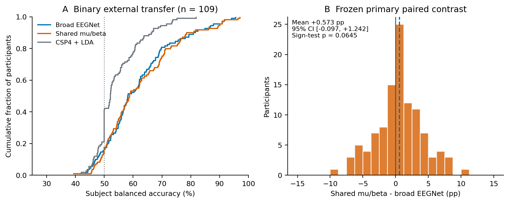
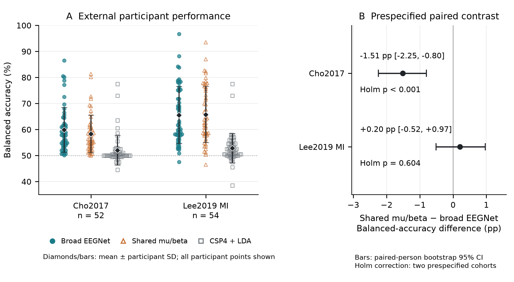

# Source-only model selection and limits of shared spectral representations in cross-subject motor-imagery EEG decoding

*An experimental audit with separate external evaluations on PhysioNet, Cho2017, and Lee2019*

Ziyuan Zhu (corresponding author)

College of Artificial Intelligence Medicine, Chongqing Medical University, Chongqing, China

Correspondence: zzy2630816871@gmail.com

Scientific draft for author review — 5 October 2026. Declarations pending.

## Abstract

Objective. We examined how training-duration selection and fixed spectral parameter sharing affect cross-subject motor-imagery EEG decoding without target fitting. Methods. An exploratory four-class study used nine BNCI2014_001 participants, holding out both sessions of each target person. Archived predictions were re-audited alongside source partitions, duration schedules, matched-runtime controls, and robustness interventions. Separate binary source models were evaluated on PhysioNet (109 people), Cho2017 (52 people), and the offline-training runs of Lee2019 (54 people, two sessions). Cohorts and protocols were analyzed separately. Results. Mean-rank rather than mean-loss duration selection increased internal balanced accuracy from 33.72% to 42.67%; two people accounted for 87.57% of the aggregate gain. A matched-runtime fixed-duration comparison had a positive mean but improved only four of nine people. Shared mu/beta EEGNet did not improve internal performance. Its external shared-minus-broad differences were +0.573 percentage points (pp) on PhysioNet (95% bootstrap interval [−0.097, 1.242]), −1.513 pp on Cho2017 [−2.249, −0.804], and +0.204 pp on Lee2019 [−0.515, 0.969]. The two-cohort Holm-adjusted permutation p-values for Cho2017 and Lee2019 were 0.000100 and 0.604. The latter evaluations used 15 source fits and no target fits; their final raw-to-prediction scientific validation and publication readback passed. Conclusion. Training-duration decisions can produce large, concentrated changes in a small development benchmark. Fixed spectral sharing offered no consistent transfer advantage and reduced performance on Cho2017. These results support participant-level selection diagnostics and explicit protocol auditing. Unknown native voltage calibration and acquisition-reference details constrain physiological and deployment interpretations.

Keywords: motor imagery; EEG; cross-subject decoding; EEGNet; source-only model selection; spectral parameter sharing; external evaluation; reproducibility.

## 1. Introduction

Motor-imagery EEG decoding must distinguish imagined actions in scalp recordings whose spatial and spectral structure varies between people. A calibration-free model should transfer to a new person without fitting to that person’s labels or distributional statistics. This differs from within-person evaluation and from adaptation using unlabeled target recordings. BCI Competition IV dataset 2a provides a small, well-documented benchmark [1,2], but its nine participants make a mean especially sensitive to a few large changes. Broader reviews and multi-dataset evaluation frameworks emphasize both variation between datasets and the dependence of reported performance on evaluation design [3,4].

Spatial filtering and frequency decomposition offer complementary inductive biases. Common spatial patterns (CSP) learn discriminative projections from class covariance structure [5], while filter-bank CSP extends that approach across frequency bands [6,7]. Compact convolutional models such as EEGNet combine temporal filtering, depthwise spatial filtering, and separable convolutions [8]. Broader CNN work illustrates the flexibility of learned EEG representations [9]. None of these architectural ideas removes the need to choose training duration using source participants whose validation curves may differ in scale, shape, and optimum epoch.

A decoder that predicts predominantly one class can have balanced accuracy near chance even when the same architecture performs well with a different training duration. Such a failure can be mistaken for evidence that the input distribution requires normalization or a new representation. Conversely, a positive average after an intervention may reflect rescue of one or two participants rather than consistent improvement. Source-only fitting prevents per-fit target leakage, but it does not make a method independently confirmatory when the research program was developed after examining the same benchmark.

We separate three questions that are often merged in decoder comparisons. First, can heterogeneous source-validation loss curves lead to very short training schedules, and does within-fold rank aggregation change those schedules? Second, does processing predefined mu/beta views with one shared EEGNet improve on a broad input when spatial, capacity, and robustness controls are reported? Third, how does that representation behave in external binary transfer? The external evidence comprises an earlier PhysioNet evaluation [10,11] and a subsequently frozen, separately fitted pipeline for Cho2017 [12,13] and Lee2019 [14,15]. These are separate evaluations with different channel sets and time windows, not a pooled benchmark score.

This study contributes an experimental audit of model selection and transfer limits. It retains negative and adverse conditions, uses the person as the inference unit, and identifies which comparisons are exploratory, runtime-matched, or externally frozen. The design follows the broader observation that model selection belongs inside a domain-generalization evaluation, rather than outside its account of the method [16]. The manuscript was prepared from completed experiments and independent reanalysis of saved predictions; no EEG model was fitted or used for fresh inference during manuscript preparation.

## 2. Materials and methods

### 2.1. Datasets, populations, and task separation

BNCI2014_001 corresponds to BCI Competition IV dataset 2a [1,2]. Nine participants completed two recording sessions, each containing six runs of 48 trials: 12 each of left-hand, right-hand, feet, and tongue imagery. Twenty-two EEG channels and three EOG channels were sampled at 250 Hz. Original acquisition used a left-mastoid reference, right-mastoid ground, 0.5–100 Hz band-pass, and 50-Hz notch; the offline operations below are additional processing of those recordings. The primary neural input uses EEG channels only. The archived metadata contain 5,184 trials, 576 per participant and 1,296 per class. All 488 expert artifact-flagged trials remain in the primary evaluation population. This include-all endpoint differs from the original competition’s artifact-free scoring; source-clean conditions exclude flagged source-training trials but retain every target trial.

The external EEG Motor Movement/Imagery Database version 1.0.0 [10] supplies a separate binary task. We include all 109 subjects and only imagery runs 4, 8, and 12; T1 and T2 denote left- and right-fist imagery. Executed-movement, bilateral-task, and rest events do not enter this contrast. The final audited inventory contains 327 official-checksum-verified EDF files and 4,918 unique trials. The nominal 160-Hz acquisition description is supplemented by the actual headers: three subjects have 128-Hz recordings. Four-class and binary balanced accuracy have different chance levels and are never pooled into a common score.

Cho2017 [12,13] supplies left/right-hand imagery recordings from 52 people at a native 512 Hz. The audited evaluation retains 10,520 imagery trials: 49 people have 200 trials and three (S7, S9, S46) have 240. The Lee2019 motor-imagery data [14,15] contain 54 people recorded at 1,000 Hz in two sessions. We retain only EEG_MI_train, the provider’s offline-training runs, giving 100 trials per session and 10,800 trials in total. EEG_MI_test, other paradigms, and non-imagery events are outside this evaluation. The provider’s term “train” describes a recording segment: these external trials were used for inference and scoring, never for parameter fitting. We do not assert that the three external cohorts represent 215 independently verified unique identities across providers.

**Table 1. Distinct populations and computational endpoints.**

| Analysis | People | Classes | Unique trials | Primary tensor |
| --- | --- | --- | --- | --- |
| Internal BNCI | 9 | 4 | 5,184 | 22 × 750 at 250 Hz |
| Q14 binary BNCI source | 9 | 2 | 2,592 | 22 × 480 at 160 Hz |
| Q14 external PhysioNet | 109 | 2 | 4,918 | 22 × 480 at 160 Hz |
| Q15 binary BNCI source | 9 | 2 | 2,592 | 21 × 320 at 160 Hz |
| Q15 external Cho2017 | 52 | 2 | 10,520 | 21 × 320 at 160 Hz |
| Q15 external Lee2019 | 54 | 2 | 10,800 | 21 × 320 at 160 Hz |

Each BNCI outer target has both sessions held out. Q14 and Q15 use separate binary source fits and preprocessing contracts. Neural inputs contain EEG channels only. Prediction-table rows repeat trials across models/seeds and are not independent participants; Lee sessions are pooled within person for the primary endpoint.

### 2.2. Offline preprocessing and source-only partitions

For internal BNCI analyses, fourth-order zero-phase Butterworth filters are applied within each native recording run before epoch extraction. The half-open interval [2.5,5.5) s after the MAT trial start corresponds to [0.5,3.5) s after the cue and yields 750 samples. There is no baseline subtraction, additional notch, or additional re-reference in the primary neural pipeline. MNE-loaded volt values are multiplied by 10^6 for network inputs in microvolts. These offline zero-phase operations use future samples and are not a causal online decoder.

The broad mean-loss and mean-rank EEGNet conditions use 4–40 Hz. Restricted broad input uses 8–30 Hz, and the shared representation uses fixed mu (8–13 Hz) and beta (13–30 Hz) views. The bands are predefined experimental choices, not participant-specific estimates or physiological source separation. Any fitted scaler, CSP/PCA projection, or whitening transform is estimated on the applicable source-training partition only.

Each primary four-class outer split holds out both sessions of one participant. The eight source people contribute 4,608 trials and the target contributes 576. Sorted source IDs define four consecutive, two-person inner-validation groups. Each inner fit trains on six people/3,456 trials and validates on two people/1,152 trials. This separation is by person, not by random trial. Final evaluation retains three fixed seeds, averaged within person before cross-person aggregation. Model evaluation freezes BatchNorm statistics; target examples do not update them.

### 2.3. Training-duration selection and diagnostic controls

The mean-loss rule selects the earliest epoch minimizing the equally weighted mean validation cross-entropy across the four inner folds. Candidate epochs are 1–40. The mean-rank rule first ranks epochs within each fold by validation cross-entropy, assigns average ranks to ties, averages those ranks across folds, and selects the earliest minimum. Its operational purpose is invariance to strictly increasing (order-preserving) transformations within a fold; that property does not guarantee better target prediction. The rank follow-up reuses the 36 frozen original inner trajectories and trains 27 new final models after the schedule has been frozen.

Selected epoch = earliest argmin over e of (1/K) Σ_k rank_k[L_k(e)].

The rank candidate was motivated by earlier results on the same BNCI participants, so the internal comparison remains exploratory despite source-only per-fit selection. A four-cell diagnostic for S3 crosses raw versus source-normalized input with two versus 16 fixed epochs. Here raw means filtered, microvolt-scaled EEG without fitted source normalization. Two cells reuse the archived original conditions and two are new archived diagnostic conditions; this is one participant, not a population-level replication. Source normalization estimates per-channel mean and scale from source-training samples only.

Later controls compare fixed 20-epoch training with raw-loss-selected schedules. An additive matched-runtime experiment uses the same historical source-selected epoch counts but retrains the 27 final models on the same actual runtime and raw files as the fixed-duration comparator. It does not reselect epochs under the newer runtime. Source-count controls use k = 2, 4, or 6 source participants, four predefined identity subsets per count, and the k = 8 anchor; all counts use fixed 20 epochs. The 0train-versus-1test source-session contrast uses equal budgets: 2,304 trials, 20 epochs, and 720 optimizer updates per fit. Source-count contrasts and comparisons of one source session with the both-session anchor change the number of training examples and optimizer updates; those contrasts do not isolate a single causal factor.

### 2.4. Neural representation and spatial-spectral controls

The four-class model is Braindecode 1.5.1 EEGNet with 22 input channels, 750 samples, F1 = 8, depth multiplier D = 2, F2 = 16, temporal kernel length 64 samples, and dropout 0.25. It has 2,932 trainable parameters in the archived implementation. Training uses Adam, learning rate 0.001, batch size 64, cross-entropy, zero weight decay, and no scheduler or default augmentation. The selection seed is 20260923 and the three final seeds are 20260924, 20260925, and 20260926. This is a configured EEGNet study, not an exact reproduction of the original paper’s preprocessing or splits [8].

For shared mu/beta input, both band views pass through the same EEGNet in one concatenated mini-batch. Their class logits are averaged before cross-entropy in training and before softmax in inference. Network parameters and BatchNorm are shared; dropout acts per view. There are no learned band weights, attention mechanism, or separate independently trained branches. Parameter count matches one EEGNet, while forward-pass work and preprocessing differ.

Shared prediction: p = softmax[(fθ(Xμ) + fθ(Xβ))/2].

Controls include individual frequency bands; fixed source-selected durations; Welch log-bandpower with source-fitted shallow classifiers; eight source-only CSP or PCA time-series projections per band; log-Euclidean covariance features; source-only normalization; and source-clean training. The CSP/PCA neural controls both use 16 projected channels and source-fitted standardization, so their width is matched to each other but differs from the 22-channel shared-logit model. Architectural ablations use two independent networks, early band stacking, four shared bands, and a broadband capacity comparator. The independent two-band model has 5,864 parameters and its comparator has 5,914, a disclosed 0.85% mismatch. The traditional filter-bank implementation is FBCSP-inspired, not a literal reproduction of Ang et al. [6,7].

### 2.5. Source-only robustness interventions

The six completed robustness conditions comprise source-pooled whitening, source-balanced empirical risk minimization (ERM), source-group distributionally robust optimization (GroupDRO), channel dropout, gain perturbation, and their combination. Source whitening uses equal-person covariance aggregation, a ridge of 5% of the mean eigenvalue, and scale preservation; no target covariance or target alignment is fitted. GroupDRO treats source person as group [17]: persistent log weights increase by 0.05 times detached per-group cross-entropy, are normalized by log-sum-exp, and weight the group loss. Its declared matched comparator is balanced ERM, preserving the batching/sampling intervention. Training-only channel dropout uses probability 0.1 with surviving-channel scale 1/0.9; gain perturbation uses U[0.8,1.2], applied before dropout in the combined condition. Validation and target inputs are not augmented.

Whitening and augmentation conditions are compared with the previously frozen broad rank-selected baseline. That historical baseline was executed on a different runtime from the robustness batch, so those cross-batch deltas combine intervention and runtime variation. GroupDRO versus balanced ERM is a cleaner within-runtime objective comparison. We retain this distinction beside the numerical table rather than attributing every delta to its named method.

### 2.6. Earlier binary source freeze and PhysioNet evaluation

The binary BNCI source population contains 2,592 left/right trials, 288 per person. Filtering and epoching occur at 250 Hz before deterministic polyphase resampling by 16/25 to 160 Hz, giving 22 × 480 samples. The broad binary model uses 8–30 Hz; the shared model uses the fixed mu/beta views. All-nine-source duration selection uses the validation groups people 1–2, 3–4, 5–6, and 7–9, with equal fold weighting. Frozen durations are 18 broad-model epochs and 17 shared-model epochs. Checkpoints, channels, labels, contrast, seeds, and preprocessing are frozen before external access. A source-only CSP4 + LDA comparator uses reg = None and LDA solver = svd; it does not inherit the internal CSP8 OAS/shrinkage-LDA configuration.

A partial external run stopped at S88 when its 128-Hz header violated the original 160-Hz assumption. A versioned, metadata-driven amendment inspected remaining headers without using their predictions or scores. S88, S92, and S100 are filtered and epoched at their native rate, then resampled by 5/4 from 384 to 480 samples. The other 106 subjects retain native 160-Hz processing. The 87 completed earlier subject outputs are copied byte-for-byte and 22 additional subjects complete the cohort. No target statistics, fitted normalization, adaptation, seed selection, or class-performance-dependent branch is introduced. Because amendment followed partial external execution, the combined result is not a pristine execution of the original freeze.

The original aggregate validation failed when re-serialized CSV probabilities were subjected to an inappropriate exact floating-point equality check. A later cross-host runtime mismatch was a separate limitation and motivated a versioned portability amendment. Both events remain in the record. The versioned validation-only attempt verified official EDF checksums and event identities and recomputed saved probability/argmax consistency, subject metrics, and statistics. It passed with zero new fits and zero new model-inference rows. This audit must not be described as regenerating all external predictions from checkpoints on the later validation host.

### 2.7. New binary source freeze and external cohorts (Q15)

Q15 is a distinct binary transfer experiment, not a continuation of the Q14 checkpoints. All nine BNCI participants supply 2,592 left/right trials. The common ordered montage comprises Fz, FC3, FC1, FC2, FC4, C5, C3, C1, Cz, C2, C4, C6, CP3, CP1, CPz, CP2, CP4, P1, Pz, P2, and POz. Each trial is processed in a fixed native-rate context from −1.5 to +4.5 s relative to the cue. Common-average reference is computed across these 21 selected channels, followed by native-rate zero-phase second-order-section Butterworth filtering with prototype order four. Broad input uses 8–30 Hz; the shared views use 8–13 and 13–30 Hz. Deterministic polyphase resampling yields 160 Hz, followed by the half-open cue crop [0.5,2.5) s, equivalent to samples [320,640) of the resampled six-second context. The model tensor is therefore 21 × 320, and the learned decoder cannot be compared to Q14 as if only the external provider changed.

The Q15 adapter treats native numeric values under a native-numeric-as-microvolt convention. It does not independently verify physical voltage calibration, the original Cho hardware reference, or hardware cue latency. The first 64 of the Cho payload’s 68 rows are EEG; four EMG rows are excluded. Channel mapping uses the publication’s numbered montage because the payload does not supply names. Cho native labels left = 1 and right = 2 are retained. Lee native labels left = 2 and right = 1 are deterministically mapped to canonical left = 1 and right = 2. Lee MATLAB cue indices are converted using t − 1; the provider’s stored segments align with Python t, leaving a disclosed one-sample (1-ms) indexing discrepancy that was not changed using outcome scores. The supplement records these adapter assumptions and file-level audit coverage.

Source-only duration selection uses four groups, people 1–2, 3–4, 5–6, and 7–9, candidate epochs 1–40, equally weighted mean within-fold ranks of cross-entropy, and the earliest minimum. Final durations are 14 broad epochs and 19 shared epochs. The selection seed is 20260923, and final seeds are 20260924–20260926. Training uses the same configured EEGNet family, optimizer, and fixed-band logit averaging described above, with the Q15 channel/time dimensions. A source-fitted CSP4 + LDA comparator uses a fixed 21-to-20 Helmert coordinate transform after common-average reference, followed by source-only fitting. The external neural comparison is between two complete frozen pipelines with different source-selected durations; it does not isolate parameter sharing or band decomposition alone. The completed source work comprises eight inner neural fits, six final neural fits, and one shallow fit: 15 in total. Migration reused those artifacts and added no source or target fit.

Official raw metadata for 18 BNCI files and all declared Cho/Lee files were audited before the preprocessing contract was committed; the pre-fit publication was recorded at 2026-10-04 01:33:03 UTC. Source completion was recorded at 01:52:42 UTC. The separate inference freeze was committed on 2026-10-05 at 09:31:05 UTC, before external prediction, and fixes channels, timing, label adapters, transformations, checkpoints, seeds, scoring units, and primary statistical procedures. Preprocessing may inspect event metadata to determine eligibility, but no external labels are used for fitting or model selection. BatchNorm remains in evaluation mode; there is no target alignment, normalization fit, adaptation, or post hoc seed selection.

All 52 Cho and 54 Lee people were processed under the declared adapters. The completed scientific validator separately replays raw-to-epoch and frozen-model prediction calculations, checks canonical events and scoring populations, verifies inference/source artifact bindings, and recalculates aggregate statistics. Its final report passes with the stated calibration limitations. The Q15 migration supervisor’s initial zero new-fit count describes reuse of the source models, not an absence of the 15 original source fits. Intermediate receipts that predate scientific replay are preserved as historical records; final validation and GitHub readback determine completion.

### 2.8. Endpoints, uncertainty, and evidence verification

Balanced accuracy = (1/C) Σ_c TP_c/(TP_c + FN_c).

The held-out person is the inference unit. Seeds are paired and averaged within person; predefined source-identity subsets are averaged within person and source count. Shallow conditions have one prediction per trial rather than three independent neural seeds. Paired differences are expressed in balanced-accuracy percentage points (pp). Person-bootstrap percentile intervals resample people, not trials, sessions, seeds, or source subsets. External intervals condition on the frozen source models and do not quantify source-cohort sampling uncertainty. Internal analyses remain exploratory because benchmark outcomes informed the research program and outer training sets overlap. For Lee2019, the two retained sessions are pooled before calculating each person/seed balanced accuracy. We then average the three neural-seed scores within person; this is an average of scores, not an ensemble of probabilities. A single CSP score is retained per person. Cross-cohort differences in scores are descriptive because Q14 and Q15 differ in source preprocessing and checkpoints.

We preserve archived experiment-specific statistics and identify each interval’s resampling procedure. Rank-selection intervals use 20,000 person-bootstrap draws with seed 20260923. The archived shared-minus-broad representation contrast and robustness intervals use 20,000 draws with seed 20260924. Source-composition and matched-runtime intervals use 10,000 draws with seed 20260926 and exhaustive two-sided sign flips over nine participant differences; familywise exploratory p-values use Holm correction within the frozen families. The earlier PhysioNet primary contrast uses 20,000 draws with seed 20260924 and an exact two-sided binomial sign test excluding exact zero differences. Its primary hypothesis is shared-minus-broad; contextual comparisons with CSP do not replace it. A supplementary numerical audit uses 200,000 draws with seed 20261002 and is labelled separately. We do not equate an interval excluding zero with agreement across all small-sample tests. For Q15, the predeclared family contains exactly two shared-minus-broad contrasts, one for each external cohort. Percentile person-bootstrap intervals use 20,000 draws with seed 20260924 [18]. Two-sided person-level sign-flip tests use 20,000 Monte Carlo draws with seed 20261003, assuming sign exchangeability of paired person effects under the null, evaluating the absolute mean, and applying the (exceedances + 1)/(20,000 + 1) correction [19]. Holm adjustment controls this two-contrast family [20]; it does not retroactively incorporate the earlier PhysioNet or internal hypotheses. The smallest attainable Monte Carlo p-value is 1/20,001. The intervals are unadjusted 95% intervals, and CSP comparisons are descriptive context. Descriptive Q15 counts of positive, negative, and tied person effects use an absolute 10^−15 tolerance for ties; the frozen primary bootstrap and sign-flip calculations retain the saved numerical effects.

One historical rank-selection script labelled a nine-person binomial calculation as a sign test while retaining two unchanged participants in its denominator. We describe its p = 0.1797 as an archived nine-person sign sensitivity. A conventional tie-excluding calculation uses seven nonzero changes and gives p = 0.015625; the paired t-test gives p = 0.111. This distinction is reported transparently rather than selecting the favorable procedure or rewriting the frozen result. Multiplicity corrections from later declared families are not retrospectively imposed on unrelated earlier statistics.

The manuscript audit independently reaggregated 809,434 saved prediction rows across 38 earlier arms and 149,240 Q15 rows. Trial keys were checked for duplication and matched to the relevant scoring population. Q15 saved labels and event sample identities were also matched to canonical metadata in the audited raw receipts; subject confusion matrices, seed-averaged scores, bootstrap intervals, sign-flip p-values, and Holm adjustment were reproduced. This manuscript reanalysis did not load raw EEG or deserialize checkpoints. It is distinct from the completed cloud validator’s raw-to-prediction replay. For the earlier experiments, validation depth remains experiment-specific: the early spectral batch has orchestration-only top-level validation, and the final Q14 portability audit rechecks saved probabilities rather than generating fresh predictions. Text artifacts with documented CRLF-to-LF conversion are identified explicitly instead of being described as byte-identical.

## 3. Results

### 3.1. Traditional baselines and heterogeneous duration selection

The all-trial four-class broad CSP8 + LDA baseline achieved 39.04% balanced accuracy; broad CSP + SVM and the full filter-bank LDA comparator achieved 37.50% and 38.12%. Raw mean-loss-selected EEGNet achieved 33.72%, below the broad CSP mean. These descriptive comparisons do not establish superiority of a model class. The mean-loss schedule selected only one or two epochs for S2, S3, and S8, while source-validation optima differed substantially across folds.

Source-only per-channel normalization increased the mean to 37.93%, a +4.21 pp difference. The archived paired 95% interval spans −1.12 to +13.49 pp and the median change is only +0.23 pp. The intervention has heterogeneous effects, including negative transfer in S8. It does not establish a general normalization benefit.

The S3 diagnostic separates normalization from duration. Raw input at two epochs gave 26.10% balanced accuracy and source normalization at two epochs gave 25.69%. At 16 epochs, raw and normalized inputs gave 67.71% and 65.86%. The short-run raw condition placed approximately 94% of predictions in one class. Duration can reproduce the observed rescue for this participant; this four-cell diagnostic does not prove that duration explains all cross-person failures.

Mean-rank selection increased equal-person mean balanced accuracy to 42.67%, a +8.95 pp change over raw mean-loss selection. The archived bootstrap interval is [+1.05,+19.96] pp and the median change is +1.85 pp. Seven participants improved and two were unchanged. S3 and S8 account for 87.57% of the summed improvement. Thus the positive average includes a marked concentration of benefit, and the prior same-dataset development and disagreement among small-sample statistics limit a general claim.

**Figure 1.** Training-duration selection and participant-level internal results. A: archived source-selected epochs. B: each participant’s all-trial balanced accuracy after averaging three fixed seeds; the dotted line is four-class chance (25%). C: the S3 four-cell diagnostic; error bars are standard deviations across three seeds, not uncertainty across people. Raw and source-normalized input are compared at two fixed durations. The diagnostic involves one person.

**Table 2. Selected completed four-class conditions; all nine participants.**

| Condition | Bands (Hz) | Mean BA (%) | Interpretation |
| --- | --- | --- | --- |
| Broad CSP8 + LDA | 4–40 | 39.04 | Single source fit/fold |
| Filter-bank CSP + LDA | 4–40 bank | 38.12 | Fixed filter-bank control |
| EEGNet, mean loss | 4–40 | 33.72 | Source-selected duration |
| EEGNet, source norm | 4–40 | 37.93 | Source-only fitted scale |
| EEGNet, mean rank | 4–40 | 42.67 | Reused source curves |
| Shared mu/beta | 8–13 / 13–30 | 42.19 | Representation-specific rank |
| Broad, fixed 20 | 4–40 | 43.99 | Later runtime |
| Broad, matched CE schedule | 4–40 | 33.92 | Same runtime as fixed 20 |

All-trial primary population. Neural means average three fixed seeds within person first. Rows span different batches; only explicitly matched comparisons isolate runtime variation. These rows summarize declared controls, not a target-selected ranking. Complete representation and robustness inventories are supplied in the supplement.

### 3.2. Matched-runtime duration and source-composition controls

In the additive matched-runtime experiment, the historical mean-loss duration schedule gave 33.92% balanced accuracy, versus 43.99% for fixed 20 epochs. The fixed-minus-historical-schedule mean was +10.06 pp, with bootstrap 95% interval [+0.68,+21.53] pp and exact sign-flip p = 0.125. Only four of nine people improved, five worsened, and the median difference was −0.174 pp. The positive mean therefore reflects large recoveries rather than a typical-person benefit. Matching runtime retains the average schedule contrast, but does not establish 20 epochs as universally preferable; historical epoch counts were reused rather than newly selected under that runtime.

Mean balanced accuracy increased descriptively with source count. Broad fixed-duration models gave 32.96%, 38.89%, 43.16%, and 43.99% at k = 2, 4, 6, and 8; shared models gave 34.74%, 38.89%, 42.48%, and 43.98%. Source-identity variation within each count remained substantial. The two-source broad-minus-eight-source difference was −11.03 pp, but its Holm-adjusted exploratory p was 0.164. Every source-count/selection/session family retained null corrected findings. One-session-versus-the-other contrasts were small and heterogeneous. These trajectories are consistent with training-information sensitivity and do not separate source diversity from sample count or optimizer-update budget.

**Figure 2.** Source composition and matched-runtime controls. A: strong lines are equal-person means; faint lines are individual target-person trajectories after averaging the four predefined identity subsets and three seeds at k = 2, 4, 6. All counts use 20 epochs; k = 8 reuses the fixed-20 anchor. B: all nine fixed-20-minus-historical-CE-schedule effects on the matched runtime. The interval is the sign-reversed archived matched contrast. Source count changes data volume and optimizer updates; these are exploratory sensitivities.

### 3.3. Spectral, spatial, and architectural interventions

The internal shared mu/beta condition achieved 42.19% versus 42.67% for the broad mean-rank baseline, a −0.48 pp mean difference. The archived Q10-V001 exploratory paired interval is [−3.21,+1.41] pp (20,000 draws, seed 20260924), with exact sign-flip p = 0.914. There is no demonstrated primary spectral-sharing gain. A restricted broad band and the individual bands provide descriptive frequency controls, while fixed-duration representation controls preserve their declared schedules.

The source-only CSP8 and PCA8 neural projections achieved 41.48% and 42.06%. The architectural controls achieved 42.99% for independent two-band networks, 42.19% for the broadband capacity comparator, 42.66% for early stacking, and 39.80% for four-band sharing. These completed alternatives do not supply evidence for a general shared-band advantage. Their differences in preprocessing, projected width, BatchNorm behavior, and compute prevent a single-factor physiological interpretation. Complete model means and participant-level values accompany the manuscript.

### 3.4. Source-only robustness has no corrected established gain

Source-pooled whitening, source-balanced ERM, and gain perturbation had positive point estimates relative to the historical broad rank baseline, whereas dropout conditions were lower. None established a corrected improvement. The matched GroupDRO-minus-balanced-ERM difference was −6.45 pp (unadjusted bootstrap interval [−11.47,−1.79] pp; exact sign-flip p = 0.046875, Holm-adjusted p = 0.140625). This adverse estimate is a follow-up lead, not evidence that distributionally robust optimization generally harms EEG decoding. Whitening and gain perturbation intervals cross zero; their cross-runtime historical comparator further limits attribution.

**Table 3. Exploratory source-only robustness (nine participants).**

| Condition | BA (%) | Control | Δ (pp) | 95% CI (pp) | Holm p |
| --- | --- | --- | --- | --- | --- |
| Whitening | 44.34 | Q8 historical | +1.67 | [−0.39,+3.67] | 0.3594 |
| Balanced ERM | 43.18 | Q8 historical | +0.51 | [−0.71,+1.77] | 0.4766 |
| GroupDRO | 36.73 | Balanced ERM | −6.45 | [−11.47,−1.79] | 0.1406 |
| Channel dropout | 41.00 | Q8 historical | −1.67 | [−4.51,+0.64] | 0.7617 |
| Gain perturbation | 43.42 | Q8 historical | +0.75 | [−0.34,+1.86] | 0.7617 |
| Dropout + gain | 40.92 | Q8 historical | −1.75 | [−5.05,+0.91] | 0.7617 |

Intervals are the archived, unadjusted person-bootstrap intervals; p-values use the declared within-family Holm correction. All comparisons with Q8 cross runtimes. GroupDRO versus balanced ERM is the matched-batching, within-runtime contrast. No interval/p-value is treated as a target-selection rule.

### 3.5. Earlier PhysioNet transfer: a small, uncertain primary effect

In binary BNCI development, broad, shared, and CSP models achieved 68.21%, 67.35%, and 61.54% balanced accuracy. These development outcomes cannot be pooled with the four-class analyses. The separately frozen all-nine-source models then provided predictions for all 109 external subjects. The final validation confirms 4,918 trial identities and 34,426 saved prediction rows. No target fit was made.

External equal-person balanced accuracy was 61.81% for broad EEGNet, 62.39% for shared mu/beta, and 54.46% for CSP4 + LDA. The predeclared shared-minus-broad primary difference was +0.573 pp, with 95% bootstrap interval [-0.097,+1.242] pp. Sixty-three people favored shared, 43 favored broad, and three tied; the exact tie-excluding sign-test p was 0.06446. Neither the interval nor this test establishes external superiority.

Individual performance varied widely. The shared model ranged from 39.33% to 97.07% balanced accuracy, with median 58.73%. Three-seed average differences also varied in direction across people. The three resampled subjects had mean shared-minus-broad Δ = +0.514 pp, versus +0.575 pp for the 106 native-160-Hz subjects. The small three-person subgroup is descriptive, not a powered subgroup test. This result is reported with the sampling-rate and validation-portability amendments, rather than as an unmodified original external protocol.

**Table 4. Separate binary external evaluation (109 participants).**

| Frozen model | Mean BA (%) | Subject SD (pp) | Median BA (%) |
| --- | --- | --- | --- |
| Broad EEGNet | 61.81 | 12.56 | 58.23 |
| Shared mu/beta | 62.39 | 12.92 | 58.73 |
| CSP4 + LDA | 54.46 | 7.90 | 52.08 |

Deep-model seeds are averaged within each person. The primary contrast is shared minus broad: +0.573 pp, 95% CI [−0.097,+1.242], p = 0.06446. CSP comparisons are contextual and do not replace the primary hypothesis. Sampling-rate amendment and versioned portability validation are disclosed in Methods.

**Figure 3.** Independent-cohort binary transfer. A: empirical cumulative distributions of three-seed subject mean balanced accuracy (one CSP value per person); the vertical dotted line denotes binary chance (50%). B: all 109 primary paired effects, with zero and the mean indicated. The interval and p-value are the frozen person-bootstrap and tie-excluding sign-test outputs. The cohort contains three deterministically resampled subjects under the disclosed metadata amendment.

### 3.6. Completed Cho2017 and Lee2019 transfer: lower accuracy on Cho2017 and an uncertain Lee2019 contrast

The completed Q15 outputs cover 21,320 unique external trials and 149,240 saved model/seed prediction rows, seven per trial. All canonical labels and event identities, person-level confusion matrices, aggregate balanced accuracies, frozen statistical outputs, and declared artifact bindings passed independent checks. Original source fits remained 15, with zero new migration fits and zero target fits. These counts demonstrate adherence to the source-only fitting rule; they are not independent repetitions of the external experiment.

On Cho2017, equal-person balanced accuracy was 59.82% for broad EEGNet and 58.31% for shared mu/beta EEGNet. The primary shared-minus-broad mean was −1.513 pp (95% person-bootstrap interval [−2.249,−0.804] pp), with two-sided Monte Carlo sign-flip p = 0.000049998 and two-cohort Holm-adjusted p = 0.000099995. The raw p-value is the Monte Carlo procedure’s minimum attainable value, rather than an exact probability below that resolution. Twelve people favored shared, 37 favored broad, and three were tied within a 10^−15 numerical tolerance. This is a corrected adverse result for the declared representation contrast.

On Lee2019, broad and shared models achieved 65.51% and 65.72% balanced accuracy. The primary difference was +0.204 pp (95% interval [−0.515,+0.969] pp); raw and Holm-adjusted p-values were both 0.60367. Twenty-three people favored shared, 30 favored broad, and one tied. This result provides no evidence of a reliable improvement and is not an equivalence test. The two sessions were combined within each person, so neither the 108 session records nor the repeated model seeds increase the primary sample size beyond 54.

**Table 5. New external binary evaluation under the Q15 freeze.**

| Cohort / model | BA (%) | Person SD (pp) | Left recall (%) | Right recall (%) |
| --- | --- | --- | --- | --- |
| Cho2017 / Broad EEGNet | 59.82 | 8.64 | 46.79 | 72.86 |
| Cho2017 / Shared mu/beta | 58.31 | 7.22 | 37.52 | 79.10 |
| Cho2017 / CSP4 + LDA | 51.99 | 5.67 | 94.10 | 9.88 |
| Lee2019 / Broad EEGNet | 65.51 | 10.97 | 75.56 | 55.46 |
| Lee2019 / Shared mu/beta | 65.72 | 10.76 | 72.69 | 58.75 |
| Lee2019 / CSP4 + LDA | 52.77 | 5.57 | 85.98 | 19.56 |

Neural scores and class recalls are averaged over three seeds within person, then equally over people. Person SD describes heterogeneity, not a standard error. Lee uses only offline-training runs, pooled across two sessions. Primary shared-minus-broad contrasts are −1.513 pp [−2.249,−0.804], Holm p = 0.000100 for Cho, and +0.204 pp [−0.515,+0.969], Holm p = 0.604 for Lee. Class recalls and CSP are descriptive; no additional confirmatory tests were added.

The CSP comparator was near binary chance on both cohorts and strongly favored left-hand labels. On Cho2017, shared input reduced mean left-hand recall from 46.79% to 37.52%, while right-hand recall increased from 72.86% to 79.10%. On Lee2019, the corresponding recalls changed from 75.56% to 72.69% and from 55.46% to 58.75%. These asymmetric changes are retained rather than hidden by balanced accuracy. They were calculated from the frozen outputs as descriptive checks and did not trigger any threshold, label, adapter, or model change.

**Figure 4.** Completed Q15 external evaluation. Cohorts are shown separately, with all person/model scores, equal-person means and person standard deviations, and the frozen paired person-bootstrap 95% intervals. Deep-model scores average three seeds within each person; Lee sessions are pooled before person scoring. Holm p-values belong to the predeclared two-cohort shared-minus-broad family. The common 21-channel, two-second pipeline differs from Q14; no pooled cross-cohort test is shown.

## 4. Discussion

### 4.1. Duration selection can dominate a representation comparison

The most conspicuous internal changes arose from training duration. At two epochs, S3 remained near chance with raw or source-normalized inputs; at 16 epochs, both inputs performed substantially better. Rank aggregation subsequently changed the source-selected schedule and recovered performance for S3 and S8. The matched-runtime control retained a large mean difference between fixed training and the historical mean-loss schedule. These observations make selected duration, source-validation trajectories, per-class recall, and prediction concentration necessary diagnostic outputs when a cross-person neural model appears to collapse.

The evidence supports a diagnostic claim rather than a general prescription. Rank aggregation removes within-fold loss scale but discards magnitude information, and equal fold weighting is itself a choice. The internal candidate was developed after inspecting this benchmark. Moreover, the matched-runtime fixed-duration mean improved while the median person worsened. The external experiments did not compare rank versus mean-loss selection, so they cannot establish independent transfer of the internal rank-selection gain. A prospective comparison must freeze candidate selection rules before new-person outcomes are seen and match runtime, available source examples, and update budgets.

### 4.2. Spectral sharing has cohort-dependent costs

The completed external evaluations change the interpretation from an uncertain positive signal to a clear limit on generality. Shared mu/beta input gave no internal advantage, a small uncertain positive estimate on PhysioNet, a corrected negative contrast on Cho2017, and an uncertain near-zero contrast on Lee2019. The adverse Cho2017 result is evidence against a consistent advantage of this fixed representation under the evaluated source-only adapter. It does not demonstrate that mu/beta rhythms are uninformative, that all parameter sharing is harmful, or that another band definition would succeed.

Class recalls clarify what the cohort means obscure. On Cho2017, sharing reduced mean left-hand recall while increasing right-hand recall; on Lee2019, its corresponding recall changes partly offset. These are descriptive effects of the frozen model, not a post hoc label correction or a physiological mechanism. They are compatible with several unisolated causes, including differences in spatial montage, acquisition reference, exported amplitude scale, temporal alignment, and the constraints imposed by averaging band logits. No intervention in this study identifies which cause produced the adverse contrast.

Parameter economy also differs from compute economy. The shared network has one parameter set but evaluates two band views and shares their BatchNorm statistics. The independent-branch controls change capacity and normalization behavior, while the broadband capacity comparator has a small disclosed parameter mismatch. The source-fitted CSP model transfers poorly and asymmetrically in Q15. Exceeding that contextual comparator cannot be used to claim practical or clinical reliability. None of these experiments is a comparison against contemporary target-adaptation or foundation-model methods under a common budget, and no state-of-the-art claim is made.

### 4.3. The unit of evidence is the person

Repeated seeds reduce sensitivity to one stochastic fit but do not add participants. Lee2019 sessions and source-identity subsets are repeated measurements within a person. We consequently use person-level paired effects, retain all declared people, and show the directions of individual differences. The bootstrap intervals condition on the frozen source models; they exclude uncertainty from choosing another nine-person source cohort, another acquisition adapter, or another research-development history. Overlapping outer training sets also complicate a simple independent-person interpretation of the nine-person internal study.

Small-sample procedures can disagree when a few recoveries drive the mean. The rank-selection sign calculation originally retained exact ties, and its conventional tie-excluding sensitivity differs from both the archived calculation and the paired t-test. Reporting this discrepancy avoids giving an erroneous test label scientific authority. The later internal families retain their corrected null findings. Q15 has its own frozen two-cohort family: its Cho2017 result survives that correction, whereas Lee2019 does not establish either benefit or equivalence. PhysioNet uses a different archived primary test and an amended protocol, so its p-value is not silently absorbed into the newer family.

### 4.4. External validation does not resolve every acquisition assumption

Q15 used a common operational tensor and a committed adapter to make transfer executable across three providers. A common tensor does not establish a common physical measurement. The native export voltage calibration, original Cho acquisition reference, and hardware cue latency were not independently verified. Cho channel order is an explicitly reviewed mapping from the publication montage because the MATLAB payload lacks channel-name strings. Lee event indexing retains a one-native-sample convention discrepancy. These limitations are part of the method’s scope, rather than defects that can be erased by a passing numerical validator.

The distinction between Q14 and Q15 matters here. The earlier PhysioNet run required a sampling-rate amendment after partial execution, and its later portability validator rechecked existing outputs without replaying inference. Q15 separately froze the preprocessing contract before source fitting and the inference contract before external predictions; its completed scientific validator reports independent raw-to-prediction replay. The manuscript’s own checks only recalculate saved outputs and verify their hash bindings. Keeping these levels separate lets a reader assess reproducibility without mistaking a launcher, a saved status flag, or an API response for scientific validation.

All models were evaluated offline with zero-phase filtering. No online latency, prospective assistive-control performance, clinical population, or patient benefit was tested. The two-second Q15 crop also excludes part of each imagery interval and does not reproduce each provider’s original benchmark. A useful next experiment would preregister a fully calibrated adapter and compare frozen source-only models on another cohort, with per-class and per-person outcomes specified before access. Such a study would test the boundary revealed here; the present results do not justify retuning on the held-out cohorts and calling the resulting performance external confirmation.

## 5. Conclusion

In this experimental audit, source-only training-duration choices produced large but concentrated changes in a small development benchmark. Fixed shared mu/beta representations did not confer a consistent cross-person or external-cohort advantage. The completed Cho2017 evaluation showed a 1.513-pp reduction relative to broad EEGNet; Lee2019 remained compatible with a small effect in either direction. Person-level diagnostics, explicit source and inference freezes, and complete adverse-result reporting provide a firmer account of these decoders than an aggregate improvement claim. Unknown acquisition calibration and offline evaluation limit deployment and physiological conclusions.

## Data, code, ethics, and author declarations

The study uses public BNCI2014_001, PhysioNet, Cho2017, and Lee2019 recordings [1,2,10,11,21,12,13,14,15]; the providers’ licenses and usage terms apply. PhysioNet platform sources are cited separately [21,22]. No new participants were recruited and raw EEG is not redistributed in this manuscript bundle. The original collection ethics and consent are governed by the providers’ publications; the author must confirm the institutional requirements for secondary analysis before submission. No ethics approval identifier or consent waiver is asserted here.

Code and archived experiments are available at https://github.com/jackzhu119/cross-subject-mi-eeg. This paper uses completed Q15 results verified at commit bc48b257eb44f412ad069f50d0f1a72a33c3c520, with publication readback evidence and final status archived on q15/run-20261005T050511Z-migration-from-r2-b82ad79b. The source scientific revision is 271af288a2f3863430ab80e3145c2dee9bd5571d. The companion evidence files record exact contracts, checkpoints, publication hashes, numerical reanalysis, validation scope, and the reviewed prior manuscript. Repository publication verifies preservation of artifacts, not independent scientific replication or physical server shutdown.

Author and corresponding author: Ziyuan Zhu. The title-page affiliation follows the author-provided institution and corroborated published English usage. Funding, competing interests, author contributions, and institutional secondary-analysis requirements remain to be confirmed by the author. AI assistance was used for manuscript drafting, language revision, and artifact preparation; the author must review the text and confirm responsibility for its scientific content. The journal-specific disclosure should describe the actual use and follow the selected journal’s policy. No funding award, competing-interest declaration, or completed human review is invented.

## Supplementary material

### S1. Full internal model inventory and participant effects

Table S1 reports all completed nine-person Q4–Q11 four-class conditions, including shallow spectral/geometric controls and source-clean/source-normalized variants. It is descriptive: higher target mean does not select a method for a confirmatory claim. Individual participant values, fixed seeds, primary all-trial populations, and source file hashes are available in the accompanying CSV/JSON evidence. The complete inventory includes 61 Q4–Q14 condition records, with repeated endpoints and the four single-person diagnostic cells marked; these rows are not independent replications or a cumulative fit count. Robustness conditions are reported in Table 3, source-composition means in the complete CSV, and their statistical families in Table S2.

**Table S1. Completed nine-person Q4–Q11 four-class conditions.**

| Archived condition | Mean BA (%) | Subject SD (pp) |
| --- | --- | --- |
| Q4-E001/BroadCSP LDA | 39.04 | 14.18 |
| Q4-E001/BroadCSP SVM | 37.50 | 12.66 |
| Q4-E001/FBCSP LDA | 38.12 | 7.69 |
| Q4-E001/FBCSP MI8 LDA | 31.37 | 4.26 |
| Q4-A001/FBCSP MI16 LDA | 34.65 | 8.45 |
| Q4-A001/FBCSP MI32 LDA | 36.75 | 8.86 |
| Q4-A001/FBCSP MI72 LDA | 38.12 | 7.69 |
| Q4-A001/FBCSP MI8 LDA | 31.37 | 4.26 |
| Q5-E001 | 33.72 | 11.58 |
| Q6-E001 | 37.93 | 15.68 |
| Q8-E001 | 42.67 | 16.04 |
| Q9-A001/PSD44 LDA | 36.28 | 8.17 |
| Q9-A001/PSD44 LINEAR SVM | 35.78 | 8.39 |
| Q10-A001/BROAD LOGE LOGREG | 35.32 | 10.74 |
| Q10-A001/BROAD LOGE MDM | 29.49 | 8.73 |
| Q10-A001/MUBETA LOGE LDA | 36.00 | 10.75 |
| Q10-A001/MUBETA LOGE SVM | 35.47 | 8.83 |
| Q9-E001/BETA 13 30 | 31.53 | 10.05 |
| Q9-E001/MID 8 30 | 44.55 | 17.17 |
| Q9-E001/MU 8 13 | 43.30 | 16.22 |
| Q9-E001/MU BETA SHARED | 42.19 | 14.10 |
| Q9-E002/MID 8 30 Q8 EPOCHS | 42.73 | 15.73 |
| Q9-E002/MU BETA SHARED Q8 EPOCHS | 43.50 | 15.82 |
| Q9-E004/MU BETA SHARED SOURCE CLEAN | 42.11 | 15.23 |
| Q9-E005/MU BETA SHARED SOURCE NORM | 41.53 | 13.88 |
| Q10-E001/MU BETA CSP8 EEGNET | 41.48 | 16.04 |
| Q10-E001/MU BETA PCA8 EEGNET | 42.06 | 15.51 |
| Q11-E001/BROAD CAPACITY MATCHED | 42.19 | 14.05 |
| Q11-E001/FOUR BAND SHARED | 39.80 | 11.58 |
| Q11-E001/TWO BAND EARLY STACK | 42.66 | 16.23 |
| Q11-E001/TWO BAND INDEPENDENT | 42.99 | 17.38 |

Neural seeds are averaged within person; shallow arms have one evaluated model per fold. Q4-A001 reuses fitted CSP feature caches but refits scaler/LDA; its k8/k72 predictions reproduce prior Q4 endpoints and do not add independent outcomes. Archived condition IDs identify protocol order, not a sorted leaderboard. The four S3 diagnostic cells are shown in Figure 1C, not included as nine-person rows.

### S2. Robustness heterogeneity

**Figure S1.** All nine participant-level robustness differences in fixed order. Color and annotations are balanced-accuracy percentage points. The GroupDRO row uses balanced ERM as control; every other row uses the historical Q8 rank baseline and therefore crosses runtime. This is descriptive, without target-based exclusion or significance stars.

### S3. Duration, source-count, and source-session statistical families

**Table S2. Archived exploratory Q13/E006 paired contrasts.**

| Contrast | Δ (pp) | 95% CI (pp) | Holm p |
| --- | --- | --- | --- |
| Broad k2 minus k8 | -11.03 | [-18.80,-3.56] | 0.1641 |
| Broad k4 minus k8 | -5.10 | [-10.36,-0.38] | 0.4336 |
| Broad k6 minus k8 | -0.83 | [-3.67,+1.89] | 0.5664 |
| Shared k2 minus k8 | -9.23 | [-15.41,-3.15] | 0.1641 |
| Shared k4 minus k8 | -5.09 | [-9.28,-1.31] | 0.2344 |
| Shared k6 minus k8 | -1.49 | [-3.41,+0.42] | 0.4336 |
| Broad 1test minus 0train | -0.84 | [-1.89,+0.19] | 0.3516 |
| Shared 1test minus 0train | +0.08 | [-1.14,+1.18] | 0.8516 |
| Fixed20 minus Historical CE | +10.27 | [+0.96,+21.62] | 0.1562 |
| Shared FIXED20 minus Shared RAW CE | +3.91 | [+0.44,+7.62] | 0.1562 |
| Matched CE minus Fixed20 | -10.06 | [-21.53,-0.68] | 0.1250 |

Each row uses nine people after within-person averaging of fixed seeds and, where applicable, source subsets. The historical CE contrast crosses runtimes; the separately declared matched-CE-minus-fixed20 row matches them. Intervals are unadjusted, while p-values are corrected within each declared family. These signs follow the archived contrasts; Figure 2B reverses the matched contrast for readability.

### S4. Audit and reporting boundaries

The manuscript-number audit independently reaggregates stored predictions and records its actual CSV hashes. Historical source scientific replay counts are reported only where a passing scientific receipt supports them. The Q9 top-level batch report alone is orchestration-only. The external versioned portability validator adds no new inference. CRLF-to-LF matches are labelled explicitly. The paper bundle includes the source-snapshot manifest, per-review input hashes, an independent numerical audit, generated tables, figure sources, and draft-render checks. None of these files is a new training authorization or an external outcome-selected method freeze. For completed Q15, the final scientific validator binds 221 artifacts and the verified result publication binds 223 artifacts at its committed snapshot. The manuscript independently verifies these bindings, 52 source-artifact bindings, and 10 frozen checkpoint/transform bindings, with freeze and manifest documents checked separately. A later status update can legitimately have different bytes from the status snapshot bound to the earlier result commit; hashes are checked at the commit to which the receipt refers. An intermediate completion receipt still marked pending does not supersede the final passing validator.

The original rank-follow-up archive reports a bootstrap interval [+1.048,+19.959] pp (20,000 draws, seed 20260923); the independent 200,000-draw reanalysis with seed 20261002 gives [+1.067,+19.952] pp. The main text preserves the original interval. The saved nine-person sign sensitivity retains zero changes in its denominator; the conventional tie-excluding sensitivity is identified separately. Disclosing both implementation and resampling differences prevents an apparent numerical disagreement from being silently concealed.

The external primary sign test preserves the archived exact-zero rule. S10 has a saved shared-minus-broad difference of approximately −1.11 × 10^−16 and therefore counts as negative: 63 positive, 43 negative, and three zero differences, p = 0.06446. A numerical-tolerance sensitivity at 10^−14 classifies that difference as a tie, giving 63 positive, 42 negative, four ties, and p = 0.05044. The primary rule is unchanged; neither calculation establishes superiority at the conventional 0.05 threshold.

### S5. Earlier binary calibration, artifact, and EOG checks

Earlier pipeline checks use only left/right imagery and must remain separate from the four-class analysis. P2-E001 contains 2,346 expert-clean trials. Its within-session leave-run-out and cross-session models use labeled trials from the evaluated person; only its cross-subject LOSO excludes both target sessions. Within-session/LOSO each evaluate all 2,346 trials, while cross-session evaluates 1,183 later-session trials. The single-person P2-SMOKE-S1B is a technical smoke, not a population replication. The all-trial P2-E002-ALLTRIALS condition changes both source and target populations to include 2,592 trials; some retained metadata uses an earlier clean-name field, so effective populations, rather than those labels, determine interpretation.

P3-E001 compares CSP4, Welch PSD88, and their 92-feature fusion under source-all versus source-expert-clean training. The same 2,346 expert-clean target trials define its primary endpoint; all 2,592 and the 246 flagged target trials are secondary strata. P4-E001B is the successful EOG-processing retry: regression coefficients are fitted on clean source data, then applied to three synchronous target EOG channels. It uses no target parameter fit but requires those additional sensors. Its clean-target balanced accuracy is 62.57% versus 62.85% uncorrected, so the result does not establish a decoding benefit or selective ocular-artifact removal. The failed original P4 attempt remains in the technical record.

**Table S3. Earlier binary QC primary endpoints; all nine participants.**

| Stage / model | Split / source policy | Target trials | BA (%) |
| --- | --- | --- | --- |
| P2-E001 / CSP+LDA | cross session; expert clean only | 1183 | 76.06 |
| P2-E001 / CSP+linearSVM | cross session; expert clean only | 1183 | 75.05 |
| P2-E001 / CSP+LDA | cross subject; expert clean only | 2346 | 62.76 |
| P2-E001 / CSP+linearSVM | cross subject; expert clean only | 2346 | 62.09 |
| P2-E001 / CSP+LDA | within session; expert clean only | 2346 | 78.06 |
| P2-E001 / CSP+linearSVM | within session; expert clean only | 2346 | 78.21 |
| P2-E002-ALLTRIALS / CSP+LDA | cross subject; all trials | 2592 | 61.50 |
| P2-E002-ALLTRIALS / CSP+linearSVM | cross subject; all trials | 2592 | 60.57 |
| P3-E001 / CSP4+PSD88 + LDA | cross subject; all trials | 2346 | 64.10 |
| P3-E001 / CSP4 + LDA | cross subject; all trials | 2346 | 61.92 |
| P3-E001 / PSD88 + LDA | cross subject; all trials | 2346 | 58.55 |
| P3-E001 / CSP4+PSD88 + LDA | cross subject; expert clean only | 2346 | 64.63 |
| P3-E001 / CSP4 + LDA | cross subject; expert clean only | 2346 | 62.85 |
| P3-E001 / PSD88 + LDA | cross subject; expert clean only | 2346 | 58.19 |
| P4-E001B / EOG regression | cross subject; source train fitted EOG regression | 2346 | 62.57 |
| P4-E001B / Uncorrected CSP4 + LDA | cross subject; uncorrected | 2346 | 62.85 |

All rows are binary, with 50% chance. Within-session and cross-session rows use target-person labeled calibration. P3/P4 rows use expert-clean targets; P2 all-trial rows use all trials. CSV supplements retain all/flagged secondary endpoints, target-information notes, and the single-person smoke. These modes and populations are not pooled into a calibration-free score.

### S6. Selection-curve analyses and technical history

Completed Q8-A001/A002/A003 analyses inspect archived source-validation curves without additional model fitting. Leave-one-inner-fold-out sensitivity and six candidate aggregation rules are hypothesis-generating analyses; they do not constitute six target-evaluated decoder conditions. P1-E001 is a single-subject acquisition audit. P2-SMOKE-S1 and the original P4-E001 retain failed run receipts, followed by successful retries. Q13-E002/E003 and Q14-E003 remain unrun and receive no performance values. The external partial 87-person attempt is not counted as an additional cohort alongside the completed 109-person result. The separate completed-experiment inventory links each record to its evidential role and explicitly marks reuse, validation depth, and technical failure.

### S7. External adapter, freeze chronology, and cohort-level sensitivity

The companion supplementary_methods.md records the 21-channel montage, six-second native context, deterministic cue indexing, native-rate filters, two-second crop, Helmert coordinates, provider label remapping, raw audits, source selection groups, 15 original fits, and source/inference freeze chronology. Cho2017 rows are retained as labeled imagery; 49 people contribute 200 trials and S7, S9, S46 contribute 240. Lee2019 contributes offline-training runs only, 100 trials per session. Every primary person remains in the reported population. The calibration limitations accompany all Q15 claims.

**Figure S2.** Participant-level Q15 transfer heterogeneity. Saved seed-averaged shared-minus-broad effects and within-person three-seed sample standard deviations (106 paired effects and 212 dispersion points; CSP omitted) are displayed separately for 52 Cho and 54 Lee people. Participant order is descriptive and does not define subgroups or target selection. Repeated seeds and the two Lee sessions are not additional inference units.

Descriptive seed dispersion was larger for shared than broad input: mean within-person seed SD was 6.014 versus 4.550 pp on Cho, and 3.798 versus 2.887 pp on Lee. These values characterize three fixed source-model seeds rather than an estimated population distribution of training randomness. They are not additional confirmatory hypotheses. Full person/seed metrics and class recalls are supplied in q15_external_subjects.csv, q15_seed_metrics.csv, and q15_model_summary.csv.

### S8. Reproducible manuscript materials

The manuscript bundle contains consistent English Markdown, editable DOCX, a PDF layout export, standalone LaTeX source with embedded numerical figure panels, the Chinese companion, figure sources and PNG/PDF/SVG exports, participant tables, a completed-condition inventory, verified references, independent numerical-audit scripts, and an author submission checklist. The main paper reports the retained scientific results; operational cloud failure logs do not substitute for scientific endpoints. All manuscript preparation fits and checkpoint-inference counts are zero. Author declarations and journal formatting require author confirmation before submission.

## References

1. Brunner, C.; Leeb, R.; Müller-Putz, G. R.; Schlögl, A.; Pfurtscheller, G. (2008). BCI Competition 2008 – Graz data set A. Official competition dataset description. https://www.bbci.de/competition/iv/desc_2a.pdf
2. Tangermann, Michael; Müller, Klaus-Robert; Aertsen, Ad; Birbaumer, Niels; Braun, Christoph; Brunner, Clemens; Leeb, Robert; Mehring, Carsten; Miller, Kai J.; Müller-Putz, Gernot R.; Nolte, Guido; Pfurtscheller, Gert; Preissl, Hubert; Schalk, Gerwin; Schlögl, Alois; Vidaurre, Carmen; Waldert, Stephan; Blankertz, Benjamin (2012). Review of the BCI Competition IV. Frontiers in Neuroscience, 6, 55. https://doi.org/10.3389/fnins.2012.00055
3. Jayaram, Vinay; Barachant, Alexandre (2018). MOABB: trustworthy algorithm benchmarking for BCIs. Journal of Neural Engineering, 15(6), 066011. https://doi.org/10.1088/1741-2552/aadea0
4. Lotte, F; Bougrain, L; Cichocki, A; Clerc, M; Congedo, M; Rakotomamonjy, A; Yger, F (2018). A review of classification algorithms for EEG-based brain–computer interfaces: a 10 year update. Journal of Neural Engineering, 15(3), 031005. https://doi.org/10.1088/1741-2552/aab2f2
5. Ramoser, H.; Muller-Gerking, J.; Pfurtscheller, G. (2000). Optimal spatial filtering of single trial EEG during imagined hand movement. IEEE Transactions on Rehabilitation Engineering, 8(4), 441-446. https://doi.org/10.1109/86.895946
6. Ang, Kai Keng; Chin, Zheng Yang; Wang, Chuanchu; Guan, Cuntai; Zhang, Haihong (2012). Filter Bank Common Spatial Pattern Algorithm on BCI Competition IV Datasets 2a and 2b. Frontiers in Neuroscience, 6, 39. https://doi.org/10.3389/fnins.2012.00039
7. Kai Keng Ang; Zhang Yang Chin; Haihong Zhang; Cuntai Guan,  (2008). Filter Bank Common Spatial Pattern (FBCSP) in Brain-Computer Interface. 2008 IEEE International Joint Conference on Neural Networks (IEEE World Congress on Computational Intelligence), 2390-2397. https://doi.org/10.1109/IJCNN.2008.4634130
8. Lawhern, Vernon J; Solon, Amelia J; Waytowich, Nicholas R; Gordon, Stephen M; Hung, Chou P; Lance, Brent J (2018). EEGNet: a compact convolutional neural network for EEG-based brain–computer interfaces. Journal of Neural Engineering, 15(5), 056013. https://doi.org/10.1088/1741-2552/aace8c
9. Schirrmeister, Robin Tibor; Springenberg, Jost Tobias; Fiederer, Lukas Dominique Josef; Glasstetter, Martin; Eggensperger, Katharina; Tangermann, Michael; Hutter, Frank; Burgard, Wolfram; Ball, Tonio (2017). Deep learning with convolutional neural networks for EEG decoding and visualization. Human Brain Mapping, 38(11), 5391-5420. https://doi.org/10.1002/hbm.23730
10. Schalk, Gerwin; McFarland, Dennis J; Hinterberger, Thilo; Birbaumer, Niels; Wolpaw, Jonathan R (2009). EEG Motor Movement/Imagery Dataset. physionet.org, version 1.0.0. https://doi.org/10.13026/C28G6P
11. Schalk, G.; McFarland, D.J.; Hinterberger, T.; Birbaumer, N.; Wolpaw, J.R. (2004). BCI2000: A General-Purpose Brain-Computer Interface (BCI) System. IEEE Transactions on Biomedical Engineering, 51(6), 1034-1043. https://doi.org/10.1109/TBME.2004.827072
12. Cho, Hohyun; Ahn, Minkyu; Ahn, Sangtae; Kwon, Moonyoung; Jun, Sung Chan (2017). EEG datasets for motor imagery brain–computer interface. GigaScience, 6(7), gix034. https://doi.org/10.1093/gigascience/gix034
13. Cho, Hohyun; Ahn, Minkyu; Ahn, Sangtae; Kwon, Moonyoung; Jun, Sung Chan (2017). Supporting data for "EEG datasets for motor imagery brain computer interface". GigaScience Database. https://doi.org/10.5524/100295
14. Lee, Min-Ho; Kwon, O-Yeon; Kim, Yong-Jeong; Kim, Hong-Kyung; Lee, Young-Eun; Williamson, John; Fazli, Siamac; Lee, Seong-Whan (2019). EEG dataset and OpenBMI toolbox for three BCI paradigms: an investigation into BCI illiteracy. GigaScience, 8(5), giz002. https://doi.org/10.1093/gigascience/giz002
15. Lee, Min-Ho; Kwon, O-Yeon; Kim, Yong-Jeong; Kim, Hong-Kyung; Lee, Young-Eun; Williamson, John; Fazli, Siamac; Lee, Seong-Whan (2019). Supporting data for "EEG Dataset and OpenBMI Toolbox for Three BCI Paradigms: An Investigation into BCI Illiteracy". GigaScience Database. https://doi.org/10.5524/100542
16. Gulrajani, Ishaan; Lopez-Paz, David (2021). In Search of Lost Domain Generalization. International Conference on Learning Representations (ICLR). https://iclr.cc/virtual/2021/poster/2998
17. Sagawa, Shiori; Koh, Pang Wei; Hashimoto, Tatsunori B.; Liang, Percy (2020). Distributionally Robust Neural Networks for Group Shifts: On the Importance of Regularization for Worst-Case Generalization. International Conference on Learning Representations (ICLR). https://openreview.net/forum?id=ryxGuJrFvS
18. Efron, B. (1979). Bootstrap Methods: Another Look at the Jackknife. The Annals of Statistics, 7(1). https://doi.org/10.1214/aos/1176344552
19. Winkler, Anderson M.; Ridgway, Gerard R.; Webster, Matthew A.; Smith, Stephen M.; Nichols, Thomas E. (2014). Permutation inference for the general linear model. NeuroImage, 92, 381-397. https://doi.org/10.1016/j.neuroimage.2014.01.060
20. Holm, Sture (1979). A Simple Sequentially Rejective Multiple Test Procedure. Scandinavian Journal of Statistics, 6(2), 65–70. https://www.jstor.org/stable/4615733
21. Goldberger, Ary L.; Amaral, Luis A. N.; Glass, Leon; Hausdorff, Jeffrey M.; Ivanov, Plamen Ch.; Mark, Roger G.; Mietus, Joseph E.; Moody, George B.; Peng, Chung-Kang; Stanley, H. Eugene (2000). PhysioBank, PhysioToolkit, and PhysioNet: Components of a New Research Resource for Complex Physiologic Signals. Circulation, 101(23). https://doi.org/10.1161/01.CIR.101.23.e215
22. Pollard, Tom; Moody, Benjamin E.; Lehman, Li-wei H.; Gow, Brian J.; Fernandes, Chrystinne; Xie, Chen; Johnson, Alistair; Mark, Roger G.; Heldt, Thomas (2026). PhysioNet as a global platform for biomedical research. Nature Health, 1(8), 792-795. https://doi.org/10.1038/s44360-026-00096-z
