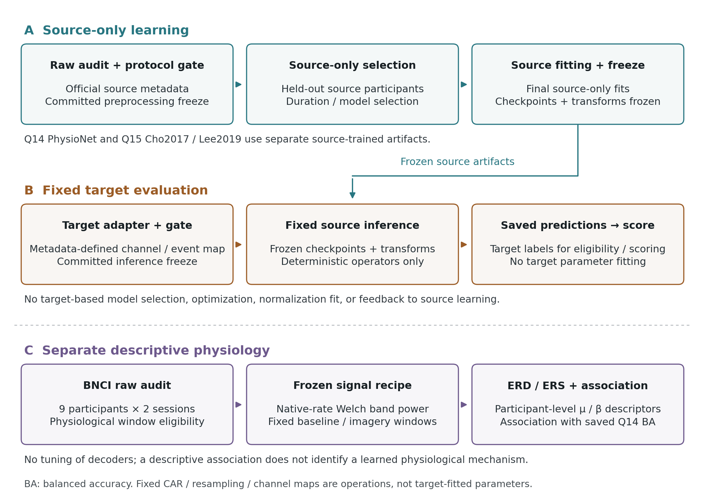
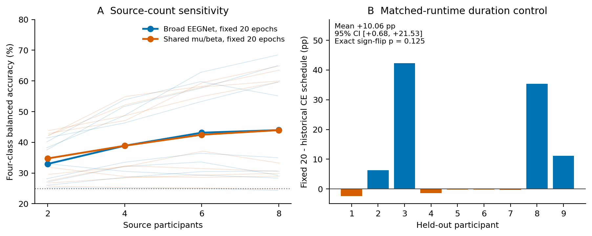
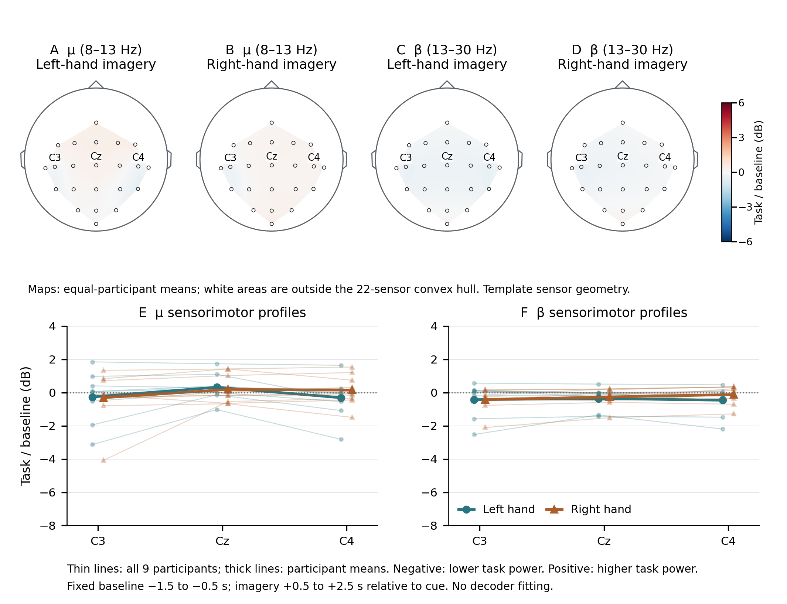
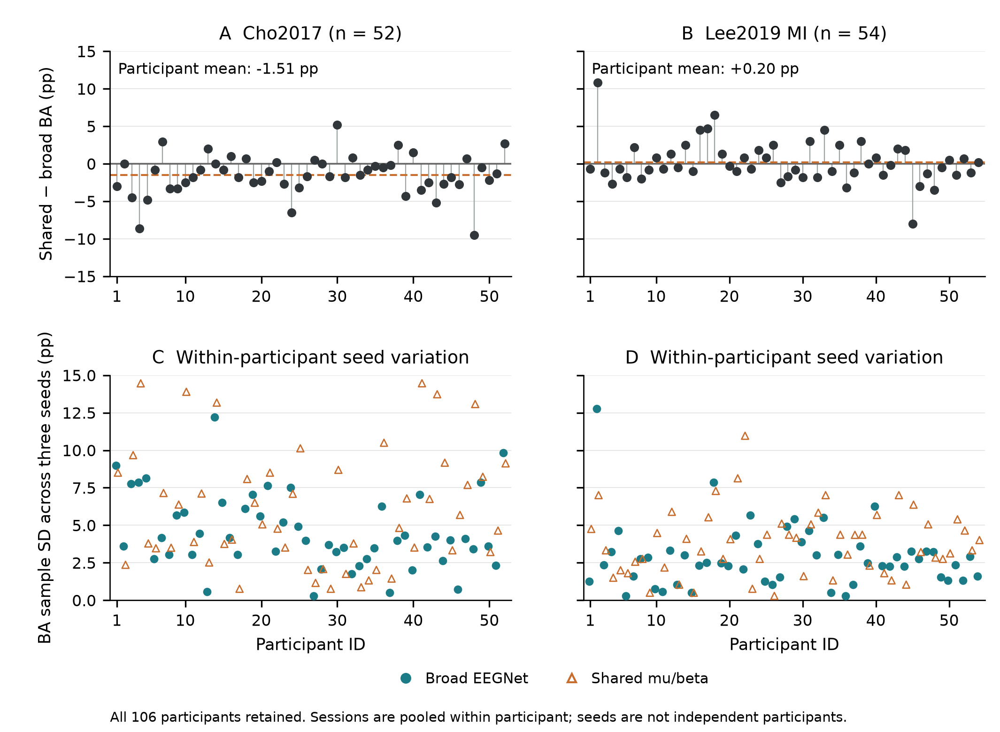
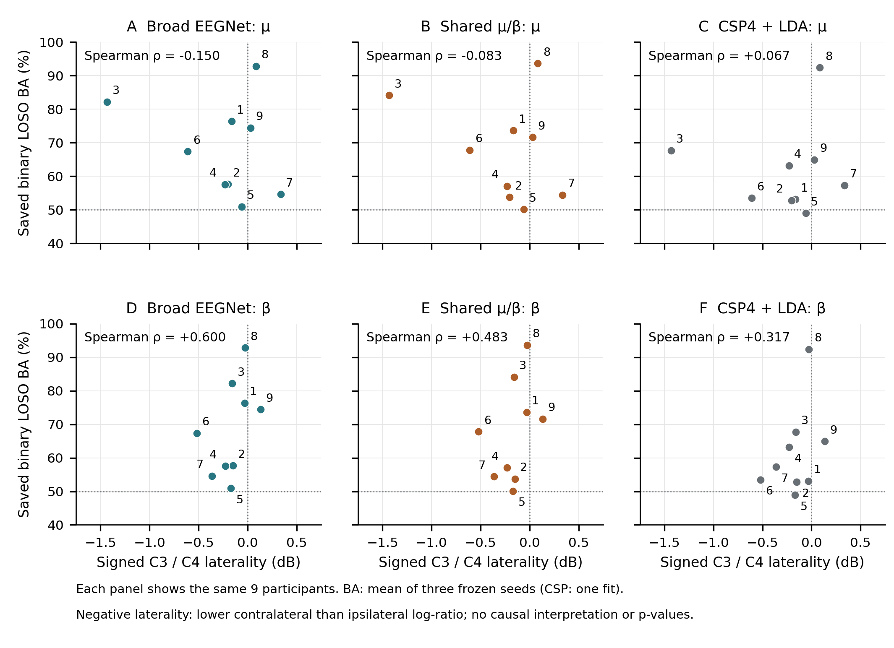

# Source-only model selection and limits of fixed spectral-sharing pipelines in cross-subject motor-imagery EEG decoding

*Strict zero-calibration evaluation with separate external cohorts and BNCI sensor-level physiology*

Ziyuan Zhu (corresponding author)

College of Artificial Intelligence Medicine, Chongqing Medical University, Chongqing, China

Correspondence: zzy2630816871@gmail.com

Postal address: Jinyun Campus, Chongqing Medical University, No. 61, Daxuecheng Middle Road, Shapingba District, Chongqing 401331, China

7 October 2026

## Abstract

Objective. We audited source-only training-duration selection and evaluated fixed shared mu/beta input pipelines for cross-subject motor-imagery EEG decoding. Approach. An exploratory four-class study used nine BNCI2014_001 participants, excluding both target sessions from each corresponding model fit and duration selection. Separate frozen binary pipelines were evaluated on PhysioNet (109 people), Cho2017 (52) and Lee2019 offline-training runs (54, two sessions), without target fitting or adaptation. We re-audited saved predictions and source partitions. A BNCI signal analysis, specified after decoder outcomes were known, described baseline-relative mu/beta power and associations with saved binary LOSO balanced accuracy. Main results. Mean-rank duration selection increased internal balanced accuracy from 33.72% to 42.67% compared with mean-loss selection; S3 and S8 contributed 87.57% of the aggregate gain. A matched-runtime fixed-duration control improved four of nine people despite a positive mean. Shared-minus-broad external differences were +0.573 percentage points (pp) on PhysioNet (95% person-bootstrap interval [−0.097,1.242]), −1.513 pp on Cho2017 [−2.249,−0.804] and +0.204 pp on Lee2019 [−0.515,0.969]. Cho2017 and Lee2019 Holm-adjusted permutation p-values were 0.000100 and 0.604. These complete-pipeline contrasts used unequal source-selected durations. The BNCI signal analysis retained all 5,184 trials; its 2,592 hand-imagery trials gave mean signed laterality of −0.250 dB in mu and −0.168 dB in beta, with signs varying between people. Significance. Training-duration choices yielded large but concentrated gains in this development benchmark. Shared-input pipelines showed no consistent external advantage. BNCI sensor patterns provide descriptive context; nine-person associations do not establish a decoder mechanism. Unknown voltage calibration and offline evaluation limit deployment conclusions.

Keywords: motor imagery; EEG; cross-subject decoding; EEGNet; source-only model selection; spectral parameter sharing; external evaluation; reproducibility.

## 1. Introduction

Motor-imagery EEG decoding must distinguish imagined actions in scalp recordings whose spatial and spectral structure varies between people. A calibration-free model should transfer to a new person without fitting to that person’s labels or distributional statistics. This requirement differs from within-person evaluation and adaptation using unlabeled target recordings. BCI Competition IV dataset 2a is a small, well-documented benchmark [1,2], but its nine participants make the cohort mean especially sensitive to a few large changes. Reviews and multi-dataset evaluation frameworks document variation between datasets and show how evaluation design shapes reported performance [3,4].

A decoder that predicts predominantly one class can have balanced accuracy near chance even when the same architecture performs well after a different training duration. This failure may be attributed to an input distribution that requires normalization or a different representation, overlooking the role of model selection. Likewise, an increase in average balanced accuracy may reflect recovery in one or two participants rather than consistent improvement across people. Source-only fitting prevents target leakage within each fit, but it does not provide independent confirmation when the research programme was developed after examining the same benchmark.

We address three questions. First, can heterogeneous source-validation loss curves lead to very short training schedules, and does within-fold rank aggregation change those schedules? Second, how does a pipeline that processes predefined mu/beta views with one shared EEGNet compare with broad input, alongside spatial, capacity, and robustness controls? Third, how do the complete source-selected pipelines perform in external binary transfer? A separate descriptive analysis characterizes measured BNCI sensor signals without changing the decoders. The external evidence comprises an earlier PhysioNet evaluation [5,6] and a subsequently frozen, separately fitted pipeline for Cho2017 [7,8] and Lee2019 [9,10]. The evaluations use different channel sets and time windows and are reported separately.

Here, we audit source-only model selection as part of cross-subject decoder evaluation [11]. The development analyses trace how training-duration decisions affect apparent model failure and distinguish concentrated aggregate gains from participant-level benefit. Separate frozen external evaluations retain adverse and uncertain outcomes, with participants as the unit of inference. A downstream BNCI sensor analysis adds measured-signal context while keeping physiological description separate from decoder attribution.

## 2. Related Work

Classical motor-imagery decoders use spatial and spectral structure. CSP estimates discriminative spatial projections from class covariance structure [12], and filter-bank CSP combines spatial features across frequency bands [13,14]. These methods inform the spatial and spectral controls used here. The implemented filter bank is FBCSP-inspired rather than an exact reproduction; its projections, feature scaling and classifiers are fitted on source partitions under the same target-information restriction as the neural models.

EEGNet combines temporal filtering, depthwise spatial filtering and separable convolutions in a compact architecture [15]; broader CNN work investigates learned EEG decoding and visualization [16]. Our shared-input model processes predefined mu and beta views with one configured EEGNet and averages their class logits. Its parameter count matches one branch, but computation on two views and shared BatchNorm exposure differ. These bands define experimental input views; they do not provide verified physiological source separation.

Algorithm reviews and multi-dataset benchmarks document performance variation between methods, people and datasets [3,4]. Domain-generalization evaluation must also account for model selection [11]. Here, fitting is restricted to source participants within a repeatedly used development benchmark, followed by external evaluation of frozen pipelines. Methods that fit on target labels or unlabeled target distributions have a different information budget and were not compared directly.

Recent domain-generalization studies seek invariance across source domains for unseen-subject motor-imagery decoding. EEG-DG aligns marginal and conditional distributions across multiple source domains [17]. Zheng et al. combine spectral/task knowledge distillation with cross-source correlation alignment and distance regularization [18]. These approaches pursue source-only generalization without target adaptation, although a matched comparison still requires compatible information budgets and selection procedures. Our contribution is an audit of source-only model selection, participant heterogeneity and complete frozen-pipeline transfer, with adverse and null results retained in a traceable evidence record. We do not introduce a new domain-generalization algorithm or rank the evaluated pipelines against these methods.

EEG pretraining offers another route to transferable representations. LaBraM learns generic representations from large EEG collections [19], while EEGPT uses pretrained transformers for transferable EEG representations [20]. Fair comparison requires the pretraining data, downstream fitting procedures and computational budgets to be specified. Neither model was evaluated here, and equivalence to our target-information contract was not established; the findings concern the selected source-only pipelines.

Event-related desynchronization and synchronization describe decreases and increases in spectral power relative to a reference interval [21]. Earlier motor-imagery work investigated sensorimotor rhythm changes [22]. These concepts guide the separate characterization of measured signals, for which the baseline and estimator are specified explicitly. Scalp power patterns do not establish anatomical source localization or demonstrate that a learned decoder used those patterns.

## 3. Materials and Methods

### 3.1. Experimental Design

The study comprises exploratory development and two external-evaluation stages. In the four-class BNCI2014_001 development stage, both sessions of each target person are excluded from the corresponding fitting and duration selection. Earlier benchmark outcomes informed later candidates, so the nine-person comparisons remain exploratory. The earlier PhysioNet external evaluation (Q14) applies separately fitted binary BNCI models to PhysioNet; a metadata-driven sampling-rate amendment followed partial target execution. The frozen Cho2017/Lee2019 transfer experiment (Q15) uses a new binary source pipeline with a different montage, crop and reference, evaluating its frozen broad, shared-input and CSP models on Cho2017 and Lee2019 offline-training segments. These datasets are external to fitting, but participant identity nonoverlap across providers was not independently established.

The primary external estimand is the mean paired balanced-accuracy difference between the frozen shared-input and broad pipelines, with equal weight for each person and separate estimates for each cohort. The PhysioNet evaluation uses 17 shared and 18 broad epochs; the frozen Cho2017/Lee2019 evaluation uses 19 shared and 14 broad epochs, all selected on source data. Each contrast therefore evaluates complete selected pipelines rather than the isolated effect of sharing. CSP provides context, and neither external stage compares rank with mean-loss selection. The descriptive BNCI physiological analysis (Q16) was defined after decoder results were known and uses BNCI signals only. Its raw-signal summaries and associations provide no feedback into the decoders and cannot establish their physiological mechanism.

**Figure 1.** Study workflow and information boundaries. Both sessions of each internal target person are excluded from the corresponding source fit; these development analyses remain exploratory. Q14 and Q15 use separate binary models and preprocessing contracts. At inference, deterministic adapters and frozen source-derived transformations are applied without fitting, adaptation or BatchNorm updates. Event and class metadata establish eligibility and canonical label mapping; ground-truth labels are used for scoring. The separate BNCI-only physiological analysis reads native signals and labels after decoder outcomes are known, without feeding back into fitting or selection. Results are aggregated by person. Q14's post-partial-run amendment and the external differences in selected duration are described in the Methods and comparison-fairness table.

### 3.2. Datasets, Populations and Task Separation

BNCI2014_001 corresponds to BCI Competition IV dataset 2a [1,2]. Nine participants completed two recording sessions, each containing six runs of 48 trials: 12 each of left-hand, right-hand, feet, and tongue imagery. Twenty-two EEG channels and three EOG channels were sampled at 250 Hz. Acquisition used a left-mastoid reference, right-mastoid ground, 0.5–100 Hz band-pass, and 50-Hz notch; the offline operations below were applied in addition to this acquisition processing. The primary neural input contains EEG channels only. The archived metadata contain 5,184 trials, 576 per participant and 1,296 per class. All 488 expert artifact-flagged trials remain in the primary evaluation population. Including all trials differs from the original competition’s artifact-free scoring; source-clean conditions exclude flagged source-training trials but retain every target trial.

The external EEG Motor Movement/Imagery Database version 1.0.0 [5] provides a separate binary task. We include all 109 subjects and only imagery runs 4, 8, and 12; T1 and T2 denote left- and right-fist imagery. Executed-movement, bilateral-task, and rest events are excluded from this contrast. The final audited inventory contains 327 EDF files verified against official checksums and 4,918 unique trials. Although the acquisition description specifies 160-Hz sampling, the file headers identify three subjects with 128-Hz recordings. Four-class and binary balanced accuracy have different chance levels and are reported separately.

Cho2017 [7,8] provides left/right-hand imagery recordings from 52 people at a native sampling rate of 512 Hz. The audited evaluation retains 10,520 imagery trials: 49 people have 200 trials and three (S7, S9, S46) have 240. The Lee2019 motor-imagery data [9,10] contain 54 people recorded at 1,000 Hz in two sessions. We retain only EEG_MI_train, the provider’s offline-training runs, giving 100 trials per session and 10,800 trials in total. EEG_MI_test, other paradigms, and non-imagery events are excluded. The provider’s term “train” identifies a recording segment; these external trials were used only for inference and scoring, never for parameter fitting. The three external cohorts cannot be assumed to represent 215 independently verified unique identities across providers.

**Table 1. Distinct populations and computational endpoints.**

| Analysis | People | Classes | Unique trials | Primary tensor |
| --- | --- | --- | --- | --- |
| Internal BNCI | 9 | 4 | 5,184 | 22 × 750 at 250 Hz |
| Q14 binary BNCI source | 9 | 2 | 2,592 | 22 × 480 at 160 Hz |
| Q14 external PhysioNet | 109 | 2 | 4,918 | 22 × 480 at 160 Hz |
| Q15 binary BNCI source | 9 | 2 | 2,592 | 21 × 320 at 160 Hz |
| Q15 external Cho2017 | 52 | 2 | 10,520 | 21 × 320 at 160 Hz |
| Q15 external Lee2019 | 54 | 2 | 10,800 | 21 × 320 at 160 Hz |

Both sessions of each BNCI outer target are held out. Q14 and Q15 have separate binary source fits and preprocessing contracts, and neural inputs contain EEG channels only. Prediction rows repeat trials across models and seeds; they are not independent participants. Lee sessions are pooled within person for the primary endpoint.

### 3.3. Strict Zero-calibration Information Contract

Within each evaluation fit, strict zero-calibration means that no parameter, state, preprocessing coefficient, hyperparameter, duration, seed, decision threshold or model choice is fitted or selected using the current target person’s recordings or labels. Neural weights and BatchNorm statistics, shallow-model coefficients, source-fitted transforms and source-selected schedules are fixed before target inference. Target data are not used to fit normalization, covariance alignment or adaptation, update BatchNorm, stop training or select seeds. This restriction applies to each fit; it does not make the repeatedly used BNCI development programme independent of earlier target outcomes.

Target EEG provides model inputs; event and class metadata determine declared eligibility and canonical label mappings. Labels are then used to score saved predictions. Cho recordings are stored in class-specific containers, so the adapter has access to native class metadata. Fixed filtering, channel selection, resampling and common-average referencing operate on target signals without fitting a target-dependent decoder. The Q15 Helmert basis depends only on channel count; scalers, CSP/PCA, whitening and EOG-regression coefficients, where used, are estimated on source-training data and applied unchanged. Separate physiological summaries use raw signals and labels but provide no feedback into bands, crops, weights, thresholds, schedules or model choice.

The absence of target fitting does not establish physical acquisition calibration. Q15’s native-numeric-as-microvolt convention does not verify the exported voltage units. Earlier within-person and cross-session P2 models use target-person labelled calibration and remain outside the strict zero-calibration endpoints. The source-fitted P4 EOG regression requires synchronous target EOG and thus additional sensors, although it fits no target coefficients.

**Table 2. Target information and fitting boundaries.**

| Operation | Information read | Target fitting | Interpretation |
| --- | --- | --- | --- |
| Eligibility, fixed channel and class maps, cue indexing | Native rate/channel/event/class metadata | None | Declared metadata adapter |
| Filtering, resampling, crop and Q15 CAR | Target EEG, fixed native metadata | None | Deterministic offline operations |
| Q15 Helmert coordinates | Channel count and signal | None | Analytical CAR-subspace basis |
| Source-fitted scaler/CSP/PCA/whitening/EOG regression | Source data to fit; target signal to apply | None | Frozen source coefficients; EOG needs extra sensors |
| Neural inference | Target tensors | None; weights and BatchNorm fixed | Strict zero-calibration prediction |
| Scoring and separate Q16 characterization | Predictions/raw signals and canonical labels | None | Downstream analyses with no decoder feedback |
| P2 within-person or cross-session models | Target-person labeled training trials | Yes | Calibrated context; separate endpoint |

The restriction applies to fitting and selecting the corresponding decoder. It permits deterministic computation on target signals, metadata inspection, and label use for scoring and separate physiology. These boundaries do not make the development history outcome-blind.

### 3.4. Offline Preprocessing and Source-only Partitions

For internal BNCI analyses, fourth-order zero-phase Butterworth filters are applied within each native recording run before epoch extraction. The half-open interval [2.5,5.5) s after the MAT trial start corresponds to [0.5,3.5) s after the cue and yields 750 samples. The primary neural pipeline applies no baseline subtraction, additional notch, or additional re-reference. MNE-loaded values in volts are multiplied by 10^6 to give network inputs in microvolts. These offline zero-phase operations use future samples, so this pipeline does not constitute a causal online decoder.

The broad mean-loss and mean-rank EEGNet conditions use 4–40 Hz input. Restricted broad input uses 8–30 Hz, and the shared representation uses fixed mu (8–13 Hz) and beta (13–30 Hz) views. These predefined bands are experimental choices; they are neither participant-specific estimates nor physiological source separation. Any fitted scaler, CSP/PCA projection, or whitening transform is estimated only on the applicable source-training partition.

Each primary four-class outer split holds out both sessions of one participant. The eight source people contribute 4,608 trials and the target contributes 576. Sorted source IDs define four consecutive, two-person inner-validation groups. Each inner fit trains on six people/3,456 trials and validates on two people/1,152 trials. Thus, source training and validation are separated by person. Final evaluation uses three fixed seeds, with scores averaged within person before aggregation across people. BatchNorm statistics remain fixed during model evaluation and are not updated by target examples.

### 3.5. Training-duration Selection and Diagnostic Controls

The mean-loss rule selects the earliest epoch that minimizes validation cross-entropy averaged with equal weight across the four inner folds. Candidate epochs are 1–40. The mean-rank rule ranks epochs within each fold by validation cross-entropy, assigns average ranks to ties, averages the ranks across folds, and selects the earliest minimum. This rule is invariant to strictly increasing (order-preserving) transformations of the losses within each fold, although that property does not guarantee better target prediction. The rank follow-up reuses the 36 frozen original inner trajectories and trains 27 new final models after the schedule has been frozen.

Selected epoch = earliest argmin over e of (1/K) Σ_k rank_k[L_k(e)].

The rank candidate was motivated by earlier results on the same BNCI participants, so the internal comparison remains exploratory despite source-only selection within each fit. A four-cell diagnostic for S3 crosses raw and source-normalized input with two and 16 fixed epochs. Here, raw input means filtered, microvolt-scaled EEG without fitted source normalization. Two cells reuse the archived original conditions and two are new diagnostic conditions preserved in the archive; the comparison involves one participant and does not provide population-level replication. Source normalization estimates per-channel mean and scale from source-training samples only.

Later controls compare fixed 20-epoch training with raw-loss-selected schedules. A matched-runtime experiment retains the historical source-selected epoch counts but retrains the 27 final models using the same runtime and raw files as the fixed-duration comparator. Epochs are not reselected under the newer runtime. Source-count controls use k = 2, 4, or 6 source participants, four predefined identity subsets per count, and the k = 8 anchor; all counts use fixed 20 epochs. The 0train-versus-1test source-session contrast has equal training budgets: 2,304 trials, 20 epochs, and 720 optimizer updates per fit. Source-count contrasts and comparisons of one source session with the both-session anchor change both the number of training examples and optimizer updates, preventing attribution to a single causal factor.

The population raw-versus-source-normalized Q5/Q6 comparison also changes the selected duration for S3 from 2 to 16 epochs and S5 from 13 to 12. Its aggregate difference therefore cannot be attributed solely to normalization. The fixed-duration Q7 four-cell diagnostic separates normalization and duration more directly, but only for S3.

### 3.6. Neural Representation and Baseline Fairness

The four-class model is Braindecode 1.5.1 EEGNet with 22 input channels, 750 samples, F1 = 8, depth multiplier D = 2, F2 = 16, temporal kernel length 64 samples, and dropout 0.25. It has 2,932 trainable parameters in the archived implementation. Training uses Adam, learning rate 0.001, batch size 64, cross-entropy, zero weight decay, and no scheduler or default augmentation. The selection seed is 20260923 and the three final seeds are 20260924, 20260925, and 20260926. This is a configured EEGNet study, not an exact reproduction of the original paper’s preprocessing or splits [15].

For shared mu/beta input, both band views pass through the same EEGNet in one concatenated mini-batch. Their class logits are averaged before cross-entropy during training and before softmax during inference. Network parameters and BatchNorm are shared, while dropout acts per view. The model has no learned band weights, attention mechanism, or independently trained branches. Its parameter count matches one EEGNet, but forward-pass computation and preprocessing differ.

Shared prediction: p = softmax[(fθ(Xμ) + fθ(Xβ))/2].

Controls include individual frequency bands; fixed source-selected durations; Welch log-bandpower with source-fitted shallow classifiers; eight source-only CSP or PCA time-series projections per band; log-Euclidean covariance features; source-only normalization; and source-clean training. The CSP/PCA neural controls both use 16 projected channels and source-fitted standardization. Their input widths therefore match each other but differ from the 22-channel shared-logit model. Architectural ablations use two independent networks, early band stacking, four shared bands, and a broadband capacity comparator. The independent two-band model has 5,864 parameters and its comparator has 5,914, a 0.85% mismatch. The traditional filter-bank implementation is FBCSP-inspired rather than a literal reproduction of Ang et al. [13,14].

**Table 3. Matching and remaining differences in decoder comparisons.**

| Comparison | Matched aspects | Remaining difference / scope |
| --- | --- | --- |
| Q5 mean-loss vs Q8 mean-rank | Nine-person all-trial LOSO, 22×750, 4–40 Hz, original 36 inner trajectories, final seeds | Schedule changes; candidate arose after BNCI outcomes; exploratory |
| Q5 raw vs Q6 source normalization | Same all-trial targets and EEGNet family; source-only scaler fit | Selected epochs also change: S3 2→16, S5 13→12; not normalization alone |
| Q7 S3 raw/normalized ×2/16 epochs | Epochs fixed within each raw/normalized pair | One-person diagnostic |
| Q9 broad vs shared, reselected durations | Same targets, dimensions, EEGNet parameter count, optimizer/seeds | Bands, two-view computation, BatchNorm exposure and schedules differ |
| Q9-E002 fixed-schedule broad/shared | Same targets and frozen Q8 per-target epochs | Duration-controlled sensitivity; views/computation still differ |
| Q10 CSP vs PCA neural projections | Eight source-fitted components per band; 16 projected channels and source scaling | Matched to each other, not to 22-channel shared-logit input |
| Q11 independent branches vs capacity comparator | Same targets; approximate trainable capacity | 5,864 vs 5,914 parameters; branch computation/normalization differ |
| Q12 GroupDRO vs balanced ERM | Same runtime and batching/sampling policy | Declared objective comparison |
| Q12 whitening/augmentation vs historical Q8 | Same nominal target population and source-only rule | Historical baseline uses another runtime |
| Q13 fixed20 vs matched-runtime CE schedule | Same actual runtime, raw files and three seeds | Historical epochs replayed, not reselected in the newer runtime |
| Q13 source-session 0train vs 1test | 2,304 source trials, 20 epochs, 720 updates | Session composition changes; both-session anchor also changes exposure |
| Q14 external broad vs shared | 109 people/4,918 trials; 22×480; same source seeds and target rule | 18 vs 17 epochs; metadata amendment after partial execution |
| Q15 external broad vs shared | Identical people/trials within cohort; 21×320 adapter, neural family/seeds | 14 vs 19 epochs and one-view vs two-view processing |
| Q14/Q15 CSP4+LDA context | Same cohort scoring population; source-only fit | One shallow model vs three neural seeds; Q15 Helmert; differs from Q4 CSP8/OAS |

Each comparison controls the aspects listed, while retaining the stated implementation differences. Q14/Q15 therefore compare complete frozen pipelines. Matching selected aspects does not isolate every causal factor, and the CSP comparisons remain descriptive.

### 3.7. Source-only Robustness Interventions

The six completed robustness conditions are source-pooled whitening, source-balanced empirical risk minimization (ERM), source-group distributionally robust optimization (GroupDRO), channel dropout, gain perturbation, and their combination. Source whitening uses equal-person covariance aggregation, a ridge of 5% of the mean eigenvalue, and scale preservation; no target covariance or alignment is fitted. GroupDRO treats each source person as a group [23]. Persistent log weights increase by 0.05 times detached per-group cross-entropy, are normalized by log-sum-exp, and weight the group loss. Its matched comparator is balanced ERM, which preserves the batching/sampling intervention. Training-only channel dropout uses probability 0.1 with surviving-channel scale 1/0.9; gain perturbation uses U[0.8,1.2] and precedes dropout in the combined condition. Validation and target inputs are not augmented.

Whitening and augmentation conditions are compared with the previously frozen broad rank-selected baseline. The historical baseline ran on a different runtime from the robustness batch, so these differences reflect both intervention and runtime variation. GroupDRO versus balanced ERM provides a within-runtime comparison of training objectives. This distinction accompanies the numerical table and limits attribution of cross-batch differences to the named interventions.

### 3.8. Earlier Binary Source Freeze and PhysioNet Evaluation (Q14)

The binary BNCI source population contains 2,592 left/right trials, 288 per person. Filtering and epoching occur at 250 Hz before deterministic polyphase resampling by 16/25 to 160 Hz, giving 22 × 480 samples. The broad binary model uses 8–30 Hz; the shared model uses the fixed mu/beta views. Source-only duration selection across all nine participants uses validation groups comprising people 1–2, 3–4, 5–6, and 7–9, with equal fold weighting. The frozen training durations are 18 epochs for the broad model and 17 for the shared model. Checkpoints, channels, labels, contrast, seeds, and preprocessing are fixed before external access. The source-only CSP4 + LDA comparator uses reg = None and LDA solver = svd; it differs from the internal CSP8 OAS/shrinkage-LDA configuration. The external neural comparison evaluates complete pipelines with different source-selected durations and therefore cannot isolate parameter sharing.

A partial external run stopped at S88 because its 128-Hz header violated the original 160-Hz assumption. A versioned amendment used metadata from the remaining headers without consulting predictions or scores. S88, S92, and S100 are filtered and epoched at their native rate, then resampled by 5/4 from 384 to 480 samples. The other 106 subjects retain native 160-Hz processing. The 87 completed subject outputs from the earlier run are copied byte-for-byte, and 22 additional subjects complete the cohort. The amendment introduces no target statistics, fitted normalization, adaptation, seed selection, or class-performance-dependent processing. Because it followed partial external execution, the combined result does not represent an unmodified execution of the original freeze.

The original aggregate validation failed because it applied an inappropriate exact floating-point equality check to re-serialized CSV probabilities. A separate cross-host runtime mismatch later prompted a versioned portability amendment. Both limitations are documented. The versioned validation-only audit checked official EDF checksums and event identities and recomputed saved probability/argmax consistency, subject metrics, and statistics. It passed with zero new fits and zero new model-inference rows. It therefore validates saved outputs; it does not regenerate all external predictions from checkpoints on the later validation host.

### 3.9. Frozen Cho2017/Lee2019 Transfer (Q15)

The frozen Cho2017/Lee2019 study is a separate binary transfer experiment using different checkpoints from Q14. All nine BNCI participants supply 2,592 left/right trials. The common ordered montage comprises Fz, FC3, FC1, FC2, FC4, C5, C3, C1, Cz, C2, C4, C6, CP3, CP1, CPz, CP2, CP4, P1, Pz, P2, and POz. Each trial is processed in a fixed native-rate context from −1.5 to +4.5 s relative to the cue. Common-average reference is computed across these 21 selected channels, followed by native-rate zero-phase second-order-section Butterworth filtering with prototype order four. Broad input uses 8–30 Hz; the shared views use 8–13 and 13–30 Hz. Deterministic polyphase resampling yields 160 Hz, followed by the half-open cue crop [0.5,2.5) s, equivalent to samples [320,640) of the resampled six-second context. The resulting model tensor is 21 × 320. These preprocessing and input differences preclude interpreting a comparison with Q14 as an effect of external provider alone.

The Q15 adapter interprets native numeric values as microvolts by convention. Physical voltage calibration, the original Cho hardware reference, and hardware cue latency have not been independently verified. The first 64 of the Cho payload’s 68 rows are EEG; four EMG rows are excluded. Channel mapping follows the publication’s numbered montage because the payload does not supply names. Cho native labels left = 1 and right = 2 are retained. Lee native labels left = 2 and right = 1 are deterministically mapped to canonical left = 1 and right = 2. Lee MATLAB cue indices are converted using t − 1; the provider’s stored segments align with Python t, leaving a disclosed one-sample (1-ms) indexing discrepancy that was not changed using outcome scores. The supplement documents these adapter assumptions and the file-level checks.

Source-only duration selection uses four groups comprising people 1–2, 3–4, 5–6, and 7–9, candidate epochs 1–40, equally weighted mean within-fold cross-entropy ranks, and the earliest minimum. Final durations are 14 broad epochs and 19 shared epochs. The selection seed is 20260923, and final seeds are 20260924–20260926. Training uses the same configured EEGNet family, optimizer, and fixed-band logit averaging described above, with the Q15 channel/time dimensions. A source-fitted CSP4 + LDA comparator applies a fixed 21-to-20 Helmert coordinate transform after common-average reference, followed by source-only fitting. The external neural comparison evaluates two complete frozen pipelines with different source-selected durations and cannot isolate parameter sharing or band decomposition alone. Source training comprises eight inner neural fits, six final neural fits, and one shallow fit: 15 in total. Migration reused these artifacts without additional source or target fitting.

Official raw metadata for 18 BNCI files and all declared Cho/Lee files were audited before the preprocessing specification was committed; its pre-fit publication was recorded at 2026-10-04 01:33:03 UTC. Source training was completed at 01:52:42 UTC. The separate inference freeze was committed on 2026-10-05 at 09:31:05 UTC, before external prediction, fixing channels, timing, label adapters, transformations, checkpoints, seeds, scoring units, and primary statistical procedures. Event metadata may be inspected to determine preprocessing eligibility, but external labels are not used for fitting or model selection. BatchNorm remains in evaluation mode; there is no target alignment, normalization fit, adaptation, or post hoc seed selection. These repository-defined freezes followed external metadata inspection and do not constitute independently registered preregistration.

All 52 Cho2017 and 54 Lee2019 participants were processed under the declared adapters. The archived independent computational validator replays processing from raw data to epochs and predictions from the frozen models, checks canonical events and scoring populations, verifies links to inference and source artifacts, and recalculates aggregate statistics. Validation passed subject to the stated acquisition-calibration limitations. The supplementary reproducibility documentation identifies the exact input, parameter, checkpoint and result revisions.

### 3.10. BNCI-only Physiological Signal Characterization (Q16)

The BNCI characterization separately describes native BNCI2014_001 recordings: 18 files, 108 motor-imagery runs, nine people and both sessions, retaining all 5,184 four-class trials and their artifact flags in the primary population. The signals retain all 22 EEG sensors at native 250 Hz, with no additional bandpass, notch, resampling, reference transform, source scaler or learned projection. Three EOG channels are excluded. EEG column order follows the provider montage; individual MAT files do not contain channel-name strings. Native one-based trial starts are converted to zero-based samples; the cue is 500 samples after the trial start. The fixed cue-relative baseline is [−1.5,−0.5) s and the task window is [0.5,2.5) s. Before power calculation, all originals are rehashed against archived source provenance, and labels, artifact flags, finite samples, montage order and complete window bounds are checked. All 18 source SHA-256 digests, 5,184 event identities and 228,096 trial-channel-band eligibility rows passed these checks; no trial was excluded by a power guard. The primary population retained all 488 flagged trials, including 246 of the 2,592 hand trials.

Welch power is defined separately within each trial’s baseline and task windows using float64 native numeric values, a periodic Hann taper, 250-sample segments, 125-sample overlap, 250-point FFT, linear detrending, one-sided density and arithmetic segment averaging. This gives 1-Hz bins. Closed 8–13-Hz and 13–30-Hz masks are integrated with the trapezoidal rule in physical frequency; the 13-Hz boundary supplies half-bin weights to the adjacent integrals. The trial-level change is 10 log10(Ptask/Pbaseline), in dB. Nonfinite or nonpositive powers require an explicit invalid-row receipt rather than an epsilon or clipped ratio. The 1-s baseline contributes one Welch segment and the 2-s task contributes three overlapping segments. Unequal log-power estimator variance can create a positive offset even without a true power change, so these dB summaries are not claimed to be unbiased ERD estimates.

Arithmetic mean trial dB is aggregated within person, session, class, channel and band, followed by equal averaging of the two sessions. This averages log ratios rather than taking the logarithm of averaged powers. Left/right-hand C3/C4 summaries use common trial eligibility. The signed hand descriptor is L = [(C3right − C4right) + (C4left − C3left)]/2. A negative descriptor means the contralateral task/baseline change is lower than the ipsilateral change; it does not alone establish absolute contralateral ERD. C3, Cz and C4 absolute changes, separate hand terms, full scalp summaries, sessions and artifact strata are retained to show that distinction.

The physiological parameters were fixed on 6 October 2026 after the decoder outcomes were known and before the physiological calculations. The analysis is therefore descriptive and does not provide independent confirmation. Associations use existing matched-binary Q14-E001 BNCI LOSO scores, averaged over the three fixed neural seeds within each of the same nine people; all-nine-source fits and external-cohort scores are excluded. The broad EEGNet score is the designated descriptive endpoint. Six Spearman coefficients cover the three fixed models and two fixed bands, with no p-values, tertile groups or outcome-selected bands/models. Decoder imagery covers [0.5,3.5) s, whereas the physiological power analysis covers [0.5,2.5) s. No external physiology was calculated, and no physiological output was used to fit, select or update a decoder. The parameter freeze is commit 050e01b028aaab8e3d745934b13b2d17e9bb0a7a; its public readback preceded raw-power calculation. The preprocessing freeze, raw-data receipt, execution manifest and final independent validation link the specification and inputs to the completed tables in Q16-P001-BNCI-20261006.

### 3.11. Statistical Analysis

Balanced accuracy = (1/C) Σ_c TP_c/(TP_c + FN_c).

The held-out person is the unit of statistical inference. Paired seeds are averaged within person; predefined source-identity subsets are averaged within person and source count. Shallow conditions have one prediction per trial rather than three independent neural seeds. Paired differences are expressed in balanced-accuracy percentage points (pp). Person-bootstrap percentile intervals resample people, not trials, sessions, seeds, or source subsets. External intervals describe variation across target people conditional on the frozen source models; they do not quantify source-cohort sampling uncertainty. Internal analyses remain exploratory because benchmark outcomes informed the research program and outer training sets overlap. For Lee2019, the two retained sessions are pooled before calculating each person/seed balanced accuracy. The three neural-seed scores are then averaged within person, giving an average of scores rather than an ensemble of probabilities. A single CSP score is retained per person. Cross-cohort score differences are descriptive because Q14 and Q15 differ in source preprocessing and checkpoints.

For each archived experiment, we report its original statistics and the interval resampling procedure. Rank-selection intervals use 20,000 person-bootstrap draws with seed 20260923. The archived shared-minus-broad representation contrast and robustness intervals use 20,000 draws with seed 20260924. Source-composition and matched-runtime intervals use 10,000 draws with seed 20260926 and exhaustive two-sided sign flips over nine participant differences; familywise exploratory p-values use Holm correction within the frozen families. The earlier PhysioNet primary contrast uses 20,000 draws with seed 20260924 and an exact two-sided binomial sign test excluding exact zero differences. Its primary hypothesis is shared-minus-broad; contextual comparisons with CSP do not replace it. A supplementary numerical audit uses 200,000 draws with seed 20261002 and is labelled separately. An interval excluding zero need not agree with every small-sample test. For Q15, the predeclared family contains exactly two shared-minus-broad contrasts, one for each external cohort. Percentile person-bootstrap intervals use 20,000 draws with seed 20260924 [24]. Two-sided person-level sign-flip tests use 20,000 Monte Carlo draws with seed 20261003, assuming sign exchangeability of paired person effects under the null, evaluating the absolute mean, and applying the (exceedances + 1)/(20,000 + 1) correction [25]. Holm adjustment controls this two-contrast family [26]; it does not retroactively include the earlier PhysioNet or internal hypotheses. The smallest attainable Monte Carlo p-value is 1/20,001. The intervals are unadjusted 95% intervals, and CSP comparisons are descriptive context. Descriptive Q15 counts of positive, negative, and tied person effects use an absolute 10^−15 tolerance for ties; the frozen primary bootstrap and sign-flip calculations retain the saved numerical effects.

One historical rank-selection script labelled a nine-person binomial calculation as a sign test while retaining two unchanged participants in its denominator. We report its p = 0.1797 as an archived nine-person sign sensitivity. A conventional tie-excluding calculation uses seven nonzero changes and gives p = 0.015625; the paired t-test gives p = 0.111. These procedures are reported separately rather than treated as interchangeable or used to select a favourable result. Multiplicity corrections from later declared families are not retrospectively applied to unrelated earlier statistics.

The physiological characterization was specified after decoder outcomes were known and remains descriptive. Physiological aggregation and decoder associations use nine person-level records; channels, trials, sessions and seeds are not treated as independent people. The six Spearman coefficients have no physiological p-values or confirmatory testing family. They are separate from Q15’s frozen two-cohort tests and cannot retrospectively confirm the decoder contrasts.

### 3.12. Reproducibility and Validation Scope

Saved predictions were independently reaggregated to check trial identities, scoring populations, person-level confusion matrices, seed-averaged scores and reported statistics. This numerical reanalysis neither loaded decoder checkpoints nor generated predictions. The Cho2017/Lee2019 experiment also underwent a completed replay from raw data to epochs and frozen-model predictions; the earlier PhysioNet portability audit checked saved outputs without replaying inference. Validation of earlier experiments remains experiment-specific, as documented in the supplement.

The physiological analysis was checked independently against native BNCI recordings. An explicit detrending, periodic-Hann FFT and trapezoidal integration calculation reproduced all 31,104 C3/Cz/C4 trial-band pairs: the maximum relative power difference was 1.85 × 10^−15 and the maximum absolute dB difference was 7.11 × 10^−15, within fixed 10^−10 tolerances. Raw spectral replay covered these three central channels; identities and eligibility were checked for all 228,096 saved rows, and all aggregation and association tables were recomputed. Numerical agreement establishes implementation consistency, not independent laboratory replication.

OpenAI Codex assisted analysis-code development and verification-code preparation. The computations use explicitly specified algorithms; the archived validation reports document the numerical checks. AI-assisted code generation is distinct from a learned decoder or a physiological model.

## 4. Results

### 4.1. Traditional baselines and heterogeneous duration selection

The all-trial four-class broad CSP8 + LDA baseline achieved 39.04% balanced accuracy; broad CSP + SVM and the full filter-bank LDA comparator achieved 37.50% and 38.12%. EEGNet with duration selected by raw mean loss achieved 33.72%, below the broad CSP baseline. These descriptive comparisons do not establish superiority of a model class. The mean-loss schedule selected only one or two epochs for S2, S3, and S8, while source-validation optima varied substantially across folds.

Source-only per-channel normalization increased mean balanced accuracy to 37.93%, a +4.21 pp difference. The archived paired 95% interval spans −1.12 to +13.49 pp, whereas the median change was only +0.23 pp. Effects varied across participants, including negative transfer in S8, so the average gain does not establish a general normalization benefit. Selected durations also changed for S3 (2 to 16 epochs) and S5 (13 to 12); the population contrast therefore combines normalization and duration changes.

The S3 diagnostic separates normalization from training duration. With two epochs, raw input gave 26.10% balanced accuracy and source-normalized input gave 25.69%. With 16 epochs, raw and normalized inputs gave 67.71% and 65.86%. The short-run raw condition assigned approximately 94% of predictions to one class. Extending training reproduced the recovery for this participant, but this four-cell diagnostic does not establish that duration explains all cross-person failures.

Mean-rank selection increased equal-person mean balanced accuracy to 42.67%, a +8.95 pp change over raw mean-loss selection. The archived bootstrap interval is [+1.05,+19.96] pp, and the median change is +1.85 pp. Seven participants improved and two were unchanged. S3 and S8 account for 87.57% of the summed improvement. The average gain therefore reflects a concentrated benefit; prior development on the same dataset and disagreement among small-sample statistics limit its generalizability.

**Figure 2.** Training-duration selection and participant-level internal results. A: archived source-selected epochs. B: each participant’s all-trial balanced accuracy averaged over three fixed seeds; the dotted line marks four-class chance (25%). C: the S3 four-cell diagnostic, comparing raw and source-normalized input at two fixed durations. Error bars show standard deviations across three seeds, not uncertainty across people. This diagnostic concerns one person.

**Table 4. Selected completed four-class conditions; all nine participants.**

| Condition | Bands (Hz) | Mean BA (%) | Interpretation |
| --- | --- | --- | --- |
| Broad CSP8 + LDA | 4–40 | 39.04 | Single source fit/fold |
| Filter-bank CSP + LDA | 4–40 bank | 38.12 | Fixed filter-bank control |
| EEGNet, mean loss | 4–40 | 33.72 | Source-selected duration |
| EEGNet, source norm | 4–40 | 37.93 | Source-only fitted scale |
| EEGNet, mean rank | 4–40 | 42.67 | Reused source curves |
| Shared mu/beta | 8–13 / 13–30 | 42.19 | Representation-specific rank |
| Broad, fixed 20 | 4–40 | 43.99 | Later runtime |
| Broad, matched CE schedule | 4–40 | 33.92 | Same runtime as fixed 20 |

The primary population includes all trials. Neural scores are averaged over three fixed seeds within person before population summaries. Rows span different experimental batches, so runtime variation is controlled only in explicitly matched comparisons. The table summarizes declared controls rather than a target-selected ranking; full representation and robustness inventories are in the supplement.

### 4.2. Matched-runtime duration and source-composition controls

In the additive matched-runtime experiment, the historical mean-loss duration schedule gave 33.92% balanced accuracy, compared with 43.99% for fixed 20 epochs. The fixed-minus-historical-schedule mean was +10.06 pp, with a bootstrap 95% interval of [+0.68,+21.53] pp and exact sign-flip p = 0.125. Four of nine people improved and five worsened; the median difference was −0.174 pp. The positive mean thus reflects large recoveries rather than a typical-person benefit. The average schedule difference persisted under matched runtime, but it does not establish 20 epochs as universally preferable: historical epoch counts were reused rather than newly selected under that runtime.

Mean balanced accuracy increased descriptively with source count. Broad fixed-duration models gave 32.96%, 38.89%, 43.16%, and 43.99% at k = 2, 4, 6, and 8; shared models gave 34.74%, 38.89%, 42.48%, and 43.98%. Performance varied substantially with source identity at each count. The two-source broad-minus-eight-source difference was −11.03 pp, but its Holm-adjusted exploratory p was 0.164. No source-count/selection/session family showed a corrected significant result. Contrasts between the two sessions were small and heterogeneous. These trajectories are consistent with sensitivity to source training information, but do not separate source diversity from sample count or optimizer-update budget.

**Figure 3.** Source composition and matched-runtime controls. A: thick lines show equal-person means; thin lines show individual target-person trajectories averaged over the four predefined identity subsets and three seeds at k = 2, 4, 6. Every source count uses 20 epochs; k = 8 reuses the fixed-20 anchor. B: all nine fixed-20-minus-historical-CE-schedule effects in the matched runtime. The interval reverses the sign of the archived matched contrast. Source count also changes data volume and optimizer updates, so these exploratory sensitivities do not isolate source count alone.

### 4.3. Spectral, spatial, and architectural interventions

The internal shared mu/beta condition achieved 42.19% balanced accuracy, compared with 42.67% for the broad mean-rank baseline, a −0.48 pp mean difference. The archived Q10-V001 exploratory paired interval is [−3.21,+1.41] pp (20,000 draws, seed 20260924), with exact sign-flip p = 0.914. This comparison did not demonstrate a spectral-sharing gain. The restricted broad band and individual bands provide descriptive frequency controls, while fixed-duration representation controls retain their declared schedules.

The source-only CSP8 and PCA8 neural projections achieved 41.48% and 42.06% balanced accuracy. Architectural controls achieved 42.99% for independent two-band networks, 42.19% for the broadband capacity comparator, 42.66% for early stacking, and 39.80% for four-band sharing. These alternatives provide no evidence of a general shared-band advantage. Differences in preprocessing, projected width, BatchNorm behaviour, and compute also preclude attributing the contrasts to a single physiological factor. Full model means and participant-level results accompany the manuscript.

### 4.4. Source-only robustness has no corrected established gain

Source-pooled whitening, source-balanced ERM, and gain perturbation had positive point estimates relative to the historical broad rank baseline, whereas dropout conditions were lower. No intervention established an improvement after correction. The matched GroupDRO-minus-balanced-ERM difference was −6.45 pp (unadjusted bootstrap interval [−11.47,−1.79] pp; exact sign-flip p = 0.046875, Holm-adjusted p = 0.140625). This adverse estimate warrants follow-up but does not establish that distributionally robust optimization generally harms EEG decoding. The whitening and gain perturbation intervals include zero, and comparison with a historical model from a different runtime further limits attribution.

**Table 5. Exploratory source-only robustness (nine participants).**

| Condition | BA (%) | Control | Δ (pp) | 95% CI (pp) | Holm p |
| --- | --- | --- | --- | --- | --- |
| Whitening | 44.34 | Q8 historical | +1.67 | [−0.39, +3.67] | 0.3594 |
| Balanced ERM | 43.18 | Q8 historical | +0.51 | [−0.71, +1.77] | 0.4766 |
| GroupDRO | 36.73 | Balanced ERM | −6.45 | [−11.47, −1.79] | 0.1406 |
| Channel dropout | 41.00 | Q8 historical | −1.67 | [−4.51, +0.64] | 0.7617 |
| Gain perturbation | 43.42 | Q8 historical | +0.75 | [−0.34, +1.86] | 0.7617 |
| Dropout + gain | 40.92 | Q8 historical | −1.75 | [−5.05, +0.91] | 0.7617 |

Intervals are the archived, unadjusted person-bootstrap intervals; p-values use the declared within-family Holm correction. Every comparison with Q8 crosses runtimes. GroupDRO versus balanced ERM matches batching within the same runtime. Neither intervals nor p-values are used to select a model on target outcomes.

### 4.5. Earlier PhysioNet transfer: a small, uncertain primary effect

In binary BNCI development, broad, shared, and CSP models achieved 68.21%, 67.35%, and 61.54% balanced accuracy. These development outcomes cannot be pooled with the four-class analyses. The separately frozen all-nine-source models then generated predictions for all 109 external subjects. Final validation confirmed 4,918 trial identities and 34,426 saved prediction rows. No model was fitted to target data.

External equal-person balanced accuracy was 61.81% for broad EEGNet, 62.39% for shared mu/beta, and 54.46% for CSP4 + LDA. The predeclared shared-minus-broad primary difference was +0.573 pp, with a 95% bootstrap interval of [-0.097,+1.242] pp. Sixty-three people favoured shared, 43 favoured broad, and three tied; the exact tie-excluding sign-test p was 0.06446. The interval includes zero, and the sign test does not establish external superiority.

Individual performance varied widely. The shared model ranged from 39.33% to 97.07% balanced accuracy, with a median of 58.73%. Differences averaged across three seeds also varied in direction across people. The three resampled subjects had mean shared-minus-broad Δ = +0.514 pp, compared with +0.575 pp for the 106 native-160-Hz subjects. The three-person subgroup comparison is descriptive and has no powered subgroup test. The result incorporates the sampling-rate and validation-portability amendments and therefore does not represent an unmodified execution of the original external protocol.

**Table 6. Separate binary external evaluation (109 participants).**

| Frozen model | Mean BA (%) | Subject SD (pp) | Median BA (%) |
| --- | --- | --- | --- |
| Broad EEGNet | 61.81 | 12.56 | 58.23 |
| Shared mu/beta | 62.39 | 12.92 | 58.73 |
| CSP4 + LDA | 54.46 | 7.90 | 52.08 |

Deep-model scores are averaged over seeds within person. The primary shared-minus-broad contrast is +0.573 pp, 95% CI [−0.097,+1.242], p = 0.06446. CSP provides context and is outside the primary hypothesis. The Methods describe the sampling-rate amendment and versioned portability validation.

**Figure 4.** Separate-cohort binary transfer. A: empirical cumulative distributions of three-seed person-mean balanced accuracy, with one CSP score per person; the dotted vertical line marks binary chance (50%). B: all 109 paired primary effects, with zero and the mean indicated. The interval and p-value are the frozen person-bootstrap and tie-excluding sign-test outputs. Three participants were deterministically resampled under the disclosed metadata amendment.

### 4.6. Completed Cho2017 and Lee2019 transfer: lower balanced accuracy on Cho2017 and an uncertain Lee2019 contrast

The completed Q15 outputs cover 21,320 unique external trials and 149,240 saved model/seed prediction rows, seven per trial. Independent checks verified canonical labels and event identities, person-level confusion matrices, aggregate balanced accuracies, frozen statistical outputs, and links to the declared artifacts. Original source fits remained 15, with zero new migration fits and zero target fits. These counts confirm source-only fitting; they do not constitute independent repetitions of the external experiment.

On Cho2017, equal-person balanced accuracy was 59.82% for broad EEGNet and 58.31% for shared mu/beta EEGNet. The primary shared-minus-broad mean was −1.513 pp (95% person-bootstrap interval [−2.249,−0.804] pp), with two-sided Monte Carlo sign-flip p = 0.000049998 and two-cohort Holm-adjusted p = 0.000099995. The raw p-value is the Monte Carlo procedure’s minimum attainable value and does not resolve probabilities below that value. Twelve people favoured shared, 37 favoured broad, and three were tied within a 10^−15 numerical tolerance. Shared performed worse in this declared complete-pipeline comparison after correction.

On Lee2019, broad and shared models achieved 65.51% and 65.72% balanced accuracy. The primary difference was +0.204 pp (95% interval [−0.515,+0.969] pp); raw and Holm-adjusted p-values were both 0.60367. Twenty-three people favoured shared, 30 favoured broad, and one tied. This small, uncertain contrast establishes neither a reliable improvement nor equivalence. The two sessions were combined within each person, so neither the 108 session records nor repeated model seeds increase the primary sample size beyond 54.

**Table 7. New external binary evaluation under the Q15 freeze.**

| Cohort / model | BA (%) | Person SD (pp) | Left recall (%) | Right recall (%) |
| --- | --- | --- | --- | --- |
| Cho2017 / Broad EEGNet | 59.82 | 8.64 | 46.79 | 72.86 |
| Cho2017 / Shared mu/beta | 58.31 | 7.22 | 37.52 | 79.10 |
| Cho2017 / CSP4 + LDA | 51.99 | 5.67 | 94.10 | 9.88 |
| Lee2019 / Broad EEGNet | 65.51 | 10.97 | 75.56 | 55.46 |
| Lee2019 / Shared mu/beta | 65.72 | 10.76 | 72.69 | 58.75 |
| Lee2019 / CSP4 + LDA | 52.77 | 5.57 | 85.98 | 19.56 |

Neural scores and class recalls are averaged over three seeds within person, then equally over people. Person SD describes heterogeneity, not a standard error. Lee includes only offline-training runs, pooled across two sessions. The primary shared-minus-broad contrasts are −1.513 pp [−2.249,−0.804], Holm p = 0.000100 for Cho, and +0.204 pp [−0.515,+0.969], Holm p = 0.604 for Lee. Class recalls and CSP comparisons are descriptive; no additional confirmatory tests were added.

The CSP comparator was near binary chance on both cohorts and strongly favoured left-hand labels. On Cho2017, mean left-hand recall fell from 46.79% with broad input to 37.52% with shared input, while right-hand recall increased from 72.86% to 79.10%. On Lee2019, the corresponding recalls changed from 75.56% to 72.69% and from 55.46% to 58.75%. Balanced accuracy summarizes these asymmetric shifts but does not show which class gains or loses recall. These descriptive checks used the frozen outputs and did not trigger any threshold, label, adapter, or model change.

**Figure 5.** Frozen Q15 external evaluation. Cohorts are shown separately: person/model scores, equal-person means and person standard deviations, and frozen paired person-bootstrap 95% intervals. Deep-model scores average three seeds within person; Lee sessions are pooled before person scoring. Holm p-values refer to the predeclared two-cohort shared-minus-broad family. The common 21-channel, two-second pipeline differs from Q14, and no pooled cross-cohort test was specified.

### 4.7. Descriptive BNCI Sensor Physiology and Decoder Associations (Q16)

All 18 raw files, 108 labelled runs and 5,184 trials passed the fixed coverage checks. All 228,096 trial-channel-band rows had finite, positive baseline and task power. No trial, session or person was excluded; the 488 provider-flagged trials remained in the primary summaries. Figure 6 shows equal-person scalp means and all nine C3/Cz/C4 profiles. Task/baseline changes calculated with the fixed estimator varied by sensor, imagined hand and person.

**Table 8. Baseline-relative hand power and signed C3/C4 laterality.**

| Band | Contra. mean (dB) | Ipsi. mean (dB) | Mean L (dB) | Person L range (dB) | L signs (−/+) |
| --- | --- | --- | --- | --- | --- |
| Mu, 8–13 Hz | −0.308 | −0.058 | −0.250 | −1.432 to +0.336 | 6 / 3 |
| Beta, 13–30 Hz | −0.439 | −0.272 | −0.168 | −0.519 to +0.133 | 8 / 1 |

Each of nine people receives equal weight, using equal-session mean trial dB from both hands. Contra. and ipsi. average the corresponding C3/C4 hand components; L is contra. minus ipsi. All 2,592 hand trials, including 246 flagged trials, are retained. Negative L means a lower contralateral than ipsilateral task/baseline change; it does not establish an absolute contralateral power decrease. Values are rounded to three decimals here and retained at full precision in the data tables. These fixed-estimator ratios are descriptive, not unbiased ERD estimates.

Mu signed laterality averaged −0.250 dB, with six negative and three positive person descriptors; beta averaged −0.168 dB, with eight negative and one positive descriptor (Table 8). Contralateral and ipsilateral group means were both negative in each band, but absolute contralateral changes were not negative for every person. For example, S2 had negative mu laterality (−0.203 dB) even though both its contralateral (+1.491 dB) and ipsilateral (+1.694 dB) means were positive. Separate session, hand and flagged/unflagged summaries are available in the verified supplementary tables as descriptive sensitivity checks; they do not replace the all-trial population.

**Figure 6.** Descriptive native BNCI task/baseline power changes. A–D: equal-person hand-imagery means for mu (8–13 Hz) and beta (13–30 Hz) at all 22 EEG sensors. In the schematic standard-1020 geometry, anterior is upward and left scalp is on the viewer’s left; linear interpolation is restricted to the sensor convex hull. No sensor or interpolated grid value is clipped by the fixed ±6-dB range. E–F: all nine equal-session C3/Cz/C4 profiles (thin lines) and equal-person means (thick lines). Trial dB uses cue baseline [−1.5,−0.5) s and task [0.5,2.5) s, with one versus three overlapping Welch segments. Negative values indicate lower task power under this estimator; unequal window precision can bias log ratios. All trials and artifact flags are retained. Template topography neither localizes cortical sources nor attributes decoder decisions.

For the designated broad-EEGNet endpoint, descriptive associations between signed laterality and saved binary LOSO balanced accuracy were rho = −0.150 for mu and +0.600 for beta. Shared-input coefficients were −0.083 and +0.483, and CSP4+LDA coefficients were +0.067 and +0.317, respectively (Table S4; Figure S3). All six coefficients use the same nine people and have no p-values. The positive beta coefficient indicates that higher balanced accuracy accompanied a larger, less-negative signed descriptor; it does not support a benefit from stronger relative contralateral suppression.

## 5. Discussion

### 5.1. Training-duration Sensitivity in a Small Development Benchmark

Training duration was a major source of internal performance variation. At two epochs, S3 remained near chance with either raw or source-normalized inputs; at 16 epochs, both performed substantially better. Rank aggregation changed the source-selected schedule and recovered performance for S3 and S8. The matched-runtime control also retained a large mean difference between fixed training and the historical mean-loss schedule. An apparent cross-person model collapse should therefore be examined alongside selected duration, source-validation trajectories, per-class recall and prediction concentration. These outputs help distinguish an inadequate stopping schedule from a failure attributed prematurely to the input representation.

These findings do not establish rank selection as a general solution. Within-fold ranks remove loss-scale differences but discard the size of those differences; equal fold weighting imposes a further aggregation choice. The candidate was developed after this benchmark had been inspected. In addition, the matched-runtime fixed-duration condition improved the mean while the median paired difference was negative. The external evaluations did not compare rank with mean-loss selection and cannot independently confirm the internal gain. A prospective test would fix the competing selection rules before observing new-person outcomes and match runtime, source examples and update budgets.

### 5.2. Complete Spectral Pipelines Have Cohort-dependent Outcomes

The frozen evaluations limit claims of a consistent shared-input advantage. Shared mu/beta input gave no internal advantage, a small uncertain positive estimate on PhysioNet, a corrected adverse contrast on Cho2017 and an uncertain near-zero contrast on Lee2019. The Cho2017 finding contradicts a consistent advantage of this fixed shared-input pipeline under the evaluated source-only adapter. It does not show that mu/beta rhythms lack information, that parameter sharing is generally harmful or that a different band definition would perform better.

The class recalls reveal a trade-off hidden by the cohort means. On Cho2017, the shared-input pipeline reduced mean left-hand recall while increasing right-hand recall; on Lee2019, opposing recall changes partly offset one another. These patterns describe the frozen predictions. They do not justify correcting labels after inspection or attributing the contrast to physiology. Montage, acquisition reference, amplitude scale, temporal alignment and band-logit averaging are possible contributors, but the study did not isolate any of them.

One shared parameter set does not imply a cheaper computation: the network processes two band views and pools their BatchNorm exposure. Independent-branch controls alter both capacity and normalization, and the broadband capacity comparator retains a small disclosed parameter mismatch. The source-fitted CSP model also transfers poorly and asymmetrically in Q15. Performance above this contextual comparator does not establish practical or clinical reliability. Contemporary adaptation and foundation-model methods were not compared under a common budget, so the results support no state-of-the-art claim.

The external schedules are part of the pipeline contrast: broad/shared fits used 18/17 epochs in Q14 and 14/19 in Q15. Paired differences therefore combine the selected training durations, input views and shared normalization. They do not identify the causal contribution of parameter sharing alone.

### 5.3. Person-level Evidence and Descriptive Signal Characterization

Additional seeds assess sensitivity to stochastic fitting; they do not increase the number of participants. Lee2019 sessions and source-identity subsets likewise provide repeated observations within a person. The paired person-level analysis retains all declared participants and reports the direction of each difference. Its bootstrap intervals condition on the frozen source models and omit uncertainty from another nine-person source cohort, acquisition adapter or development history. For the internal study, overlapping outer training sets further limit an independent-person interpretation.

A few large recoveries can improve a mean without producing consistent benefit across people, so tests of average change and directional consistency need not agree. The original rank-selection sign calculation retained exact ties; excluding them conventionally gives a different result from both the archived calculation and the paired t-test. The discrepancy must remain visible rather than be hidden under an incorrect test label. The later internal families retain their corrected null findings. Percentile bootstrap intervals and randomization tests also need not agree in a small sample; an interval excluding zero does not override a corrected null test. Q15 uses a separately frozen two-cohort family: Cho2017 survives correction, whereas Lee2019 establishes neither benefit nor equivalence. These separate tests do not establish a cohort-by-pipeline interaction. PhysioNet has a different archived primary test and an amended protocol; its p-value belongs to that evaluation rather than the newer family.

The BNCI signals describe measured sensor activity, not the cause of the decoder contrasts. Mean signed hand laterality was negative in both bands: six of nine people had negative mu laterality and eight had negative beta laterality, with positive signs in the others. A negative relative descriptor can still accompany increased power on both sides, as in S2, so its absolute components must also be examined. The positive broad-model beta correlation means higher balanced accuracy accompanied less-negative relative laterality, rather than stronger suppression. None of the six associations supports a subgroup threshold or a model-selection rule.

Neither a lateralized scalp mean nor its correlation with LOSO balanced accuracy locates a cortical source, excludes ocular or muscle contributions, or demonstrates that EEGNet used that signal. This BNCI-only physiology analysis was specified after decoder outcomes were known. It cannot explain the adverse Cho contrast or validate an external physiological mechanism.

### 5.4. Limitations

Successive development conditions used the same nine BNCI people. Excluding the target from each fit does not remove outcome-informed candidate design or dependence through overlapping LOSO training sets. The internal rank-selection gain was concentrated in two people, and the external evaluations did not test that selection-rule contrast. Controls also differ in runtime, training examples, update exposure, sensor width or approximate capacity. There is no common-budget comparison with contemporary adaptation or foundation-model methods.

Q14 and Q15 differ in montages, windows, references, filtering scope and source checkpoints. Q14’s metadata amendment followed partial execution. In the frozen transfer experiment, repository freezes preceded fitting or inference but followed metadata inspection; they are not independently registered preregistration. Cross-provider participant identities remain unverified. The external bootstrap intervals condition on one frozen source cohort and omit source-sampling, adapter and development-history uncertainty.

The external duration schedules were selected using four fixed BNCI validation groups with unequal participant counts (2/2/2/3) and equal fold weighting. The grouping was frozen before target inference, but it is one arbitrary source-validation design. Its sensitivity was not tested prospectively.

Q15 used a common operational tensor and a committed adapter for transfer across three providers. Matching tensor dimensions does not make the physical measurements equivalent. Native export voltage calibration, the original Cho acquisition reference and hardware cue latency were not independently verified. The Cho channel order was mapped from the publication montage because the MATLAB payload has no channel-name strings. Lee event indexing retains a one-native-sample convention discrepancy. Numerical consistency checks cannot resolve these acquisition uncertainties.

Q14 and Q15 also differ in the extent of verification. The earlier PhysioNet evaluation required a sampling-rate amendment after partial execution; its later portability check examined saved outputs without replaying inference. Q15 froze preprocessing before source fitting and the inference contract before external prediction, and its completed scientific validator reports independent raw-to-prediction replay. The manuscript checks recalculate saved outputs and verify hash bindings. These provide different levels of reproducibility and should not be treated as interchangeable.

Evaluation was offline and used zero-phase filtering. Online latency, prospective assistive control, clinical populations and patient benefit were not tested. The two-second Q15 crop omits part of each imagery interval and differs from the providers’ original benchmarks. A subsequent study could preregister a calibrated adapter and frozen source-only models for another cohort, specifying per-class and per-person outcomes before access. Retuning on the present held-out cohorts would be further development, not independent external confirmation.

The physiology estimates compare a one-segment baseline with a three-segment task estimator; unequal log-power variance can bias the dB difference. Negative signed laterality can arise from ipsilateral power increases without absolute contralateral suppression. The descriptor and decoder use different task windows, and nine descriptive person records with overlapping LOSO fits cannot establish a subgroup biomarker or mechanistic attribution. Baseline-relative ratios cancel only a constant multiplicative gain; they do not correct reference, timing, spatial mapping or artifacts. External voltage calibration remains unknown, and external physiology has not been evaluated.

## 6. Conclusion

Training-duration selection was consequential in this nine-person BNCI development benchmark, but its gains were concentrated rather than broadly shared. Fixed shared-input pipelines showed no consistent external advantage: balanced accuracy was 1.513 pp lower than broad EEGNet on Cho2017, and the Lee2019 estimate remained compatible with small effects in either direction. Unequal source-selected durations are part of these complete-pipeline comparisons, which do not isolate parameter sharing. The post-outcome BNCI sensor analysis found negative mean signed hand laterality in mu and beta with substantial participant variation; it established neither a decoder mechanism nor external physiological replication. Unknown acquisition calibration and offline evaluation limit deployment conclusions.

## Data and code availability

Public BNCI2014_001, PhysioNet, Cho2017 and Lee2019 recordings are available from the original providers [1,2,5,6,7,8,9,10], subject to their licenses and terms of use. PhysioNet platform publications are cited separately [27,28]. Analysis code, saved predictions, participant-level summaries, parameter specifications and numerical validation reports are available at https://github.com/jackzhu119/cross-subject-mi-eeg. The supplementary reproducibility documentation identifies the exact source and result revisions. Raw EEG is not redistributed in the manuscript bundle.

## Ethics statement

This study involved secondary analysis of public EEG recordings and recruited no new participants. The original studies report their collection ethics and participant consent. The author confirms that neither ethics approval nor an exemption was required for this secondary analysis.

## Funding

This research received no funding.

## Competing interests

The author declares no competing interests.

## Author contributions

Ziyuan Zhu undertook the study as the sole author, prepared the manuscript, checked and revised its content, and approved the final version.

## Acknowledgements

### AI assistance disclosure

ChatGPT (GPT-6, as reported by the author) assisted information retrieval, grammar revision, and preparation of instructions for publishing research materials to GitHub. OpenAI Codex assisted source and literature checks, analysis-code and verification-code development, saved-result consistency checks, figure preparation, and manuscript drafting and language revision. The author personally reviewed and revised the final manuscript and takes responsibility for its scientific content.

## Supplementary material

### S1. Full internal model inventory and participant effects

Table S1 lists all completed nine-person Q4–Q11 four-class conditions, including shallow spectral/geometric controls and source-clean/source-normalized variants. The inventory is descriptive; a higher target mean does not select a method for a confirmatory claim. Accompanying CSV/JSON files provide participant values, fixed seeds, primary all-trial populations and source file hashes. The complete inventory contains 61 Q4–Q14 condition records, with repeated endpoints and the four single-person diagnostic cells identified. These records are neither independent replications nor a cumulative fit count. Robustness conditions appear in Table 5, source-composition means in the complete CSV, and the corresponding statistical families in Table S2.

**Table S1. Completed nine-person Q4–Q11 four-class conditions.**

| Archived condition | Mean BA (%) | Subject SD (pp) |
| --- | --- | --- |
| Q4-E001/BroadCSP LDA | 39.04 | 14.18 |
| Q4-E001/BroadCSP SVM | 37.50 | 12.66 |
| Q4-E001/FBCSP LDA | 38.12 | 7.69 |
| Q4-E001/FBCSP MI8 LDA | 31.37 | 4.26 |
| Q4-A001/FBCSP MI16 LDA | 34.65 | 8.45 |
| Q4-A001/FBCSP MI32 LDA | 36.75 | 8.86 |
| Q4-A001/FBCSP MI72 LDA | 38.12 | 7.69 |
| Q4-A001/FBCSP MI8 LDA | 31.37 | 4.26 |
| Q5-E001 | 33.72 | 11.58 |
| Q6-E001 | 37.93 | 15.68 |
| Q8-E001 | 42.67 | 16.04 |
| Q9-A001/PSD44 LDA | 36.28 | 8.17 |
| Q9-A001/PSD44 LINEAR SVM | 35.78 | 8.39 |
| Q10-A001/BROAD LOGE LOGREG | 35.32 | 10.74 |
| Q10-A001/BROAD LOGE MDM | 29.49 | 8.73 |
| Q10-A001/MUBETA LOGE LDA | 36.00 | 10.75 |
| Q10-A001/MUBETA LOGE SVM | 35.47 | 8.83 |
| Q9-E001/BETA 13 30 | 31.53 | 10.05 |
| Q9-E001/MID 8 30 | 44.55 | 17.17 |
| Q9-E001/MU 8 13 | 43.30 | 16.22 |
| Q9-E001/MU BETA SHARED | 42.19 | 14.10 |
| Q9-E002/MID 8 30 Q8 EPOCHS | 42.73 | 15.73 |
| Q9-E002/MU BETA SHARED Q8 EPOCHS | 43.50 | 15.82 |
| Q9-E004/MU BETA SHARED SOURCE CLEAN | 42.11 | 15.23 |
| Q9-E005/MU BETA SHARED SOURCE NORM | 41.53 | 13.88 |
| Q10-E001/MU BETA CSP8 EEGNET | 41.48 | 16.04 |
| Q10-E001/MU BETA PCA8 EEGNET | 42.06 | 15.51 |
| Q11-E001/BROAD CAPACITY MATCHED | 42.19 | 14.05 |
| Q11-E001/FOUR BAND SHARED | 39.80 | 11.58 |
| Q11-E001/TWO BAND EARLY STACK | 42.66 | 16.23 |
| Q11-E001/TWO BAND INDEPENDENT | 42.99 | 17.38 |

Neural seeds are averaged within person; shallow arms evaluate one model per fold. Q4-A001 reuses fitted CSP feature caches but refits scaler/LDA. Its k8/k72 predictions reproduce earlier Q4 endpoints and add no independent outcomes. Condition IDs record protocol order rather than a leaderboard ranking. The four S3 diagnostic cells appear separately in Figure 2C, outside the nine-person rows.

### S2. Robustness heterogeneity

**Figure S1.** Participant-level robustness differences for all nine people in fixed order. Colours and annotations show balanced-accuracy percentage points. GroupDRO uses balanced ERM as its control; all other rows use the historical Q8 mean-rank baseline and cross runtimes. The display is descriptive, with no target-based exclusions or significance stars.

### S3. Duration, source-count, and source-session statistical families

**Table S2. Archived exploratory Q13/E006 paired contrasts.**

| Contrast | Δ (pp) | 95% CI (pp) | Holm p |
| --- | --- | --- | --- |
| Broad k2 minus k8 | −11.03 | [−18.80, −3.56] | 0.1641 |
| Broad k4 minus k8 | −5.10 | [−10.36, −0.38] | 0.4336 |
| Broad k6 minus k8 | −0.83 | [−3.67, +1.89] | 0.5664 |
| Shared k2 minus k8 | −9.23 | [−15.41, −3.15] | 0.1641 |
| Shared k4 minus k8 | −5.09 | [−9.28, −1.31] | 0.2344 |
| Shared k6 minus k8 | −1.49 | [−3.41, +0.42] | 0.4336 |
| Broad 1test minus 0train | −0.84 | [−1.89, +0.19] | 0.3516 |
| Shared 1test minus 0train | +0.08 | [−1.14, +1.18] | 0.8516 |
| Fixed20 minus Historical CE | +10.27 | [+0.96, +21.62] | 0.1562 |
| Shared FIXED20 minus Shared RAW CE | +3.91 | [+0.44, +7.62] | 0.1562 |
| Matched CE minus Fixed20 | −10.06 | [−21.53, −0.68] | 0.1250 |

Each row summarizes nine people after averaging fixed seeds and, where applicable, source subsets within person. The historical CE contrast crosses runtimes; the separately declared matched-CE-minus-fixed20 contrast controls runtime. Intervals are unadjusted, and p-values are corrected within each declared family. Signs follow the archived contrasts; Figure 3B reverses the matched contrast for readability.

### S4. Audit and reporting boundaries

The manuscript-number audit reaggregates stored predictions independently and records the CSV hashes used. Historical scientific replay counts are reported only when supported by a passing scientific receipt. The Q9 top-level batch report documents orchestration, and the versioned external portability validator adds no inference. CRLF-to-LF matches are identified explicitly. The paper bundle contains the source-snapshot manifest, review input hashes, independent numerical audit, generated tables, figure sources and rendering checks. These records document existing analyses; they do not authorize training or establish an external outcome-selected method freeze. For completed Q15, the final scientific validator binds 221 artifacts and verified result publication binds 223 artifacts at the committed snapshot. The manuscript independently checks these bindings, 52 source-artifact bindings and 10 frozen checkpoint/transform bindings; freeze and manifest documents are checked separately. Status files can change after the result commit, so each hash is checked at the commit named by its receipt. An intermediate receipt marked pending does not override the final passing validator.

The original mean-rank follow-up reports a bootstrap interval of [+1.048,+19.959] pp (20,000 draws, seed 20260923); independent reanalysis with 200,000 draws and seed 20261002 gives [+1.067,+19.952] pp. The main text retains the original interval. The saved nine-person sign sensitivity includes zero changes in its denominator; the conventional tie-excluding sensitivity is reported separately. Both implementation and resampling differences are disclosed to explain the small numerical discrepancy.

The external primary sign test retains the archived exact-zero rule. S10 has a saved shared-minus-broad difference of approximately −1.11 × 10^−16 and counts as negative: 63 positive, 43 negative and three zero differences, p = 0.06446. With a numerical tolerance of 10^−14, that difference becomes a tie, giving 63 positive, 42 negative, four ties and p = 0.05044. The primary rule remains unchanged. Neither calculation establishes superiority at the conventional 0.05 threshold.

### S5. Earlier binary calibration, artifact, and EOG checks

The earlier pipeline checks concern left/right imagery and are reported separately from the four-class analysis. P2-E001 contains 2,346 expert-clean trials. Within-session leave-run-out and cross-session models use labelled trials from the evaluated person; cross-subject LOSO excludes both target sessions. Within-session/LOSO evaluate all 2,346 trials, whereas cross-session evaluates 1,183 later-session trials. P2-SMOKE-S1B is a single-person technical check, not a population replication. P2-E002-ALLTRIALS includes 2,592 trials in both source and target populations. Some retained metadata still carries an earlier clean-population name; interpretation follows the actual trial populations.

P3-E001 compares CSP4, Welch PSD88 and their 92-feature fusion with source-all and source-expert-clean training. Its primary endpoint uses the same 2,346 expert-clean target trials; all 2,592 trials and the 246 flagged trials are secondary strata. P4-E001B is the successful EOG-processing retry. Regression coefficients fitted on clean source data are applied to three synchronous target EOG channels, without target parameter fitting. The method therefore requires these additional sensors. Clean-target balanced accuracy was 62.57% versus 62.85% without correction, establishing neither a decoding benefit nor selective ocular-artifact removal. The failed original P4 attempt remains in the technical record.

**Table S3. Earlier binary QC primary endpoints; all nine participants.**

| Stage / model | Split / source policy | Target trials | BA (%) |
| --- | --- | --- | --- |
| P2-E001 / CSP+LDA | cross session; expert clean only | 1183 | 76.06 |
| P2-E001 / CSP+linearSVM | cross session; expert clean only | 1183 | 75.05 |
| P2-E001 / CSP+LDA | cross subject; expert clean only | 2346 | 62.76 |
| P2-E001 / CSP+linearSVM | cross subject; expert clean only | 2346 | 62.09 |
| P2-E001 / CSP+LDA | within session; expert clean only | 2346 | 78.06 |
| P2-E001 / CSP+linearSVM | within session; expert clean only | 2346 | 78.21 |
| P2-E002-ALLTRIALS / CSP+LDA | cross subject; all trials | 2592 | 61.50 |
| P2-E002-ALLTRIALS / CSP+linearSVM | cross subject; all trials | 2592 | 60.57 |
| P3-E001 / CSP4+PSD88 + LDA | cross subject; all trials | 2346 | 64.10 |
| P3-E001 / CSP4 + LDA | cross subject; all trials | 2346 | 61.92 |
| P3-E001 / PSD88 + LDA | cross subject; all trials | 2346 | 58.55 |
| P3-E001 / CSP4+PSD88 + LDA | cross subject; expert clean only | 2346 | 64.63 |
| P3-E001 / CSP4 + LDA | cross subject; expert clean only | 2346 | 62.85 |
| P3-E001 / PSD88 + LDA | cross subject; expert clean only | 2346 | 58.19 |
| P4-E001B / EOG regression | cross subject; source train fitted EOG regression | 2346 | 62.57 |
| P4-E001B / Uncorrected CSP4 + LDA | cross subject; uncorrected | 2346 | 62.85 |

All rows are binary, with 50% chance. Within-session and cross-session rows use target-person labelled calibration. P3/P4 rows use expert-clean targets; P2 all-trial rows use all trials. CSV supplements retain all/flagged secondary endpoints, target-information notes, and the single-person smoke. These modes and populations are not pooled into a calibration-free score.

### S6. Selection-curve analyses and technical history

Q8-A001/A002/A003 inspect archived source-validation curves without further fitting. Leave-one-inner-fold-out sensitivity and six candidate aggregation rules generate hypotheses; they are not six target-evaluated decoder conditions. P1-E001 is a single-subject acquisition audit. P2-SMOKE-S1 and the original P4-E001 retain failure receipts followed by successful retries. Q13-E002/E003 and Q14-E003 were not run and have no performance values. The partial 87-person external attempt is not an additional cohort alongside the completed 109-person evaluation. The completed-experiment inventory records each analysis’s evidential role, reuse, validation scope and technical failures.

### S7. External adapter, freeze chronology, and cohort-level sensitivity

The companion supplementary_methods.md specifies the 21-channel montage, six-second native context, deterministic cue indexing, native-rate filters, two-second crop, Helmert coordinates, provider label maps, raw audits, source validation groups, 15 original fits and source/inference freeze chronology. Cho2017 retains labelled imagery: 49 people contribute 200 trials each, and S7, S9, S46 contribute 240. Lee2019 includes offline-training runs only, with 100 trials per session. All primary participants are retained, and Q15 interpretations retain the stated calibration limitations.

**Figure S2.** Participant-level Q15 transfer heterogeneity. Saved seed-averaged shared-minus-broad effects and within-person three-seed sample standard deviations (106 paired effects and 212 dispersion points; CSP omitted) are displayed separately for 52 Cho and 54 Lee people. Participant order is descriptive and does not define subgroups or target selection. Repeated seeds and the two Lee sessions are not additional inference units.

Shared input had greater descriptive seed dispersion than broad input: mean within-person seed SD was 6.014 versus 4.550 pp on Cho, and 3.798 versus 2.887 pp on Lee. These SDs summarize three fixed source-model seeds, not a population distribution of training randomness, and are not additional confirmatory hypotheses. Person/seed metrics and class recalls are supplied in q15_external_subjects.csv, q15_seed_metrics.csv and q15_model_summary.csv.

### S8. Reproducible manuscript materials

The manuscript bundle contains consistent English Markdown, editable DOCX, a PDF layout export, standalone LaTeX source with embedded numerical figure panels, the Chinese companion, figure sources and PNG/PDF/SVG exports, participant tables, a completed-condition inventory, verified references, independent numerical-audit scripts, and an author submission checklist. The main paper reports the retained scientific results; operational cloud failure logs do not substitute for scientific endpoints. All manuscript preparation fits and checkpoint-inference counts are zero. Funding, competing-interest and ethics statements reflect the author’s confirmation; the author has confirmed final manuscript review and approval; journal submission has not been performed.

### S9. Descriptive BNCI-only Physiological Characterization

The separate Q16 methods specify native raw-file/hash and event checks, fixed Welch parameters, trial-level dB aggregation, hand descriptors, artifact/session strata and all-nine-person associations with saved Q14-E001 binary LOSO scores. The specification follows known decoder outcomes. It adds no external physiology, p-values, subgroup selection, decoder fits or decoder inference. The public parameter freeze is 050e01b028aaab8e3d745934b13b2d17e9bb0a7a. Independent validation passed for the central-channel raw power replays, all saved aggregation tables and all six signed correlations. The bundle retains the freeze/readback, raw and execution receipts, summary, validation, person/session/artifact tables and figure input/export hashes.

**Table S4. All six descriptive physiology–balanced-accuracy associations.**

| Saved binary LOSO model | Band | Spearman rho | People | Context |
| --- | --- | --- | --- | --- |
| Broad EEGNet | Mu | −0.150 | 9 | Designated descriptive endpoint |
| Broad EEGNet | Beta | +0.600 | 9 | Designated descriptive endpoint |
| Shared mu/beta EEGNet | Mu | −0.083 | 9 | Context |
| Shared mu/beta EEGNet | Beta | +0.483 | 9 | Context |
| CSP4 + LDA | Mu | +0.067 | 9 | Context |
| CSP4 + LDA | Beta | +0.317 | 9 | Context |

Spearman rho is the Pearson correlation of average ranks. Each person contributes one equal-session signed C3/C4 hand descriptor and one saved Q14-E001 binary LOSO balanced-accuracy score: a three-seed mean for neural models and one CSP fit. All nine people are retained. Positive rho associates higher balanced accuracy with a larger signed descriptor, which is less relatively suppressive when negative. Coefficients are rounded to three decimals here and retained at full precision in the data tables. These post-decoder-outcome associations have no p-values, confirmatory claims or external physiological test.

**Figure S3.** All six descriptive BNCI associations. Every model/band panel shows the same nine people, labelled by person ID. The horizontal axis is signed C3/C4 hand laterality; the vertical axis is saved Q14-E001 binary LOSO balanced accuracy. Neural scores average three seeds within person; CSP uses one frozen fit. The physiology window [0.5,2.5) s differs from the decoder window [0.5,3.5) s. All points are retained, with no fitted lines, p-values, subgroup thresholds or decoder updates. Positive beta correlations associate higher balanced accuracy with less-negative laterality. These post-outcome descriptions establish neither mechanism nor causality and do not validate a biomarker.

## References

1. Brunner, C.; Leeb, R.; Müller-Putz, G. R.; Schlögl, A.; Pfurtscheller, G. (2008). BCI Competition 2008 – Graz data set A. Official competition dataset description. https://www.bbci.de/competition/iv/desc_2a.pdf
2. Tangermann, Michael; Müller, Klaus-Robert; Aertsen, Ad; Birbaumer, Niels; Braun, Christoph; Brunner, Clemens; Leeb, Robert; Mehring, Carsten; Miller, Kai J.; Müller-Putz, Gernot R.; Nolte, Guido; Pfurtscheller, Gert; Preissl, Hubert; Schalk, Gerwin; Schlögl, Alois; Vidaurre, Carmen; Waldert, Stephan; Blankertz, Benjamin (2012). Review of the BCI Competition IV. Frontiers in Neuroscience, 6, 55. https://doi.org/10.3389/fnins.2012.00055
3. Jayaram, Vinay; Barachant, Alexandre (2018). MOABB: trustworthy algorithm benchmarking for BCIs. Journal of Neural Engineering, 15(6), 066011. https://doi.org/10.1088/1741-2552/aadea0
4. Lotte, F; Bougrain, L; Cichocki, A; Clerc, M; Congedo, M; Rakotomamonjy, A; Yger, F (2018). A review of classification algorithms for EEG-based brain–computer interfaces: a 10 year update. Journal of Neural Engineering, 15(3), 031005. https://doi.org/10.1088/1741-2552/aab2f2
5. Schalk, Gerwin; McFarland, Dennis J; Hinterberger, Thilo; Birbaumer, Niels; Wolpaw, Jonathan R (2009). EEG Motor Movement/Imagery Dataset. physionet.org, version 1.0.0. https://doi.org/10.13026/C28G6P
6. Schalk, G.; McFarland, D.J.; Hinterberger, T.; Birbaumer, N.; Wolpaw, J.R. (2004). BCI2000: A General-Purpose Brain-Computer Interface (BCI) System. IEEE Transactions on Biomedical Engineering, 51(6), 1034-1043. https://doi.org/10.1109/TBME.2004.827072
7. Cho, Hohyun; Ahn, Minkyu; Ahn, Sangtae; Kwon, Moonyoung; Jun, Sung Chan (2017). EEG datasets for motor imagery brain–computer interface. GigaScience, 6(7), gix034. https://doi.org/10.1093/gigascience/gix034
8. Cho, Hohyun; Ahn, Minkyu; Ahn, Sangtae; Kwon, Moonyoung; Jun, Sung Chan (2017). Supporting data for "EEG datasets for motor imagery brain computer interface". GigaScience Database. https://doi.org/10.5524/100295
9. Lee, Min-Ho; Kwon, O-Yeon; Kim, Yong-Jeong; Kim, Hong-Kyung; Lee, Young-Eun; Williamson, John; Fazli, Siamac; Lee, Seong-Whan (2019). EEG dataset and OpenBMI toolbox for three BCI paradigms: an investigation into BCI illiteracy. GigaScience, 8(5), giz002. https://doi.org/10.1093/gigascience/giz002
10. Lee, Min-Ho; Kwon, O-Yeon; Kim, Yong-Jeong; Kim, Hong-Kyung; Lee, Young-Eun; Williamson, John; Fazli, Siamac; Lee, Seong-Whan (2019). Supporting data for "EEG Dataset and OpenBMI Toolbox for Three BCI Paradigms: An Investigation into BCI Illiteracy". GigaScience Database. https://doi.org/10.5524/100542
11. Gulrajani, Ishaan; Lopez-Paz, David (2021). In Search of Lost Domain Generalization. International Conference on Learning Representations (ICLR). https://iclr.cc/virtual/2021/poster/2998
12. Ramoser, H.; Muller-Gerking, J.; Pfurtscheller, G. (2000). Optimal spatial filtering of single trial EEG during imagined hand movement. IEEE Transactions on Rehabilitation Engineering, 8(4), 441-446. https://doi.org/10.1109/86.895946
13. Ang, Kai Keng; Chin, Zheng Yang; Wang, Chuanchu; Guan, Cuntai; Zhang, Haihong (2012). Filter Bank Common Spatial Pattern Algorithm on BCI Competition IV Datasets 2a and 2b. Frontiers in Neuroscience, 6, 39. https://doi.org/10.3389/fnins.2012.00039
14. Kai Keng Ang; Zhang Yang Chin; Haihong Zhang; Cuntai Guan (2008). Filter Bank Common Spatial Pattern (FBCSP) in Brain-Computer Interface. 2008 IEEE International Joint Conference on Neural Networks (IEEE World Congress on Computational Intelligence), 2390-2397. https://doi.org/10.1109/IJCNN.2008.4634130
15. Lawhern, Vernon J; Solon, Amelia J; Waytowich, Nicholas R; Gordon, Stephen M; Hung, Chou P; Lance, Brent J (2018). EEGNet: a compact convolutional neural network for EEG-based brain–computer interfaces. Journal of Neural Engineering, 15(5), 056013. https://doi.org/10.1088/1741-2552/aace8c
16. Schirrmeister, Robin Tibor; Springenberg, Jost Tobias; Fiederer, Lukas Dominique Josef; Glasstetter, Martin; Eggensperger, Katharina; Tangermann, Michael; Hutter, Frank; Burgard, Wolfram; Ball, Tonio (2017). Deep learning with convolutional neural networks for EEG decoding and visualization. Human Brain Mapping, 38(11), 5391-5420. https://doi.org/10.1002/hbm.23730
17. Xiao-Cong Zhong; Qisong Wang; Dan Liu; Zhihuang Chen; Jing-Xiao Liao; Jinwei Sun; Yudong Zhang; Feng-Lei Fan (2025). EEG-DG: A Multi-Source Domain Generalization Framework for Motor Imagery EEG Classification. IEEE Journal of Biomedical and Health Informatics, 29(4), 2484-2495. https://doi.org/10.1109/JBHI.2024.3431230
18. Yanyan Zheng; Senxiang Wu; Jie Chen; Qiong Yao; Siyu Zheng (2025). Cross-Subject Motor Imagery Electroencephalogram Decoding with Domain Generalization. Bioengineering, 12(5), 495. https://doi.org/10.3390/bioengineering12050495
19. Wei-Bang Jiang; Li-Ming Zhao; Bao-Liang Lu (2024). Large Brain Model for Learning Generic Representations with Tremendous EEG Data in BCI. The Twelfth International Conference on Learning Representations. https://openreview.net/forum?id=QzTpTRVtrP
20. Guagnyu Wang; Wenchao Liu; Yuhong He; Cong Xu; Lin Ma; Haifeng Li (2024). EEGPT: Pretrained Transformer for Universal and Reliable Representation of EEG Signals. Advances in Neural Information Processing Systems, 37. https://proceedings.neurips.cc/paper_files/paper/2024/hash/4540d267eeec4e5dbd9dae9448f0b739-Abstract-Conference.html
21. G. Pfurtscheller; F.H. Lopes da Silva (1999). Event-related EEG/MEG synchronization and desynchronization: basic principles. Clinical Neurophysiology, 110(11), 1842-1857. https://doi.org/10.1016/S1388-2457(99)00141-8
22. Gert Pfurtscheller; Christa Neuper (1997). Motor imagery activates primary sensorimotor area in humans. Neuroscience Letters, 239(2-3), 65-68. https://doi.org/10.1016/S0304-3940(97)00889-6
23. Sagawa, Shiori; Koh, Pang Wei; Hashimoto, Tatsunori B.; Liang, Percy (2020). Distributionally Robust Neural Networks for Group Shifts: On the Importance of Regularization for Worst-Case Generalization. International Conference on Learning Representations (ICLR). https://openreview.net/forum?id=ryxGuJrFvS
24. Efron, B. (1979). Bootstrap Methods: Another Look at the Jackknife. The Annals of Statistics, 7(1). https://doi.org/10.1214/aos/1176344552
25. Winkler, Anderson M.; Ridgway, Gerard R.; Webster, Matthew A.; Smith, Stephen M.; Nichols, Thomas E. (2014). Permutation inference for the general linear model. NeuroImage, 92, 381-397. https://doi.org/10.1016/j.neuroimage.2014.01.060
26. Holm, Sture (1979). A Simple Sequentially Rejective Multiple Test Procedure. Scandinavian Journal of Statistics, 6(2), 65–70. https://www.jstor.org/stable/4615733
27. Goldberger, Ary L.; Amaral, Luis A. N.; Glass, Leon; Hausdorff, Jeffrey M.; Ivanov, Plamen Ch.; Mark, Roger G.; Mietus, Joseph E.; Moody, George B.; Peng, Chung-Kang; Stanley, H. Eugene (2000). PhysioBank, PhysioToolkit, and PhysioNet: Components of a New Research Resource for Complex Physiologic Signals. Circulation, 101(23). https://doi.org/10.1161/01.CIR.101.23.e215
28. Pollard, Tom; Moody, Benjamin E.; Lehman, Li-wei H.; Gow, Brian J.; Fernandes, Chrystinne; Xie, Chen; Johnson, Alistair; Mark, Roger G.; Heldt, Thomas (2026). PhysioNet as a global platform for biomedical research. Nature Health, 1(8), 792-795. https://doi.org/10.1038/s44360-026-00096-z
